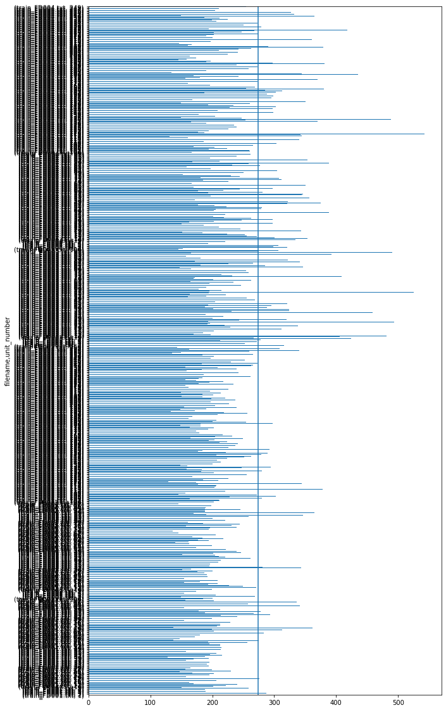

# AWS Blackbelt Capstone Predictive maintenance project writeup 

## Intro

The Nasa Turbofan dataset is interesting to use for a machine learning project for a couple of reasons.
* Predictive maintenance has traditionally leveraged classical statistics to provide insights. Survival Analysis would be a common approach, however the many observations and exogenous variables in this dataset provide an opportunity to apply machine learning to discover more subtle patterns in the data.
* This data isn't provided with a clear set of labels to train a model, it potentially lends itself to either regression or classification. 
  * Given the number of observations, framing this as a regression problem makes sense as we are able to incorporate more information into our loss function as a result of the continuous (discrete) remaining useful life versus a binary observation. 
  * A classification model would have severe class imbalance as few observation result in engine failure. 
  * Furthermore framing the problem in this way enables the consumer of the predictions to instigate a "no suprises" policy where maintenance is actively performed on engines likely to have a fault in the near future e.g. all engines with less than 50 RUL will have maintenance performed. Assuming planned maintenance is cheaper to operate than reactive maintenance, *"a stitch in time saves 9"*. 

With the above in mind our data pipeline will need to calculate a remaining useful life (RUL) for each observation.

<p align="center">

</p>

The remaining useful life for unit number (u) on cycle (i) is the maximum cycle observed in the dataset for that unique unit number minus the current cycle number, i.

## Data Ingestion and Transformation

Given the multiple engines contained in the dataset one could envisage a scenario where device data arrived in real-time as cycles were completed. For this reason I decided to encorporate a setup using kinesis firehose to buffer data as it arrive and to write the data out to S3 in batches. In a production solution a customer could leverage AWS IOT Core to publish data from devices in the cloud and use an IOT Rule to forward data onto a kinesis data stream. Our firehose solution could easily consume from this stream, in the interests of expediency this project simulates the above using a simple python script running on a Cloud9 instance to publish the data.

Once data arrives in S3 a glue crawler is configured to discover metadata and add it to the dataset to the glue data catalog, this enables data preparation jobs to run against the discovered schema. The crawler could at a frequency as low as 5 minutes, enabling our system to provide soft real-time experience for users of the system. Our glue jobs take the raw csv data and calculate the RUL value per observation.

A constraint of the dataset is that until the final (failure) observation per unit number (engine) the RUL value cannot be calculated, we can't know how long an engine will last on cycle 1 until it subsequently fails. As such the notion of engine failure is implict to the way the data is structured, so for the purposes of this project data arrives in complete batches from the files provided.  

### Todo add architecture diagram

## Data Preparation

As discussed in [intro](#Intro) the dataset requires us to calculate RUL for each observation, a Spark glue job is a scalable way to enable this as our data is tabular we can leverage the dataframe abstraction Spark provides. Leveraging a Glue Workflow enables us to chain our glue crawlers and jobs into a DAG which make the pipeline easier to manage and ensures we minimize the time between new data arriving and insight being available to our users.

### ToDo insert workflow screen

## Data Visualisation

An initial EDA was performed on the data to understand the dataset and relationships between the exogenous and endogenous (RUL) variables, this informed the approach described so far and worked with the entire (small ~30Mb) dataset. In a production scenario the dataset could be representatively sampled to achieve a similar insights to be achieved.

A quick look at 5 rows in the dataset to understand the columns and datatypes

```python
dataset = pq.ParquetDataset('s3://datalake-curated-datasets-907317471167-us-east-1-gismq40/year=2020/month=12/day=14/hour=19', filesystem=fs)
table = dataset.read()
df = table.to_pandas()
df = df.sort_values(['unit_number', 'cycle'])
df.head()
```

<div>
<style scoped>
    .dataframe tbody tr th:only-of-type {
        vertical-align: middle;
    }

    .dataframe tbody tr th {
        vertical-align: top;
    }

    .dataframe thead th {
        text-align: right;
    }
</style>
<table border="1" class="dataframe">
  <thead>
    <tr style="text-align: right;">
      <th></th>
      <th>filename</th>
      <th>unit_number</th>
      <th>failure_cycle</th>
      <th>cycle</th>
      <th>op_1</th>
      <th>op_2</th>
      <th>op_3</th>
      <th>sensor_measurement_1</th>
      <th>sensor_measurement_2</th>
      <th>sensor_measurement_3</th>
      <th>...</th>
      <th>sensor_measurement_12</th>
      <th>sensor_measurement_13</th>
      <th>sensor_measurement_14</th>
      <th>sensor_measurement_15</th>
      <th>sensor_measurement_16</th>
      <th>sensor_measurement_17</th>
      <th>sensor_measurement_18</th>
      <th>sensor_measurement_19</th>
      <th>sensor_measurement_20</th>
      <th>sensor_measurement_21</th>
    </tr>
  </thead>
  <tbody>
    <tr>
      <th>77121</th>
      <td>train_FD001.txt</td>
      <td>1</td>
      <td>191</td>
      <td>1</td>
      <td>-0.0007</td>
      <td>-0.0004</td>
      <td>100.0</td>
      <td>518.67</td>
      <td>641.82</td>
      <td>1589.70</td>
      <td>...</td>
      <td>521.66</td>
      <td>2388.02</td>
      <td>8138.62</td>
      <td>8.4195</td>
      <td>0.03</td>
      <td>392</td>
      <td>2388</td>
      <td>100.0</td>
      <td>39.06</td>
      <td>23.4190</td>
    </tr>
    <tr>
      <th>95307</th>
      <td>train_FD003.txt</td>
      <td>1</td>
      <td>258</td>
      <td>1</td>
      <td>-0.0005</td>
      <td>0.0004</td>
      <td>100.0</td>
      <td>518.67</td>
      <td>642.36</td>
      <td>1583.23</td>
      <td>...</td>
      <td>522.31</td>
      <td>2388.01</td>
      <td>8145.32</td>
      <td>8.4246</td>
      <td>0.03</td>
      <td>391</td>
      <td>2388</td>
      <td>100.0</td>
      <td>39.11</td>
      <td>23.3537</td>
    </tr>
    <tr>
      <th>132437</th>
      <td>train_FD002.txt</td>
      <td>1</td>
      <td>148</td>
      <td>1</td>
      <td>34.9983</td>
      <td>0.8400</td>
      <td>100.0</td>
      <td>449.44</td>
      <td>555.32</td>
      <td>1358.61</td>
      <td>...</td>
      <td>183.06</td>
      <td>2387.72</td>
      <td>8048.56</td>
      <td>9.3461</td>
      <td>0.02</td>
      <td>334</td>
      <td>2223</td>
      <td>100.0</td>
      <td>14.73</td>
      <td>8.8071</td>
    </tr>
    <tr>
      <th>150804</th>
      <td>train_FD004.txt</td>
      <td>1</td>
      <td>320</td>
      <td>1</td>
      <td>42.0049</td>
      <td>0.8400</td>
      <td>100.0</td>
      <td>445.00</td>
      <td>549.68</td>
      <td>1343.43</td>
      <td>...</td>
      <td>129.78</td>
      <td>2387.99</td>
      <td>8074.83</td>
      <td>9.3335</td>
      <td>0.02</td>
      <td>330</td>
      <td>2212</td>
      <td>100.0</td>
      <td>10.62</td>
      <td>6.3670</td>
    </tr>
    <tr>
      <th>77122</th>
      <td>train_FD001.txt</td>
      <td>1</td>
      <td>190</td>
      <td>2</td>
      <td>0.0019</td>
      <td>-0.0003</td>
      <td>100.0</td>
      <td>518.67</td>
      <td>642.15</td>
      <td>1591.82</td>
      <td>...</td>
      <td>522.28</td>
      <td>2388.07</td>
      <td>8131.49</td>
      <td>8.4318</td>
      <td>0.03</td>
      <td>392</td>
      <td>2388</td>
      <td>100.0</td>
      <td>39.00</td>
      <td>23.4236</td>
    </tr>
  </tbody>
</table>
<p>5 rows × 28 columns</p>
</div>


We gain further insight about the distribution of data in each of the columns.
```python
df.describe().T
```

<div>
<style scoped>
    .dataframe tbody tr th:only-of-type {
        vertical-align: middle;
    }

    .dataframe tbody tr th {
        vertical-align: top;
    }

    .dataframe thead th {
        text-align: right;
    }
</style>
<table border="1" class="dataframe">
  <thead>
    <tr style="text-align: right;">
      <th></th>
      <th>count</th>
      <th>mean</th>
      <th>std</th>
      <th>min</th>
      <th>25%</th>
      <th>50%</th>
      <th>75%</th>
      <th>max</th>
    </tr>
  </thead>
  <tbody>
    <tr>
      <th>unit_number</th>
      <td>160359.0</td>
      <td>105.553758</td>
      <td>72.867325</td>
      <td>1.0000</td>
      <td>44.00000</td>
      <td>89.0000</td>
      <td>164.0000</td>
      <td>260.0000</td>
    </tr>
    <tr>
      <th>failure_cycle</th>
      <td>160359.0</td>
      <td>122.331338</td>
      <td>83.538146</td>
      <td>0.0000</td>
      <td>56.00000</td>
      <td>113.0000</td>
      <td>172.0000</td>
      <td>542.0000</td>
    </tr>
    <tr>
      <th>cycle</th>
      <td>160359.0</td>
      <td>123.331338</td>
      <td>83.538146</td>
      <td>1.0000</td>
      <td>57.00000</td>
      <td>114.0000</td>
      <td>173.0000</td>
      <td>543.0000</td>
    </tr>
    <tr>
      <th>op_1</th>
      <td>160359.0</td>
      <td>17.211973</td>
      <td>16.527988</td>
      <td>-0.0087</td>
      <td>0.00130</td>
      <td>19.9981</td>
      <td>35.0015</td>
      <td>42.0080</td>
    </tr>
    <tr>
      <th>op_2</th>
      <td>160359.0</td>
      <td>0.410004</td>
      <td>0.367938</td>
      <td>-0.0006</td>
      <td>0.00020</td>
      <td>0.6200</td>
      <td>0.8400</td>
      <td>0.8420</td>
    </tr>
    <tr>
      <th>op_3</th>
      <td>160359.0</td>
      <td>95.724344</td>
      <td>12.359044</td>
      <td>60.0000</td>
      <td>100.00000</td>
      <td>100.0000</td>
      <td>100.0000</td>
      <td>100.0000</td>
    </tr>
    <tr>
      <th>sensor_measurement_1</th>
      <td>160359.0</td>
      <td>485.840890</td>
      <td>30.420388</td>
      <td>445.0000</td>
      <td>449.44000</td>
      <td>489.0500</td>
      <td>518.6700</td>
      <td>518.6700</td>
    </tr>
    <tr>
      <th>sensor_measurement_2</th>
      <td>160359.0</td>
      <td>597.361022</td>
      <td>42.478516</td>
      <td>535.4800</td>
      <td>549.96000</td>
      <td>605.9300</td>
      <td>642.3400</td>
      <td>645.1100</td>
    </tr>
    <tr>
      <th>sensor_measurement_3</th>
      <td>160359.0</td>
      <td>1467.035653</td>
      <td>118.175261</td>
      <td>1242.6700</td>
      <td>1357.36000</td>
      <td>1492.8100</td>
      <td>1586.5900</td>
      <td>1616.9100</td>
    </tr>
    <tr>
      <th>sensor_measurement_4</th>
      <td>160359.0</td>
      <td>1260.956434</td>
      <td>136.300073</td>
      <td>1023.7700</td>
      <td>1126.83000</td>
      <td>1271.7400</td>
      <td>1402.2000</td>
      <td>1441.4900</td>
    </tr>
    <tr>
      <th>sensor_measurement_5</th>
      <td>160359.0</td>
      <td>9.894999</td>
      <td>4.265554</td>
      <td>3.9100</td>
      <td>5.48000</td>
      <td>9.3500</td>
      <td>14.6200</td>
      <td>14.6200</td>
    </tr>
    <tr>
      <th>sensor_measurement_6</th>
      <td>160359.0</td>
      <td>14.424935</td>
      <td>6.443922</td>
      <td>5.6700</td>
      <td>8.00000</td>
      <td>13.6600</td>
      <td>21.6100</td>
      <td>21.6100</td>
    </tr>
    <tr>
      <th>sensor_measurement_7</th>
      <td>160359.0</td>
      <td>359.729968</td>
      <td>174.133835</td>
      <td>136.1700</td>
      <td>175.71000</td>
      <td>341.6900</td>
      <td>553.2900</td>
      <td>570.8100</td>
    </tr>
    <tr>
      <th>sensor_measurement_8</th>
      <td>160359.0</td>
      <td>2273.829707</td>
      <td>142.426613</td>
      <td>1914.7200</td>
      <td>2212.12000</td>
      <td>2319.3700</td>
      <td>2388.0500</td>
      <td>2388.6400</td>
    </tr>
    <tr>
      <th>sensor_measurement_9</th>
      <td>160359.0</td>
      <td>8677.553696</td>
      <td>374.657454</td>
      <td>7984.5100</td>
      <td>8334.77000</td>
      <td>8764.2000</td>
      <td>9055.8500</td>
      <td>9244.5900</td>
    </tr>
    <tr>
      <th>sensor_measurement_10</th>
      <td>160359.0</td>
      <td>1.153705</td>
      <td>0.142103</td>
      <td>0.9300</td>
      <td>1.02000</td>
      <td>1.0900</td>
      <td>1.3000</td>
      <td>1.3200</td>
    </tr>
    <tr>
      <th>sensor_measurement_11</th>
      <td>160359.0</td>
      <td>44.212049</td>
      <td>3.426342</td>
      <td>36.0400</td>
      <td>42.01000</td>
      <td>44.9300</td>
      <td>47.3400</td>
      <td>48.5300</td>
    </tr>
    <tr>
      <th>sensor_measurement_12</th>
      <td>160359.0</td>
      <td>338.789821</td>
      <td>164.193480</td>
      <td>128.3100</td>
      <td>164.79000</td>
      <td>321.6900</td>
      <td>521.3400</td>
      <td>537.4900</td>
    </tr>
    <tr>
      <th>sensor_measurement_13</th>
      <td>160359.0</td>
      <td>2349.645243</td>
      <td>111.167242</td>
      <td>2027.5700</td>
      <td>2387.97000</td>
      <td>2388.0700</td>
      <td>2388.1600</td>
      <td>2390.4900</td>
    </tr>
    <tr>
      <th>sensor_measurement_14</th>
      <td>160359.0</td>
      <td>8088.950972</td>
      <td>80.623257</td>
      <td>7845.7800</td>
      <td>8070.53000</td>
      <td>8118.5900</td>
      <td>8139.4100</td>
      <td>8293.7200</td>
    </tr>
    <tr>
      <th>sensor_measurement_15</th>
      <td>160359.0</td>
      <td>9.054747</td>
      <td>0.751581</td>
      <td>8.1563</td>
      <td>8.43925</td>
      <td>9.0301</td>
      <td>9.3442</td>
      <td>11.0669</td>
    </tr>
    <tr>
      <th>sensor_measurement_16</th>
      <td>160359.0</td>
      <td>0.025185</td>
      <td>0.004997</td>
      <td>0.0200</td>
      <td>0.02000</td>
      <td>0.0300</td>
      <td>0.0300</td>
      <td>0.0300</td>
    </tr>
    <tr>
      <th>sensor_measurement_17</th>
      <td>160359.0</td>
      <td>360.698801</td>
      <td>31.021430</td>
      <td>302.0000</td>
      <td>332.00000</td>
      <td>367.0000</td>
      <td>392.0000</td>
      <td>400.0000</td>
    </tr>
    <tr>
      <th>sensor_measurement_18</th>
      <td>160359.0</td>
      <td>2273.754039</td>
      <td>142.513114</td>
      <td>1915.0000</td>
      <td>2212.00000</td>
      <td>2319.0000</td>
      <td>2388.0000</td>
      <td>2388.0000</td>
    </tr>
    <tr>
      <th>sensor_measurement_19</th>
      <td>160359.0</td>
      <td>98.389146</td>
      <td>4.656270</td>
      <td>84.9300</td>
      <td>100.00000</td>
      <td>100.0000</td>
      <td>100.0000</td>
      <td>100.0000</td>
    </tr>
    <tr>
      <th>sensor_measurement_20</th>
      <td>160359.0</td>
      <td>25.942709</td>
      <td>11.691422</td>
      <td>10.1600</td>
      <td>14.33000</td>
      <td>24.9200</td>
      <td>38.8200</td>
      <td>39.8900</td>
    </tr>
    <tr>
      <th>sensor_measurement_21</th>
      <td>160359.0</td>
      <td>15.565700</td>
      <td>7.015067</td>
      <td>6.0105</td>
      <td>8.60130</td>
      <td>14.9535</td>
      <td>23.2946</td>
      <td>23.9505</td>
    </tr>
  </tbody>
</table>
</div>

A quick (ugly) plot shows us the distribution of the max cycle time per unique unit number (we combine this with the filename to ensure unit numbers are unique) 
```python
fig, ax = plt.subplots(figsize=(10, 20))
_ = df.groupby(['filename', 'unit_number']).cycle.max().plot.barh(ax=ax)
_ = plt.axvline(x=df.groupby('unit_number').cycle.max().mean())
```
    

    
The documentation explains the columns settings 1,2 and 3 vary between files and represent different settings the engines were configured at before cycles were run, here we explore to relationship between the target variable, failure cycle, and each operational setting
```python
sns.jointplot(x='op_1', y='failure_cycle', data=df.sample(1000), kind='reg')
```

```python
sns.jointplot(x='op_2', y='failure_cycle', data=df.sample(1000), kind='reg')
```

```python
sns.jointplot(x='op_3', y='failure_cycle', data=df.sample(10000))
```


The distribution of operational settings is multi modal, and infact varies between the files.

Looking at the other 20 sensor measurements we can see how measurments vary between unique unit numbers across cycles and files, there are some clear trends across many of the variables as cycles increase which seems to represent changes due to wear and tear, this insight indicates these features provide information our model can leverage to predict RUL.
    
File 1
```python
fig, axes = plt.subplots(7, 3, figsize=(30, 40))
axes = axes.ravel()
for i, a in zip(range(1, 22), axes):
    column = 'sensor_measurement_' + str(i)
    _ = a.plot(ddf.loc[['train_FD001.txt', ...], column].unstack(level=[0, 1]).values, alpha=.05)
    a.set_title(column)
    a.set_xlabel('cycle')
```

    
File 2
```python
fig, axes = plt.subplots(7, 3, figsize=(30, 40))
axes = axes.ravel()
for i, a in zip(range(1, 22), axes):
    column = 'sensor_measurement_' + str(i)
    _ = a.plot(ddf.loc[['train_FD002.txt', ...], column].unstack(level=[0, 1]).values, alpha=.05)
    a.set_title(column)
    a.set_xlabel('cycle')
```

File 3    
```python
fig, axes = plt.subplots(7, 3, figsize=(30, 40))
axes = axes.ravel()
for i, a in zip(range(1, 22), axes):
    column = 'sensor_measurement_' + str(i)
    _ = a.plot(ddf.loc[['train_FD003.txt', ...], column].unstack(level=[0, 1]).values, alpha=.05)
    a.set_title(column)
    a.set_xlabel('cycle')
```

File 4
```python
fig, axes = plt.subplots(7, 3, figsize=(30, 40))
axes = axes.ravel()
for i, a in zip(range(1, 22), axes):
    column = 'sensor_measurement_' + str(i)
    _ = a.plot(ddf.loc[['train_FD004.txt', ...], column].unstack(level=[0, 1]).values, alpha=.05)
    a.set_title(column)
    a.set_xlabel('cycle')
```

The training data for 2 and 4 have 6 different operational settings and we can see how this effects the measurements, as files 2 and 4 have several operational settings where as files 1 and 3 have individual settings we can see that operational setting and some of the sensor measurements interact, resulting in the difference between the plots (clear non linear trends vs noisy plots).


Given the above an ensemble model may be an appropriate approach as the data exhibits no linear effects and has clear interactions between the exogenous variables which a tree based method can discover. 

```python
from sklearn.ensemble import RandomForestRegressor
from sklearn.model_selection import train_test_split
import numpy as np

features = ['cycle', 'op_1', 'op_2',
       'op_3', 'sensor_measurement_1', 'sensor_measurement_2',
       'sensor_measurement_3', 'sensor_measurement_4', 'sensor_measurement_5',
       'sensor_measurement_6', 'sensor_measurement_7', 'sensor_measurement_8',
       'sensor_measurement_9', 'sensor_measurement_10',
       'sensor_measurement_11', 'sensor_measurement_12',
       'sensor_measurement_13', 'sensor_measurement_14',
       'sensor_measurement_15', 'sensor_measurement_16',
       'sensor_measurement_17', 'sensor_measurement_18',
       'sensor_measurement_19', 'sensor_measurement_20',
       'sensor_measurement_21']

is_train = df.unit_number % 3 != 0
is_test = df.unit_number % 3 == 0

x_train, x_test = df.loc[is_train, features], df.loc[is_test, features]
y_train, y_test = df.loc[is_train, 'failure_cycle'],  df.loc[is_test, 'failure_cycle']

cls = RandomForestRegressor(n_jobs=-1, n_estimators=40, )
cls = cls.fit(x_train, y_train)
cls.score(x_test, y_test)
```
What percentage of the variance in the dataset does this model explain?

<p align="center">

</p>

    0.6777656054746929

```python
from sklearn.metrics import mean_squared_error
mean_squared_error(y_test, cls.predict(x_test), squared=False)
```
RMSE   

    46.4291275009693
A root mean squared error of ~46 cycles

Which features does this model find most useful
```python
fig, ax = plt.subplots(figsize=(30, 20))
ax.barh(features, cls.feature_importances_)
```
    

    
### Baseline mean regressor


```python
from sklearn.dummy import DummyRegressor

dummy = DummyRegressor()
dummy = dummy.fit(x_train, y_train)
mean_squared_error(y_test, dummy.predict(x_test), squared=False)
```
RMSE  

    81.9091606758585

An ensemble based method outperforms a niave mean prediction by ~50% 
* Next steps apply Xgboost, gradient boosting generally outperforms random forest when tuned appropriately
* This approach validates the potential value before we commit to building a sagemaker model, ie if there wasn't a margin over out "dummy" model then building a sagemaker model wouldn't probably be fruitful. 

### ToDo insert quick sight screens

## Training Models


```python
%%time

import os
import boto3
import re
import sagemaker

role = sagemaker.get_execution_role()
region = boto3.Session().region_name
```

    CPU times: user 833 ms, sys: 71.6 ms, total: 905 ms
    Wall time: 1.97 s


```python
data_bucket = f"datalake-published-data-907317471167-us-east-1-gismq40"
data_prefix = "cmaps-ml2"
train_prefix = "split=train/year=2020/month=12/day=14/hour=19"
eval_prefix = "split=validation/year=2020/month=12/day=14/hour=19"
data_bucket_path = f"s3://{data_bucket}"
output_prefix = "sagemaker/cmapss-xgboost"
output_bucket_path = f"s3://{data_bucket}"
```


```python
from sagemaker.image_uris import retrieve
```


```python
from sagemaker.amazon.amazon_estimator import get_image_uri

container = retrieve(framework="xgboost", region=region, version="1.2-1")
```


```python
%%time
import boto3
from time import gmtime, strftime

job_name = f"cmapss-xgboost-regression-{strftime('%Y-%m-%d-%H-%M-%S', gmtime())}"
print("Training job", job_name)

# Ensure that the training and validation data folders generated above are reflected in the "InputDataConfig" parameter below.

create_training_params = {
    "AlgorithmSpecification": {"TrainingImage": container, "TrainingInputMode": "Pipe"},
    "RoleArn": role,
    "OutputDataConfig": {"S3OutputPath": f"{output_bucket_path}/{output_prefix}/single-xgboost"},
    "ResourceConfig": {"InstanceCount": 1, "InstanceType": "ml.m5.xlarge", "VolumeSizeInGB": 5},
    "TrainingJobName": job_name,
    "HyperParameters": {
        "max_depth": "5",
        "eta": "0.2",
        "gamma": "4",
        "min_child_weight": "6",
        "subsample": "0.7",
        "objective": "reg:squarederror",
        "num_round": "100",
    },
    "StoppingCondition": {"MaxRuntimeInSeconds": 3600},
    "InputDataConfig": [
        {
            "ChannelName": "train",
            "DataSource": {
                "S3DataSource": {
                    "S3DataType": "S3Prefix",
                    "S3Uri": f"{data_bucket_path}/{data_prefix}/{train_prefix}",
                    "S3DataDistributionType": "FullyReplicated",
                }
            },
            "ContentType": "text/csv",
            "CompressionType": "Gzip",
        },
        {
            "ChannelName": "validation",
            "DataSource": {
                "S3DataSource": {
                    "S3DataType": "S3Prefix",
                    "S3Uri": f"{data_bucket_path}/{data_prefix}/{eval_prefix}",
                    "S3DataDistributionType": "FullyReplicated",
                }
            },
            "ContentType": "text/csv",
            "CompressionType": "Gzip",
        },
    ],
}


client = boto3.client("sagemaker", region_name=region)
client.create_training_job(**create_training_params)

import time

status = client.describe_training_job(TrainingJobName=job_name)["TrainingJobStatus"]
print(status)
while status != "Completed" and status != "Failed":
    time.sleep(60)
    status = client.describe_training_job(TrainingJobName=job_name)["TrainingJobStatus"]
    print(status)
```

    Training job cmapss-xgboost-regression-2020-12-14-20-14-15
    InProgress
    InProgress
    InProgress
    InProgress
    Completed
    CPU times: user 90.6 ms, sys: 5.66 ms, total: 96.2 ms
    Wall time: 4min


Note that the "validation" channel has been initialized too. The SageMaker XGBoost algorithm actually calculates RMSE and writes it to the CloudWatch logs on the data passed to the "validation" channel.

## Set up hosting for the model
In order to set up hosting, we have to import the model from training to hosting. 

### Import model into hosting

Register the model with hosting. This allows the flexibility of importing models trained elsewhere.


```python
%%time
import boto3
from time import gmtime, strftime

model_name = f"{job_name}-model"
print(model_name)

info = client.describe_training_job(TrainingJobName=job_name)
model_data = info["ModelArtifacts"]["S3ModelArtifacts"]
print(model_data)

primary_container = {"Image": container, "ModelDataUrl": model_data}

create_model_response = client.create_model(
    ModelName=model_name, ExecutionRoleArn=role, PrimaryContainer=primary_container
)

print(create_model_response["ModelArn"])
```

    cmapss-xgboost-regression-2020-12-14-14-39-48-model
    s3://datalake-published-data-907317471167-us-east-1-gismq40/sagemaker/cmapss-xgboost/single-xgboost/cmapss-xgboost-regression-2020-12-14-14-39-48/output/model.tar.gz
    arn:aws:sagemaker:us-east-1:907317471167:model/cmapss-xgboost-regression-2020-12-14-14-39-48-model
    CPU times: user 25.3 ms, sys: 150 µs, total: 25.5 ms
    Wall time: 1.59 s


### Create endpoint configuration

SageMaker supports configuring REST endpoints in hosting with multiple models, e.g. for A/B testing purposes. In order to support this, customers create an endpoint configuration, that describes the distribution of traffic across the models, whether split, shadowed, or sampled in some way. In addition, the endpoint configuration describes the instance type required for model deployment.


```python
from time import gmtime, strftime

endpoint_config_name = f"cmapss-XGBoostEndpointConfig-{strftime('%Y-%m-%d-%H-%M-%S', gmtime())}"
print(endpoint_config_name)
create_endpoint_config_response = client.create_endpoint_config(
    EndpointConfigName=endpoint_config_name,
    ProductionVariants=[
        {
            "InstanceType": "ml.m5.xlarge",
            "InitialVariantWeight": 1,
            "InitialInstanceCount": 1,
            "ModelName": model_name,
            "VariantName": "AllTraffic",
        }
    ],
)

print(f"Endpoint Config Arn: {create_endpoint_config_response['EndpointConfigArn']}")
```

    cmapss-XGBoostEndpointConfig-2020-12-14-17-22-55
    Endpoint Config Arn: arn:aws:sagemaker:us-east-1:907317471167:endpoint-config/cmapss-xgboostendpointconfig-2020-12-14-17-22-55


### Create endpoint
Lastly, the customer creates the endpoint that serves up the model, through specifying the name and configuration defined above. The end result is an endpoint that can be validated and incorporated into production applications. This takes 9-11 minutes to complete.


```python
%%time
import time

endpoint_name = f'cmapss-XGBoostEndpoint-{strftime("%Y-%m-%d-%H-%M-%S", gmtime())}'
print(endpoint_name)
create_endpoint_response = client.create_endpoint(
    EndpointName=endpoint_name, EndpointConfigName=endpoint_config_name
)
print(create_endpoint_response["EndpointArn"])

resp = client.describe_endpoint(EndpointName=endpoint_name)
status = resp["EndpointStatus"]
while status == "Creating":
    print(f"Status: {status}")
    time.sleep(60)
    resp = client.describe_endpoint(EndpointName=endpoint_name)
    status = resp["EndpointStatus"]

print(f"Arn: {resp['EndpointArn']}")
print(f"Status: {status}")
```

    cmapss-XGBoostEndpoint-2020-12-14-17-23-20
    arn:aws:sagemaker:us-east-1:907317471167:endpoint/cmapss-xgboostendpoint-2020-12-14-17-23-20
    Status: Creating
    Status: Creating
    Status: Creating
    Status: Creating
    Status: Creating
    Status: Creating
    Status: Creating
    Status: Creating
    Arn: arn:aws:sagemaker:us-east-1:907317471167:endpoint/cmapss-xgboostendpoint-2020-12-14-17-23-20
    Status: InService
    CPU times: user 142 ms, sys: 13.4 ms, total: 155 ms
    Wall time: 8min 1s


## Validate the model for use
Finally, the customer can now validate the model for use. They can obtain the endpoint from the client library using the result from previous operations, and generate classifications from the trained model using that endpoint.


```python
runtime_client = boto3.client("runtime.sagemaker", region_name=region)
```

Start with a single prediction.
We didn't train with the engine number so drop this (first) field


```python
file = 4
test_file_name = f'test_FD00{file}.txt'
test_rul_name = f'RUL_FD00{file}.txt'
filename = f"cmapss.test.{file}"
single_filename = f"single.{filename}"
test_file_name, test_rul_name
```


    ('test_FD004.txt', 'RUL_FD004.txt')


```python
! cat /home/ec2-user/SageMaker/aws-bb-cmapss/data/{test_file_name} | cut -d ' ' -f2- > {filename}
```


```python
! head -1 {filename} > {single_filename}
```


```python
!cat {single_filename}; wc -l {filename}
```

    1 20.0072 0.7000 100.0 491.19 606.67 1481.04 1227.81 9.35 13.60 332.52 2323.67 8704.98 1.07 43.83 313.03 2387.78 8048.98 9.2229 0.02 362 2324 100.00 24.31 14.7007  
    41214 cmapss.test.4


```python
%%time
import json
from itertools import islice
import math
import struct

 # customize to your test file
with open(single_file_name, "r") as f:
    payload = f.read().strip()
response = runtime_client.invoke_endpoint(
    EndpointName=endpoint_name, ContentType="text/csv", Body=payload
)
result = response["Body"].read()
result = result.decode("utf-8")
result = result.split(",")
result = [math.ceil(float(i)) for i in result]
print(result)
print(f"Label: {label}\nPrediction: {result[0]}")
```

    [194]
    Label: 1
    Prediction: 194
    CPU times: user 6.17 ms, sys: 115 µs, total: 6.28 ms
    Wall time: 11.7 ms


OK, a single prediction works. Let's do a whole batch to see how good is the predictions accuracy.


```python
import sys
import math


def do_predict(data, endpoint_name, content_type):
    payload = "\n".join(data)
    response = runtime_client.invoke_endpoint(
        EndpointName=endpoint_name, ContentType=content_type, Body=payload
    )
    result = response["Body"].read()
    result = result.decode("utf-8")
    result = result.split(",")
    preds = [float((num)) for num in result]
    preds = [math.ceil(num) for num in preds]
    return preds


def batch_predict(data, batch_size, endpoint_name, content_type):
    items = len(data)
    arrs = []

    for offset in range(0, items, batch_size):
        if offset + batch_size < items:
            results = do_predict(data[offset : (offset + batch_size)], endpoint_name, content_type)
            arrs.extend(results)
        else:
            arrs.extend(do_predict(data[offset:items], endpoint_name, content_type))
        sys.stdout.write(".")
    return arrs
```

The following helps us calculate the Median Absolute Percent Error (MdAPE) on the batch dataset. 


```python
import pandas as pd
```


```python
test_data = pd.read_csv(f"/home/ec2-user/SageMaker/aws-bb-cmapss/data/{test_file_name}", header=None, delimiter=' ')
```


```python
labels = pd.read_csv(f"/home/ec2-user/SageMaker/aws-bb-cmapss/data/{test_rul_name}", names=['remaining_cycles'])
labels.index += 1
labels = labels.reset_index()
labels = labels.rename(columns={'index' : 0})
labels = test_data.groupby(0)[1].max().reset_index().merge(labels, left_on=0, right_on=0)
labels['max_cycles'] = labels[1] + labels['remaining_cycles']
```


```python
test_data = test_data.merge(labels[[0, 'max_cycles']], left_on=0, right_on=0)
```


```python
test_data['RUL'] = test_data['max_cycles'] - test_data[1]
```


```python
len(inference_data), len(labels)
```


    (16596, 248)


```python
%%time
import json
import numpy as np

with open(filename, "r") as f:
    payload = f.read().strip()

y_true = test_data['RUL'].to_list()
inference_data = [line.strip() for line in payload.split("\n")]

preds = batch_predict(inference_data, 100, endpoint_name, "text/csv")
```

    .............................................................................................................................................................................................................................................................................................................................................................................................................................CPU times: user 1.47 s, sys: 42.4 ms, total: 1.51 s
    Wall time: 5.5 s


```python
from sklearn.metrics import mean_squared_error
```


```python
len(y_true), len(preds)
```


    (41214, 41214)


```python
mean_squared_error(y_true, preds, squared=False)
```


    68.86138013002605


### Delete Endpoint
Once you are done using the endpoint, you can use the following to delete it. 


```python
client.delete_endpoint(EndpointName=endpoint_name)
```
```python
%%time

import os
import boto3
import re
import sagemaker

role = sagemaker.get_execution_role()
region = boto3.Session().region_name
```

    CPU times: user 837 ms, sys: 71.7 ms, total: 909 ms
    Wall time: 1.95 s


```python
data_bucket = f"datalake-published-data-907317471167-us-east-1-gismq40"
data_prefix = "cmaps-ml2"
train_prefix = "split=train/year=2020/month=12/day=14/hour=19"
eval_prefix = "split=validation/year=2020/month=12/day=14/hour=19"
data_bucket_path = f"s3://{data_bucket}"
output_prefix = "sagemaker/cmapss-xgboost"
output_bucket_path = f"s3://{data_bucket}"
```


```python
from sagemaker.image_uris import retrieve
```


```python
from sagemaker.amazon.amazon_estimator import get_image_uri

container = retrieve(framework="xgboost", region=region, version="1.2-1")
```


```python
tuning_job_config = {
    "ParameterRanges": {
      "CategoricalParameterRanges": [],
      "ContinuousParameterRanges": [
        {
          "MaxValue": "1",
          "MinValue": "0.5",
          "Name": "subsample"
        },
        {
          "MaxValue": "1",
          "MinValue": "0",
          "Name": "eta"
        },
        {
          "MaxValue": "2",
          "MinValue": "0",
          "Name": "alpha"
        },
        {
          "MaxValue": "100",
          "MinValue": "1",
          "Name": "min_child_weight"
        }
      ],
      "IntegerParameterRanges": [
        {
          "MaxValue": "10",
          "MinValue": "1",
          "Name": "max_depth"
        },
        {
          "MaxValue": "250",
          "MinValue": "1",
          "Name": "num_round"
        }
      ]
    },
    "ResourceLimits": {
      "MaxNumberOfTrainingJobs": 50,
      "MaxParallelTrainingJobs": 5
    },
    "Strategy": "Bayesian",
    "HyperParameterTuningJobObjective": {
      "MetricName": "validation:rmse",
      "Type": "Minimize"
    }
  }
```


```python
# Ensure that the training and validation data folders generated above are reflected in the "InputDataConfig" parameter below.

create_training_params = {
    "AlgorithmSpecification": {"TrainingImage": container, "TrainingInputMode": "Pipe"},
    "RoleArn": role,
    "OutputDataConfig": {"S3OutputPath": f"{output_bucket_path}/{output_prefix}/hyper-xgboost"},
    "ResourceConfig": {"InstanceCount": 5, "InstanceType": "ml.m5.xlarge", "VolumeSizeInGB": 5},
    "StaticHyperParameters": {
        "gamma": "4",
        "objective": "reg:squarederror",
    },
    "StoppingCondition": {"MaxRuntimeInSeconds": 3600},
    "InputDataConfig": [
        {
            "ChannelName": "train",
            "DataSource": {
                "S3DataSource": {
                    "S3DataType": "S3Prefix",
                    "S3Uri": f"{data_bucket_path}/{data_prefix}/{train_prefix}",
                    "S3DataDistributionType": "FullyReplicated",
                }
            },
            "ContentType": "text/csv",
            "CompressionType": "Gzip",
        },
        {
            "ChannelName": "validation",
            "DataSource": {
                "S3DataSource": {
                    "S3DataType": "S3Prefix",
                    "S3Uri": f"{data_bucket_path}/{data_prefix}/{eval_prefix}",
                    "S3DataDistributionType": "FullyReplicated",
                }
            },
            "ContentType": "text/csv",
            "CompressionType": "Gzip",
        },
    ],
}
```

```python
%%time
import boto3
from time import gmtime, strftime

job_name = f"hyper-cmapss-{strftime('%Y-%m-%d-%H-%M-%S', gmtime())}"
print("Training job", job_name)

client = boto3.client("sagemaker", region_name=region)
client.create_hyper_parameter_tuning_job(HyperParameterTuningJobName = job_name,
                                           HyperParameterTuningJobConfig = tuning_job_config,
                                           TrainingJobDefinition = create_training_params)

import time

status = client.describe_hyper_parameter_tuning_job(HyperParameterTuningJobName=job_name)["HyperParameterTuningJobStatus"]
print(status)
while status != "Completed" and status != "Failed":
    time.sleep(60)
    status = client.describe_hyper_parameter_tuning_job(HyperParameterTuningJobName=job_name)["HyperParameterTuningJobStatus"]
    print(status)
```

    Training job hyper-cmapss-2020-12-14-21-06-58
    InProgress
    InProgress
    InProgress
    InProgress
    InProgress
    InProgress
    InProgress
    InProgress
    InProgress
    InProgress
    InProgress
    InProgress
    InProgress
    InProgress
    InProgress
    InProgress
    InProgress
    InProgress
    InProgress
    InProgress
    InProgress
    InProgress
    InProgress
    InProgress
    InProgress
    InProgress
    InProgress
    InProgress
    InProgress
    InProgress
    InProgress
    InProgress
    InProgress
    InProgress
    InProgress
    InProgress
    InProgress
    InProgress
    InProgress
    InProgress
    InProgress
    InProgress
    InProgress
    InProgress
    InProgress
    InProgress
    InProgress
    InProgress
    InProgress
    InProgress
    InProgress
    InProgress
    InProgress
    InProgress
    InProgress
    InProgress
    InProgress
    InProgress
    InProgress
    InProgress
    InProgress
    InProgress
    InProgress
    InProgress
    InProgress
    InProgress
    InProgress
    InProgress
    InProgress
    Completed
    CPU times: user 1.21 s, sys: 60.4 ms, total: 1.27 s
    Wall time: 1h 9min 11s


## Evaluate ML Models

## Improving ML models accuracy

## Machine Learning Implementation / Operations & Well-Architected

