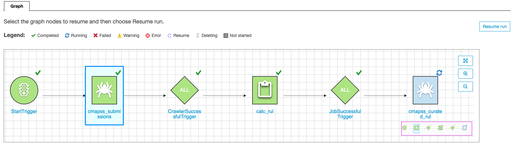

## Data Preparation

    
Click to expand

As discussed in [intro](#Intro) the dataset requires us to calculate RUL for each observation, a Spark glue job is a scalable way to enable this as our data is tabular we can leverage the dataframe abstraction Spark provides. Leveraging a Glue Workflow enables us to chain our glue crawlers and jobs into a DAG which make the pipeline easier to manage and ensures we minimize the time between new data arriving and insight being available to our users.

### Workflow diagram

