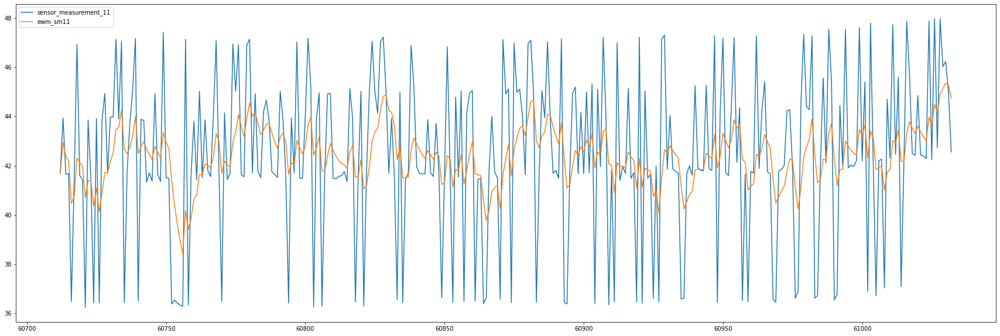

## Evaluate ML Models
<details>
    <Summary>Click to expand</summary>
* As we have formulated our project as a regression problem we use mean squared and a root mean squared error as a validation metric for hyper parameter turning

### Sagemaker Console hyper param jobs screens


<br/>*We see an improved performance on our evaluation data and also note the training could have run for more rounds (it doesn't appear to have fully converged).*

As seen in the previous section we see a RMSE of 57.25 across all of the testing data which is still significantly below our evaluation performance. After further investigation we notice poor performance on testing data files 3 and 4 which exhibit 6 different operational settings. Our model isn't generalizing well to this portion of the dataset.

Some ideas to improve our model
* 

```python
!pip install pyathena
!pip install xgboost
!pip install pyarrow
!pip install s3fs
```


```python
import pyarrow.parquet as pq
import s3fs
fs = s3fs.S3FileSystem()
```


```python
dataset = pq.ParquetDataset('s3://datalake-curated-datasets-907317471167-us-east-1-pjkrtzr/year=2021', filesystem=fs)
table = dataset.read()
df = table.to_pandas()
df = df.sort_values(['unit_number', 'cycle'])
```


```python
df.head()
```


<div>
<style scoped>
    .dataframe tbody tr th:only-of-type {
        vertical-align: middle;
    }

    .dataframe tbody tr th {
        vertical-align: top;
    }

    .dataframe thead th {
        text-align: right;
    }
</style>
<table border="1" class="dataframe">
  <thead>
    <tr style="text-align: right;">
      <th></th>
      <th>filename</th>
      <th>unit_number</th>
      <th>failure_cycle</th>
      <th>cycle</th>
      <th>op_1</th>
      <th>op_2</th>
      <th>op_3</th>
      <th>sensor_measurement_1</th>
      <th>sensor_measurement_2</th>
      <th>sensor_measurement_3</th>
      <th>...</th>
      <th>sensor_measurement_15</th>
      <th>sensor_measurement_16</th>
      <th>sensor_measurement_17</th>
      <th>sensor_measurement_18</th>
      <th>sensor_measurement_19</th>
      <th>sensor_measurement_20</th>
      <th>sensor_measurement_21</th>
      <th>month</th>
      <th>day</th>
      <th>hour</th>
    </tr>
  </thead>
  <tbody>
    <tr>
      <th>19204</th>
      <td>train_FD001.txt</td>
      <td>1</td>
      <td>191</td>
      <td>1</td>
      <td>-0.0007</td>
      <td>-0.0004</td>
      <td>100.0</td>
      <td>518.67</td>
      <td>641.82</td>
      <td>1589.70</td>
      <td>...</td>
      <td>8.4195</td>
      <td>0.03</td>
      <td>392</td>
      <td>2388</td>
      <td>100.0</td>
      <td>39.06</td>
      <td>23.4190</td>
      <td>1</td>
      <td>5</td>
      <td>19</td>
    </tr>
    <tr>
      <th>60712</th>
      <td>train_FD004.txt</td>
      <td>1</td>
      <td>320</td>
      <td>1</td>
      <td>42.0049</td>
      <td>0.8400</td>
      <td>100.0</td>
      <td>445.00</td>
      <td>549.68</td>
      <td>1343.43</td>
      <td>...</td>
      <td>9.3335</td>
      <td>0.02</td>
      <td>330</td>
      <td>2212</td>
      <td>100.0</td>
      <td>10.62</td>
      <td>6.3670</td>
      <td>1</td>
      <td>5</td>
      <td>19</td>
    </tr>
    <tr>
      <th>65088</th>
      <td>train_FD002.txt</td>
      <td>1</td>
      <td>148</td>
      <td>1</td>
      <td>34.9983</td>
      <td>0.8400</td>
      <td>100.0</td>
      <td>449.44</td>
      <td>555.32</td>
      <td>1358.61</td>
      <td>...</td>
      <td>9.3461</td>
      <td>0.02</td>
      <td>334</td>
      <td>2223</td>
      <td>100.0</td>
      <td>14.73</td>
      <td>8.8071</td>
      <td>1</td>
      <td>5</td>
      <td>19</td>
    </tr>
    <tr>
      <th>155602</th>
      <td>train_FD003.txt</td>
      <td>1</td>
      <td>258</td>
      <td>1</td>
      <td>-0.0005</td>
      <td>0.0004</td>
      <td>100.0</td>
      <td>518.67</td>
      <td>642.36</td>
      <td>1583.23</td>
      <td>...</td>
      <td>8.4246</td>
      <td>0.03</td>
      <td>391</td>
      <td>2388</td>
      <td>100.0</td>
      <td>39.11</td>
      <td>23.3537</td>
      <td>1</td>
      <td>5</td>
      <td>19</td>
    </tr>
    <tr>
      <th>19205</th>
      <td>train_FD001.txt</td>
      <td>1</td>
      <td>190</td>
      <td>2</td>
      <td>0.0019</td>
      <td>-0.0003</td>
      <td>100.0</td>
      <td>518.67</td>
      <td>642.15</td>
      <td>1591.82</td>
      <td>...</td>
      <td>8.4318</td>
      <td>0.03</td>
      <td>392</td>
      <td>2388</td>
      <td>100.0</td>
      <td>39.00</td>
      <td>23.4236</td>
      <td>1</td>
      <td>5</td>
      <td>19</td>
    </tr>
  </tbody>
</table>
<p>5 rows × 31 columns</p>
</div>


```python
import numpy as np
import matplotlib.pyplot as plt
import pandas as pd
import xgboost as xgb
```


```python
!aws s3 cp s3://datalake-published-data-907317471167-us-east-1-pjkrtzr/sagemaker/cmapss-xgboost/hyper-xgboost/hyper-cmapss-2021-01-07-16-04-50-409-07f98126/output/model.tar.gz .

!tar xvzf model.tar.gz
```


```python
import pickle as pkl
with open("xgboost-model", "rb") as f:
    booster = pkl.load(f)   
```


```python
features = ['cycle', 'op_1', 'op_2',
       'op_3', 'sensor_measurement_1', 'sensor_measurement_2',
       'sensor_measurement_3', 'sensor_measurement_4', 'sensor_measurement_5',
       'sensor_measurement_6', 'sensor_measurement_7', 'sensor_measurement_8',
       'sensor_measurement_9', 'sensor_measurement_10',
       'sensor_measurement_11', 'sensor_measurement_12',
       'sensor_measurement_13', 'sensor_measurement_14',
       'sensor_measurement_15', 'sensor_measurement_16',
       'sensor_measurement_17', 'sensor_measurement_18',
       'sensor_measurement_19', 'sensor_measurement_20',
       'sensor_measurement_21']
```


```python
is_train = df.unit_number % 3 != 0
is_test = df.unit_number % 3 == 0
```


```python
x_train, x_test = df.loc[is_train, features  + ['filename']], df.loc[is_test, features + ['filename']]

y_train, y_test = df.loc[is_train, 'failure_cycle'],  df.loc[is_test, 'failure_cycle']
```


```python
from sklearn.metrics import mean_squared_error
```


```python
residuals = y_test.values - booster.predict(xgb.DMatrix(x_test[features].values))
```


```python
mean_squared_error(y_test.values, booster.predict(xgb.DMatrix(x_test[features].values)), squared=False)
```


    44.36013601663794


```python
fig, ax = plt.subplots(figsize=(30, 12))
ax.plot(residuals)
_ = ax.set_title('residual plot by filename, engine number')
```


    

    


```python
from matplotlib.colors import ListedColormap as lcm
labels, _ = df.loc[y_test.index, 'filename'].pipe(pd.factorize)
colours = ['red','orange','blue','green']
```


```python
fig, ax = plt.subplots(figsize=(30, 12))
ax.scatter(df.loc[y_test.index, 'cycle'], residuals, c=labels, cmap=lcm(colours), s=5, alpha=.5)
```


    <matplotlib.collections.PathCollection at 0x7f1fdf5b6470>


    

    


```python
x_test['residual'] = residuals
```


```python
x_test.groupby('filename').residual.describe()
```


<div>
<style scoped>
    .dataframe tbody tr th:only-of-type {
        vertical-align: middle;
    }

    .dataframe tbody tr th {
        vertical-align: top;
    }

    .dataframe thead th {
        text-align: right;
    }
</style>
<table border="1" class="dataframe">
  <thead>
    <tr style="text-align: right;">
      <th></th>
      <th>count</th>
      <th>mean</th>
      <th>std</th>
      <th>min</th>
      <th>25%</th>
      <th>50%</th>
      <th>75%</th>
      <th>max</th>
    </tr>
    <tr>
      <th>filename</th>
      <th></th>
      <th></th>
      <th></th>
      <th></th>
      <th></th>
      <th></th>
      <th></th>
      <th></th>
    </tr>
  </thead>
  <tbody>
    <tr>
      <th>train_FD001.txt</th>
      <td>6608.0</td>
      <td>-0.628722</td>
      <td>41.703216</td>
      <td>-115.709702</td>
      <td>-25.399927</td>
      <td>-4.979549</td>
      <td>10.563948</td>
      <td>175.004593</td>
    </tr>
    <tr>
      <th>train_FD002.txt</th>
      <td>17506.0</td>
      <td>-2.387850</td>
      <td>34.093822</td>
      <td>-127.192123</td>
      <td>-22.189165</td>
      <td>-4.812390</td>
      <td>11.121140</td>
      <td>147.016792</td>
    </tr>
    <tr>
      <th>train_FD003.txt</th>
      <td>8098.0</td>
      <td>3.876181</td>
      <td>62.486405</td>
      <td>-226.096405</td>
      <td>-25.879181</td>
      <td>-3.090282</td>
      <td>21.385916</td>
      <td>260.607513</td>
    </tr>
    <tr>
      <th>train_FD004.txt</th>
      <td>19454.0</td>
      <td>-2.332206</td>
      <td>44.131340</td>
      <td>-163.258270</td>
      <td>-26.639145</td>
      <td>-4.461285</td>
      <td>15.991688</td>
      <td>190.555252</td>
    </tr>
  </tbody>
</table>
</div>


```python
! cat /home/ec2-user/SageMaker/aws-bb-cmapss/data/test_FD001.txt | cut -d ' ' -f2- > cmapss.test.1
! cat /home/ec2-user/SageMaker/aws-bb-cmapss/data/test_FD002.txt | cut -d ' ' -f2- > cmapss.test.2
! cat /home/ec2-user/SageMaker/aws-bb-cmapss/data/test_FD003.txt | cut -d ' ' -f2- > cmapss.test.3
! cat /home/ec2-user/SageMaker/aws-bb-cmapss/data/test_FD004.txt | cut -d ' ' -f2- > cmapss.test.4
```


```python
all_test_data = []
for i in range(1, 5):
    filename = f'cmapss.test.{i}'
    test_file_name = f'test_FD00{i}.txt'
    test_rul_name = f'RUL_FD00{i}.txt'
    test_data = pd.read_csv(f"/home/ec2-user/SageMaker/aws-bb-cmapss/data/{test_file_name}", header=None, delimiter=' ')

    labels = pd.read_csv(f"/home/ec2-user/SageMaker/aws-bb-cmapss/data/{test_rul_name}", names=['remaining_cycles'])
    labels.index += 1
    labels = labels.reset_index()
    labels = labels.rename(columns={'index' : 0})
    labels = test_data.groupby(0)[1].max().reset_index().merge(labels, left_on=0, right_on=0)
    labels['max_cycles'] = labels[1] + labels['remaining_cycles']

    test_data = test_data.merge(labels[[0, 'max_cycles']], left_on=0, right_on=0)

    test_data['RUL'] = test_data['max_cycles'] - test_data[1]
    test_data['filename'] = filename
    all_test_data.append(test_data)

all_test_data_df = pd.concat(all_test_data)
```


```python
residual_test = all_test_data_df.RUL.values - booster.predict(xgb.DMatrix(all_test_data_df.drop(columns=[0, 26, 27, 'max_cycles', 'RUL', 'filename']).values))
```


```python
mean_squared_error(all_test_data_df.RUL.values, booster.predict(xgb.DMatrix(all_test_data_df.drop(columns=[0, 26, 27, 'max_cycles', 'RUL', 'filename']).values)), squared=False)
```


    57.709556087846885


```python
fig, ax = plt.subplots(figsize=(30, 12))
ax.plot(residual_test)
_ = ax.set_title('residual plot by filename, engine number')
```


    

    


```python
all_test_data_df['residual'] = residual_test
```


```python
all_test_data_df.head()
```


<div>
<style scoped>
    .dataframe tbody tr th:only-of-type {
        vertical-align: middle;
    }

    .dataframe tbody tr th {
        vertical-align: top;
    }

    .dataframe thead th {
        text-align: right;
    }
</style>
<table border="1" class="dataframe">
  <thead>
    <tr style="text-align: right;">
      <th></th>
      <th>0</th>
      <th>1</th>
      <th>2</th>
      <th>3</th>
      <th>4</th>
      <th>5</th>
      <th>6</th>
      <th>7</th>
      <th>8</th>
      <th>9</th>
      <th>...</th>
      <th>22</th>
      <th>23</th>
      <th>24</th>
      <th>25</th>
      <th>26</th>
      <th>27</th>
      <th>max_cycles</th>
      <th>RUL</th>
      <th>filename</th>
      <th>residual</th>
    </tr>
  </thead>
  <tbody>
    <tr>
      <th>0</th>
      <td>1</td>
      <td>1</td>
      <td>0.0023</td>
      <td>0.0003</td>
      <td>100.0</td>
      <td>518.67</td>
      <td>643.02</td>
      <td>1585.29</td>
      <td>1398.21</td>
      <td>14.62</td>
      <td>...</td>
      <td>2388</td>
      <td>100.0</td>
      <td>38.86</td>
      <td>23.3735</td>
      <td>NaN</td>
      <td>NaN</td>
      <td>143</td>
      <td>142</td>
      <td>cmapss.test.1</td>
      <td>-46.637024</td>
    </tr>
    <tr>
      <th>1</th>
      <td>1</td>
      <td>2</td>
      <td>-0.0027</td>
      <td>-0.0003</td>
      <td>100.0</td>
      <td>518.67</td>
      <td>641.71</td>
      <td>1588.45</td>
      <td>1395.42</td>
      <td>14.62</td>
      <td>...</td>
      <td>2388</td>
      <td>100.0</td>
      <td>39.02</td>
      <td>23.3916</td>
      <td>NaN</td>
      <td>NaN</td>
      <td>143</td>
      <td>141</td>
      <td>cmapss.test.1</td>
      <td>-60.858078</td>
    </tr>
    <tr>
      <th>2</th>
      <td>1</td>
      <td>3</td>
      <td>0.0003</td>
      <td>0.0001</td>
      <td>100.0</td>
      <td>518.67</td>
      <td>642.46</td>
      <td>1586.94</td>
      <td>1401.34</td>
      <td>14.62</td>
      <td>...</td>
      <td>2388</td>
      <td>100.0</td>
      <td>39.08</td>
      <td>23.4166</td>
      <td>NaN</td>
      <td>NaN</td>
      <td>143</td>
      <td>140</td>
      <td>cmapss.test.1</td>
      <td>-58.174103</td>
    </tr>
    <tr>
      <th>3</th>
      <td>1</td>
      <td>4</td>
      <td>0.0042</td>
      <td>0.0000</td>
      <td>100.0</td>
      <td>518.67</td>
      <td>642.44</td>
      <td>1584.12</td>
      <td>1406.42</td>
      <td>14.62</td>
      <td>...</td>
      <td>2388</td>
      <td>100.0</td>
      <td>39.00</td>
      <td>23.3737</td>
      <td>NaN</td>
      <td>NaN</td>
      <td>143</td>
      <td>139</td>
      <td>cmapss.test.1</td>
      <td>-58.611984</td>
    </tr>
    <tr>
      <th>4</th>
      <td>1</td>
      <td>5</td>
      <td>0.0014</td>
      <td>0.0000</td>
      <td>100.0</td>
      <td>518.67</td>
      <td>642.51</td>
      <td>1587.19</td>
      <td>1401.92</td>
      <td>14.62</td>
      <td>...</td>
      <td>2388</td>
      <td>100.0</td>
      <td>38.99</td>
      <td>23.4130</td>
      <td>NaN</td>
      <td>NaN</td>
      <td>143</td>
      <td>138</td>
      <td>cmapss.test.1</td>
      <td>-66.911758</td>
    </tr>
  </tbody>
</table>
<p>5 rows × 32 columns</p>
</div>


```python
buckets, bins = pd.qcut(x_test.cycle, 10, precision=0, retbins=True)
```

# Futher comparisons of the data reveal a fact which we are aware of and which explains the reason for higher errors on the test set
* the test files (all_test_data_df) are truncated at some point prior to the engine failure, where are the train data (x_test) are upto and including the final cycle.
Considering the distribution of errors on the scatter above this provides fewer low error (late cycle) prediction in the test data which would pull down our average error rate.
Looking at the distribution of cycle across each of the files we can see the train data has larger dispertion
* the training data upper quartile starts at [152, 155, 193.75 and 180] cycles
* the test data upper quartile starts at [113, 119, 149 and 155] cycles


```python
x_test.groupby(['filename']).cycle.describe()
```


<div>
<style scoped>
    .dataframe tbody tr th:only-of-type {
        vertical-align: middle;
    }

    .dataframe tbody tr th {
        vertical-align: top;
    }

    .dataframe thead th {
        text-align: right;
    }
</style>
<table border="1" class="dataframe">
  <thead>
    <tr style="text-align: right;">
      <th></th>
      <th>count</th>
      <th>mean</th>
      <th>std</th>
      <th>min</th>
      <th>25%</th>
      <th>50%</th>
      <th>75%</th>
      <th>max</th>
    </tr>
    <tr>
      <th>filename</th>
      <th></th>
      <th></th>
      <th></th>
      <th></th>
      <th></th>
      <th></th>
      <th></th>
      <th></th>
    </tr>
  </thead>
  <tbody>
    <tr>
      <th>train_FD001.txt</th>
      <td>6608.0</td>
      <td>106.867736</td>
      <td>69.710392</td>
      <td>1.0</td>
      <td>51.0</td>
      <td>101.0</td>
      <td>152.00</td>
      <td>362.0</td>
    </tr>
    <tr>
      <th>train_FD002.txt</th>
      <td>17506.0</td>
      <td>106.889181</td>
      <td>66.943381</td>
      <td>1.0</td>
      <td>51.0</td>
      <td>102.0</td>
      <td>155.00</td>
      <td>340.0</td>
    </tr>
    <tr>
      <th>train_FD003.txt</th>
      <td>8098.0</td>
      <td>142.325142</td>
      <td>103.378154</td>
      <td>1.0</td>
      <td>63.0</td>
      <td>125.0</td>
      <td>193.75</td>
      <td>494.0</td>
    </tr>
    <tr>
      <th>train_FD004.txt</th>
      <td>19454.0</td>
      <td>126.601213</td>
      <td>83.612747</td>
      <td>1.0</td>
      <td>59.0</td>
      <td>117.0</td>
      <td>180.00</td>
      <td>417.0</td>
    </tr>
  </tbody>
</table>
</div>


```python
all_test_data_df.groupby(['filename'])[1].describe()
```


<div>
<style scoped>
    .dataframe tbody tr th:only-of-type {
        vertical-align: middle;
    }

    .dataframe tbody tr th {
        vertical-align: top;
    }

    .dataframe thead th {
        text-align: right;
    }
</style>
<table border="1" class="dataframe">
  <thead>
    <tr style="text-align: right;">
      <th></th>
      <th>count</th>
      <th>mean</th>
      <th>std</th>
      <th>min</th>
      <th>25%</th>
      <th>50%</th>
      <th>75%</th>
      <th>max</th>
    </tr>
    <tr>
      <th>filename</th>
      <th></th>
      <th></th>
      <th></th>
      <th></th>
      <th></th>
      <th></th>
      <th></th>
      <th></th>
    </tr>
  </thead>
  <tbody>
    <tr>
      <th>cmapss.test.1</th>
      <td>13096.0</td>
      <td>76.836515</td>
      <td>53.057749</td>
      <td>1.0</td>
      <td>33.0</td>
      <td>69.0</td>
      <td>113.0</td>
      <td>303.0</td>
    </tr>
    <tr>
      <th>cmapss.test.2</th>
      <td>33991.0</td>
      <td>81.223647</td>
      <td>58.892845</td>
      <td>1.0</td>
      <td>34.0</td>
      <td>70.0</td>
      <td>119.0</td>
      <td>367.0</td>
    </tr>
    <tr>
      <th>cmapss.test.3</th>
      <td>16596.0</td>
      <td>105.999518</td>
      <td>83.286900</td>
      <td>1.0</td>
      <td>42.0</td>
      <td>87.0</td>
      <td>149.0</td>
      <td>475.0</td>
    </tr>
    <tr>
      <th>cmapss.test.4</th>
      <td>41214.0</td>
      <td>108.739094</td>
      <td>83.717459</td>
      <td>1.0</td>
      <td>43.0</td>
      <td>91.0</td>
      <td>155.0</td>
      <td>486.0</td>
    </tr>
  </tbody>
</table>
</div>


# How do residuals vary across the train/ test


```python
x_test.groupby(['filename',buckets]).residual.describe()
```


<div>
<style scoped>
    .dataframe tbody tr th:only-of-type {
        vertical-align: middle;
    }

    .dataframe tbody tr th {
        vertical-align: top;
    }

    .dataframe thead th {
        text-align: right;
    }
</style>
<table border="1" class="dataframe">
  <thead>
    <tr style="text-align: right;">
      <th></th>
      <th></th>
      <th>count</th>
      <th>mean</th>
      <th>std</th>
      <th>min</th>
      <th>25%</th>
      <th>50%</th>
      <th>75%</th>
      <th>max</th>
    </tr>
    <tr>
      <th>filename</th>
      <th>cycle</th>
      <th></th>
      <th></th>
      <th></th>
      <th></th>
      <th></th>
      <th></th>
      <th></th>
      <th></th>
    </tr>
  </thead>
  <tbody>
    <tr>
      <th rowspan="10" valign="top">train_FD001.txt</th>
      <th>(0.0, 22.0]</th>
      <td>726.0</td>
      <td>-2.504561</td>
      <td>50.789281</td>
      <td>-86.244019</td>
      <td>-35.661686</td>
      <td>-13.136742</td>
      <td>16.097553</td>
      <td>175.004593</td>
    </tr>
    <tr>
      <th>(22.0, 44.0]</th>
      <td>726.0</td>
      <td>-3.755982</td>
      <td>50.656662</td>
      <td>-115.709702</td>
      <td>-36.211971</td>
      <td>-15.256157</td>
      <td>13.969833</td>
      <td>173.169632</td>
    </tr>
    <tr>
      <th>(44.0, 66.0]</th>
      <td>726.0</td>
      <td>-4.321798</td>
      <td>50.130904</td>
      <td>-88.229858</td>
      <td>-35.897781</td>
      <td>-15.830536</td>
      <td>12.547562</td>
      <td>174.960602</td>
    </tr>
    <tr>
      <th>(66.0, 88.0]</th>
      <td>726.0</td>
      <td>-3.666177</td>
      <td>47.859289</td>
      <td>-83.804855</td>
      <td>-33.549446</td>
      <td>-15.542778</td>
      <td>10.791906</td>
      <td>173.310860</td>
    </tr>
    <tr>
      <th>(88.0, 110.0]</th>
      <td>726.0</td>
      <td>-3.702890</td>
      <td>44.198749</td>
      <td>-69.713692</td>
      <td>-30.358004</td>
      <td>-14.475109</td>
      <td>8.751095</td>
      <td>160.703506</td>
    </tr>
    <tr>
      <th>(110.0, 133.0]</th>
      <td>754.0</td>
      <td>-1.152965</td>
      <td>38.874536</td>
      <td>-79.414566</td>
      <td>-23.152164</td>
      <td>-7.689329</td>
      <td>4.784771</td>
      <td>156.172768</td>
    </tr>
    <tr>
      <th>(133.0, 156.0]</th>
      <td>705.0</td>
      <td>0.305408</td>
      <td>32.445708</td>
      <td>-63.428772</td>
      <td>-15.390663</td>
      <td>-3.736670</td>
      <td>5.717579</td>
      <td>125.682098</td>
    </tr>
    <tr>
      <th>(156.0, 183.0]</th>
      <td>637.0</td>
      <td>2.831494</td>
      <td>28.467537</td>
      <td>-58.045792</td>
      <td>-10.312904</td>
      <td>-0.793730</td>
      <td>7.015697</td>
      <td>110.830215</td>
    </tr>
    <tr>
      <th>(183.0, 226.0]</th>
      <td>537.0</td>
      <td>8.049312</td>
      <td>22.698423</td>
      <td>-36.912132</td>
      <td>-4.002255</td>
      <td>0.353560</td>
      <td>11.885986</td>
      <td>98.876205</td>
    </tr>
    <tr>
      <th>(226.0, 494.0]</th>
      <td>345.0</td>
      <td>9.872488</td>
      <td>14.305110</td>
      <td>-11.570721</td>
      <td>-1.046422</td>
      <td>5.766025</td>
      <td>16.840992</td>
      <td>67.317307</td>
    </tr>
    <tr>
      <th rowspan="10" valign="top">train_FD002.txt</th>
      <th>(0.0, 22.0]</th>
      <td>1892.0</td>
      <td>-3.379630</td>
      <td>43.861788</td>
      <td>-117.789108</td>
      <td>-31.157356</td>
      <td>-9.812286</td>
      <td>19.146919</td>
      <td>142.545486</td>
    </tr>
    <tr>
      <th>(22.0, 44.0]</th>
      <td>1892.0</td>
      <td>-3.787235</td>
      <td>42.764452</td>
      <td>-105.122421</td>
      <td>-31.099270</td>
      <td>-10.069321</td>
      <td>17.380657</td>
      <td>146.350555</td>
    </tr>
    <tr>
      <th>(44.0, 66.0]</th>
      <td>1892.0</td>
      <td>-3.623476</td>
      <td>42.160388</td>
      <td>-127.192123</td>
      <td>-30.555206</td>
      <td>-9.525581</td>
      <td>18.226646</td>
      <td>138.584610</td>
    </tr>
    <tr>
      <th>(66.0, 88.0]</th>
      <td>1892.0</td>
      <td>-4.294027</td>
      <td>40.546853</td>
      <td>-106.112152</td>
      <td>-31.691811</td>
      <td>-10.794277</td>
      <td>15.179213</td>
      <td>147.016792</td>
    </tr>
    <tr>
      <th>(88.0, 110.0]</th>
      <td>1892.0</td>
      <td>-2.775645</td>
      <td>37.417924</td>
      <td>-119.322372</td>
      <td>-28.266768</td>
      <td>-9.380726</td>
      <td>17.536855</td>
      <td>133.719429</td>
    </tr>
    <tr>
      <th>(110.0, 133.0]</th>
      <td>1974.0</td>
      <td>-2.439496</td>
      <td>31.484923</td>
      <td>-90.092560</td>
      <td>-23.193541</td>
      <td>-7.683946</td>
      <td>13.097157</td>
      <td>107.921883</td>
    </tr>
    <tr>
      <th>(133.0, 156.0]</th>
      <td>1845.0</td>
      <td>-1.671300</td>
      <td>24.668291</td>
      <td>-71.997299</td>
      <td>-16.704857</td>
      <td>-4.038641</td>
      <td>9.215130</td>
      <td>97.528938</td>
    </tr>
    <tr>
      <th>(156.0, 183.0]</th>
      <td>1835.0</td>
      <td>-0.503050</td>
      <td>18.568626</td>
      <td>-70.537537</td>
      <td>-10.035807</td>
      <td>-2.071850</td>
      <td>6.523329</td>
      <td>80.012054</td>
    </tr>
    <tr>
      <th>(183.0, 226.0]</th>
      <td>1579.0</td>
      <td>0.421674</td>
      <td>13.489835</td>
      <td>-56.354706</td>
      <td>-6.727734</td>
      <td>-1.307190</td>
      <td>5.976973</td>
      <td>62.230415</td>
    </tr>
    <tr>
      <th>(226.0, 494.0]</th>
      <td>813.0</td>
      <td>0.179374</td>
      <td>10.830035</td>
      <td>-37.054092</td>
      <td>-6.092457</td>
      <td>-1.104939</td>
      <td>6.291022</td>
      <td>35.263420</td>
    </tr>
    <tr>
      <th rowspan="10" valign="top">train_FD003.txt</th>
      <th>(0.0, 22.0]</th>
      <td>715.0</td>
      <td>1.405239</td>
      <td>82.684349</td>
      <td>-218.186340</td>
      <td>-45.376617</td>
      <td>-14.923691</td>
      <td>31.251846</td>
      <td>239.966370</td>
    </tr>
    <tr>
      <th>(22.0, 44.0]</th>
      <td>715.0</td>
      <td>0.881188</td>
      <td>84.169375</td>
      <td>-226.096405</td>
      <td>-46.808243</td>
      <td>-17.224731</td>
      <td>31.290154</td>
      <td>260.607513</td>
    </tr>
    <tr>
      <th>(44.0, 66.0]</th>
      <td>715.0</td>
      <td>0.555060</td>
      <td>79.966932</td>
      <td>-214.549561</td>
      <td>-45.290245</td>
      <td>-17.738831</td>
      <td>30.820015</td>
      <td>231.603485</td>
    </tr>
    <tr>
      <th>(66.0, 88.0]</th>
      <td>715.0</td>
      <td>0.775917</td>
      <td>77.009338</td>
      <td>-195.553711</td>
      <td>-49.224915</td>
      <td>-16.815788</td>
      <td>28.167610</td>
      <td>245.300003</td>
    </tr>
    <tr>
      <th>(88.0, 110.0]</th>
      <td>715.0</td>
      <td>-0.480452</td>
      <td>70.564215</td>
      <td>-184.827423</td>
      <td>-43.262886</td>
      <td>-14.907150</td>
      <td>23.750622</td>
      <td>239.450256</td>
    </tr>
    <tr>
      <th>(110.0, 133.0]</th>
      <td>747.0</td>
      <td>0.900544</td>
      <td>61.744840</td>
      <td>-139.748413</td>
      <td>-33.811954</td>
      <td>-9.987747</td>
      <td>20.160927</td>
      <td>230.481369</td>
    </tr>
    <tr>
      <th>(133.0, 156.0]</th>
      <td>737.0</td>
      <td>1.559486</td>
      <td>55.121857</td>
      <td>-135.229279</td>
      <td>-24.313309</td>
      <td>-5.979464</td>
      <td>12.745003</td>
      <td>225.069641</td>
    </tr>
    <tr>
      <th>(156.0, 183.0]</th>
      <td>772.0</td>
      <td>4.150465</td>
      <td>46.893530</td>
      <td>-134.661041</td>
      <td>-13.673084</td>
      <td>-3.049020</td>
      <td>8.735978</td>
      <td>202.286560</td>
    </tr>
    <tr>
      <th>(183.0, 226.0]</th>
      <td>857.0</td>
      <td>8.758735</td>
      <td>41.360778</td>
      <td>-89.223892</td>
      <td>-7.758352</td>
      <td>-0.719723</td>
      <td>11.801170</td>
      <td>169.891205</td>
    </tr>
    <tr>
      <th>(226.0, 494.0]</th>
      <td>1410.0</td>
      <td>11.782943</td>
      <td>25.574665</td>
      <td>-40.207283</td>
      <td>-3.077310</td>
      <td>4.311538</td>
      <td>20.075932</td>
      <td>143.065857</td>
    </tr>
    <tr>
      <th rowspan="10" valign="top">train_FD004.txt</th>
      <th>(0.0, 22.0]</th>
      <td>1848.0</td>
      <td>1.085215</td>
      <td>56.994532</td>
      <td>-148.551788</td>
      <td>-36.781509</td>
      <td>-3.572090</td>
      <td>34.545368</td>
      <td>178.681519</td>
    </tr>
    <tr>
      <th>(22.0, 44.0]</th>
      <td>1848.0</td>
      <td>-0.442039</td>
      <td>56.360199</td>
      <td>-142.576538</td>
      <td>-36.458767</td>
      <td>-5.829292</td>
      <td>34.683262</td>
      <td>186.002258</td>
    </tr>
    <tr>
      <th>(44.0, 66.0]</th>
      <td>1829.0</td>
      <td>-0.469235</td>
      <td>53.472335</td>
      <td>-132.643524</td>
      <td>-35.859573</td>
      <td>-4.764755</td>
      <td>32.213287</td>
      <td>180.314835</td>
    </tr>
    <tr>
      <th>(66.0, 88.0]</th>
      <td>1826.0</td>
      <td>-2.348534</td>
      <td>52.763904</td>
      <td>-163.258270</td>
      <td>-35.873798</td>
      <td>-6.751415</td>
      <td>29.326567</td>
      <td>176.858704</td>
    </tr>
    <tr>
      <th>(88.0, 110.0]</th>
      <td>1826.0</td>
      <td>-1.221774</td>
      <td>50.255498</td>
      <td>-152.362183</td>
      <td>-31.426479</td>
      <td>-6.853584</td>
      <td>25.477556</td>
      <td>190.555252</td>
    </tr>
    <tr>
      <th>(110.0, 133.0]</th>
      <td>1910.0</td>
      <td>-1.429512</td>
      <td>44.750493</td>
      <td>-156.774826</td>
      <td>-28.027679</td>
      <td>-5.428851</td>
      <td>22.290173</td>
      <td>159.926422</td>
    </tr>
    <tr>
      <th>(133.0, 156.0]</th>
      <td>1866.0</td>
      <td>-3.429129</td>
      <td>37.340699</td>
      <td>-121.004807</td>
      <td>-24.338524</td>
      <td>-4.499727</td>
      <td>13.126463</td>
      <td>142.372818</td>
    </tr>
    <tr>
      <th>(156.0, 183.0]</th>
      <td>1872.0</td>
      <td>-4.869862</td>
      <td>33.073220</td>
      <td>-117.772827</td>
      <td>-21.353634</td>
      <td>-3.799168</td>
      <td>7.267905</td>
      <td>130.786636</td>
    </tr>
    <tr>
      <th>(183.0, 226.0]</th>
      <td>2030.0</td>
      <td>-6.390596</td>
      <td>29.408362</td>
      <td>-107.694397</td>
      <td>-20.150320</td>
      <td>-4.691977</td>
      <td>6.208179</td>
      <td>117.488937</td>
    </tr>
    <tr>
      <th>(226.0, 494.0]</th>
      <td>2599.0</td>
      <td>-3.063986</td>
      <td>17.442081</td>
      <td>-106.255951</td>
      <td>-11.061481</td>
      <td>-3.695995</td>
      <td>3.258115</td>
      <td>70.771942</td>
    </tr>
  </tbody>
</table>
</div>


```python
all_test_data_df.groupby(['filename', pd.cut(all_test_data_df[1], bins)]).residual.describe()
```


<div>
<style scoped>
    .dataframe tbody tr th:only-of-type {
        vertical-align: middle;
    }

    .dataframe tbody tr th {
        vertical-align: top;
    }

    .dataframe thead th {
        text-align: right;
    }
</style>
<table border="1" class="dataframe">
  <thead>
    <tr style="text-align: right;">
      <th></th>
      <th></th>
      <th>count</th>
      <th>mean</th>
      <th>std</th>
      <th>min</th>
      <th>25%</th>
      <th>50%</th>
      <th>75%</th>
      <th>max</th>
    </tr>
    <tr>
      <th>filename</th>
      <th>1</th>
      <th></th>
      <th></th>
      <th></th>
      <th></th>
      <th></th>
      <th></th>
      <th></th>
      <th></th>
    </tr>
  </thead>
  <tbody>
    <tr>
      <th rowspan="10" valign="top">cmapss.test.1</th>
      <th>(1.0, 22.0]</th>
      <td>2100.0</td>
      <td>3.520735</td>
      <td>44.656605</td>
      <td>-125.288116</td>
      <td>-25.922104</td>
      <td>-4.356697</td>
      <td>25.610508</td>
      <td>150.095718</td>
    </tr>
    <tr>
      <th>(22.0, 44.0]</th>
      <td>2165.0</td>
      <td>3.442535</td>
      <td>43.878569</td>
      <td>-124.837585</td>
      <td>-25.752701</td>
      <td>-4.136856</td>
      <td>26.616257</td>
      <td>149.234985</td>
    </tr>
    <tr>
      <th>(44.0, 66.0]</th>
      <td>1996.0</td>
      <td>5.539272</td>
      <td>43.434743</td>
      <td>-124.005646</td>
      <td>-23.238945</td>
      <td>-2.878273</td>
      <td>29.806156</td>
      <td>155.589104</td>
    </tr>
    <tr>
      <th>(66.0, 88.0]</th>
      <td>1763.0</td>
      <td>8.490756</td>
      <td>42.294289</td>
      <td>-86.309799</td>
      <td>-20.548023</td>
      <td>0.525902</td>
      <td>31.212120</td>
      <td>152.160652</td>
    </tr>
    <tr>
      <th>(88.0, 110.0]</th>
      <td>1557.0</td>
      <td>8.280883</td>
      <td>40.722240</td>
      <td>-89.006210</td>
      <td>-18.366188</td>
      <td>-0.360016</td>
      <td>33.614380</td>
      <td>156.355827</td>
    </tr>
    <tr>
      <th>(110.0, 133.0]</th>
      <td>1384.0</td>
      <td>7.762673</td>
      <td>37.190255</td>
      <td>-80.164001</td>
      <td>-17.367428</td>
      <td>1.915558</td>
      <td>29.883945</td>
      <td>140.861984</td>
    </tr>
    <tr>
      <th>(133.0, 156.0]</th>
      <td>955.0</td>
      <td>6.500854</td>
      <td>31.985700</td>
      <td>-60.163895</td>
      <td>-16.133802</td>
      <td>0.081562</td>
      <td>22.494577</td>
      <td>123.967819</td>
    </tr>
    <tr>
      <th>(156.0, 183.0]</th>
      <td>611.0</td>
      <td>5.642109</td>
      <td>27.468518</td>
      <td>-57.098763</td>
      <td>-11.588488</td>
      <td>-0.833815</td>
      <td>13.254990</td>
      <td>99.660904</td>
    </tr>
    <tr>
      <th>(183.0, 226.5]</th>
      <td>356.0</td>
      <td>10.824724</td>
      <td>24.113555</td>
      <td>-38.132217</td>
      <td>-4.525483</td>
      <td>2.798200</td>
      <td>23.428264</td>
      <td>87.730965</td>
    </tr>
    <tr>
      <th>(226.5, 494.0]</th>
      <td>109.0</td>
      <td>4.466225</td>
      <td>21.191497</td>
      <td>-28.535103</td>
      <td>-9.470699</td>
      <td>-1.635033</td>
      <td>8.514038</td>
      <td>60.917480</td>
    </tr>
    <tr>
      <th rowspan="10" valign="top">cmapss.test.2</th>
      <th>(1.0, 22.0]</th>
      <td>5438.0</td>
      <td>5.858601</td>
      <td>47.666633</td>
      <td>-135.746918</td>
      <td>-29.975613</td>
      <td>-0.679977</td>
      <td>38.541111</td>
      <td>182.410522</td>
    </tr>
    <tr>
      <th>(22.0, 44.0]</th>
      <td>5514.0</td>
      <td>6.582082</td>
      <td>47.408448</td>
      <td>-138.485275</td>
      <td>-28.970951</td>
      <td>-0.082741</td>
      <td>39.475830</td>
      <td>180.409332</td>
    </tr>
    <tr>
      <th>(44.0, 66.0]</th>
      <td>5009.0</td>
      <td>9.755159</td>
      <td>46.665680</td>
      <td>-114.380569</td>
      <td>-26.162445</td>
      <td>4.232635</td>
      <td>43.732559</td>
      <td>174.345825</td>
    </tr>
    <tr>
      <th>(66.0, 88.0]</th>
      <td>4277.0</td>
      <td>11.602093</td>
      <td>46.089158</td>
      <td>-135.819489</td>
      <td>-23.974854</td>
      <td>6.541122</td>
      <td>45.998123</td>
      <td>182.489395</td>
    </tr>
    <tr>
      <th>(88.0, 110.0]</th>
      <td>3705.0</td>
      <td>12.355930</td>
      <td>43.160384</td>
      <td>-114.929489</td>
      <td>-20.530693</td>
      <td>6.366707</td>
      <td>43.088959</td>
      <td>165.444092</td>
    </tr>
    <tr>
      <th>(110.0, 133.0]</th>
      <td>3335.0</td>
      <td>11.621051</td>
      <td>36.797735</td>
      <td>-98.788689</td>
      <td>-13.986936</td>
      <td>7.319420</td>
      <td>35.088497</td>
      <td>161.465248</td>
    </tr>
    <tr>
      <th>(133.0, 156.0]</th>
      <td>2581.0</td>
      <td>10.831543</td>
      <td>30.121543</td>
      <td>-64.782944</td>
      <td>-8.783073</td>
      <td>6.060909</td>
      <td>29.621262</td>
      <td>130.988403</td>
    </tr>
    <tr>
      <th>(156.0, 183.0]</th>
      <td>1846.0</td>
      <td>11.397143</td>
      <td>25.684043</td>
      <td>-64.752716</td>
      <td>-5.042450</td>
      <td>6.837380</td>
      <td>26.585899</td>
      <td>122.378967</td>
    </tr>
    <tr>
      <th>(183.0, 226.5]</th>
      <td>1339.0</td>
      <td>12.988834</td>
      <td>20.518929</td>
      <td>-47.086792</td>
      <td>-0.615672</td>
      <td>11.145702</td>
      <td>23.251854</td>
      <td>103.006027</td>
    </tr>
    <tr>
      <th>(226.5, 494.0]</th>
      <td>688.0</td>
      <td>9.299476</td>
      <td>15.737585</td>
      <td>-42.023972</td>
      <td>-0.088955</td>
      <td>6.868351</td>
      <td>16.877409</td>
      <td>75.874046</td>
    </tr>
    <tr>
      <th rowspan="10" valign="top">cmapss.test.3</th>
      <th>(1.0, 22.0]</th>
      <td>2100.0</td>
      <td>-5.436495</td>
      <td>69.236693</td>
      <td>-196.868713</td>
      <td>-45.404919</td>
      <td>-11.224632</td>
      <td>28.164417</td>
      <td>237.850037</td>
    </tr>
    <tr>
      <th>(22.0, 44.0]</th>
      <td>2191.0</td>
      <td>-6.088853</td>
      <td>68.747860</td>
      <td>-202.530945</td>
      <td>-45.098724</td>
      <td>-11.677673</td>
      <td>30.170403</td>
      <td>212.480209</td>
    </tr>
    <tr>
      <th>(44.0, 66.0]</th>
      <td>2098.0</td>
      <td>-4.547773</td>
      <td>68.637975</td>
      <td>-188.374298</td>
      <td>-42.697742</td>
      <td>-11.669319</td>
      <td>31.206028</td>
      <td>220.786621</td>
    </tr>
    <tr>
      <th>(66.0, 88.0]</th>
      <td>1927.0</td>
      <td>-5.198087</td>
      <td>70.722780</td>
      <td>-225.840942</td>
      <td>-43.850693</td>
      <td>-9.424919</td>
      <td>32.155155</td>
      <td>227.023697</td>
    </tr>
    <tr>
      <th>(88.0, 110.0]</th>
      <td>1713.0</td>
      <td>0.030292</td>
      <td>71.566194</td>
      <td>-255.108856</td>
      <td>-40.714005</td>
      <td>-2.994843</td>
      <td>32.814888</td>
      <td>236.292755</td>
    </tr>
    <tr>
      <th>(110.0, 133.0]</th>
      <td>1480.0</td>
      <td>4.998880</td>
      <td>69.133659</td>
      <td>-190.394592</td>
      <td>-34.015862</td>
      <td>1.855469</td>
      <td>30.346106</td>
      <td>230.311584</td>
    </tr>
    <tr>
      <th>(133.0, 156.0]</th>
      <td>1198.0</td>
      <td>7.737704</td>
      <td>61.087120</td>
      <td>-171.162567</td>
      <td>-25.291012</td>
      <td>3.580765</td>
      <td>24.867485</td>
      <td>222.661026</td>
    </tr>
    <tr>
      <th>(156.0, 183.0]</th>
      <td>1094.0</td>
      <td>5.341505</td>
      <td>54.892290</td>
      <td>-145.054993</td>
      <td>-25.662830</td>
      <td>-2.482634</td>
      <td>20.263256</td>
      <td>215.092079</td>
    </tr>
    <tr>
      <th>(183.0, 226.5]</th>
      <td>1140.0</td>
      <td>10.485861</td>
      <td>50.855737</td>
      <td>-114.906097</td>
      <td>-18.101614</td>
      <td>-2.769909</td>
      <td>19.543915</td>
      <td>162.339218</td>
    </tr>
    <tr>
      <th>(226.5, 494.0]</th>
      <td>1555.0</td>
      <td>18.780771</td>
      <td>31.474184</td>
      <td>-45.905762</td>
      <td>-3.308881</td>
      <td>7.767645</td>
      <td>34.567596</td>
      <td>133.484367</td>
    </tr>
    <tr>
      <th rowspan="10" valign="top">cmapss.test.4</th>
      <th>(1.0, 22.0]</th>
      <td>5197.0</td>
      <td>13.014354</td>
      <td>71.949132</td>
      <td>-228.039459</td>
      <td>-36.783508</td>
      <td>-0.530396</td>
      <td>50.847214</td>
      <td>302.854019</td>
    </tr>
    <tr>
      <th>(22.0, 44.0]</th>
      <td>5202.0</td>
      <td>13.640582</td>
      <td>71.297904</td>
      <td>-199.115082</td>
      <td>-36.106380</td>
      <td>0.690041</td>
      <td>52.502308</td>
      <td>301.732330</td>
    </tr>
    <tr>
      <th>(44.0, 66.0]</th>
      <td>4939.0</td>
      <td>14.328683</td>
      <td>71.954203</td>
      <td>-181.160828</td>
      <td>-36.105560</td>
      <td>2.720200</td>
      <td>54.630867</td>
      <td>295.034058</td>
    </tr>
    <tr>
      <th>(66.0, 88.0]</th>
      <td>4549.0</td>
      <td>16.819457</td>
      <td>69.886478</td>
      <td>-189.924591</td>
      <td>-33.161392</td>
      <td>4.383598</td>
      <td>55.655243</td>
      <td>285.988174</td>
    </tr>
    <tr>
      <th>(88.0, 110.0]</th>
      <td>4160.0</td>
      <td>18.899573</td>
      <td>69.416224</td>
      <td>-155.837006</td>
      <td>-29.928434</td>
      <td>5.643051</td>
      <td>57.595146</td>
      <td>304.102112</td>
    </tr>
    <tr>
      <th>(110.0, 133.0]</th>
      <td>3688.0</td>
      <td>20.331775</td>
      <td>68.591487</td>
      <td>-158.725525</td>
      <td>-24.817009</td>
      <td>4.449980</td>
      <td>54.321655</td>
      <td>270.812576</td>
    </tr>
    <tr>
      <th>(133.0, 156.0]</th>
      <td>3091.0</td>
      <td>20.119571</td>
      <td>65.437487</td>
      <td>-167.124176</td>
      <td>-22.710411</td>
      <td>7.281219</td>
      <td>46.659111</td>
      <td>242.512787</td>
    </tr>
    <tr>
      <th>(156.0, 183.0]</th>
      <td>2905.0</td>
      <td>18.094720</td>
      <td>63.204204</td>
      <td>-140.929749</td>
      <td>-23.153137</td>
      <td>5.402756</td>
      <td>41.006531</td>
      <td>225.754837</td>
    </tr>
    <tr>
      <th>(183.0, 226.5]</th>
      <td>3158.0</td>
      <td>18.936176</td>
      <td>57.048878</td>
      <td>-135.915100</td>
      <td>-18.304459</td>
      <td>6.106365</td>
      <td>44.722948</td>
      <td>211.088488</td>
    </tr>
    <tr>
      <th>(226.5, 494.0]</th>
      <td>4077.0</td>
      <td>23.060754</td>
      <td>36.941650</td>
      <td>-70.808640</td>
      <td>-3.132629</td>
      <td>15.967628</td>
      <td>45.973053</td>
      <td>173.814369</td>
    </tr>
  </tbody>
</table>
</div>


### To confirm our hypothesis for the discrepencies in eval vs test performance we can truncate the eval data from the train files similarly to the test files and see what our error rate looks like
The number of cycles an engine lasted for on eval vs test is distributed similarly


```python
all_test_data_df.loc[all_test_data_df[1] == 1,'RUL'].add(1).describe()
```


    count    707.000000
    mean     229.806223
    std       69.589798
    min      126.000000
    25%      180.500000
    50%      215.000000
    75%      261.000000
    max      554.000000
    Name: RUL, dtype: float64


```python
y_test.loc[x_test['cycle'] == 1].add(1).describe()
```


    count    236.000000
    mean     221.190678
    std       66.340464
    min      128.000000
    25%      176.750000
    50%      202.000000
    75%      245.250000
    max      494.000000
    Name: failure_cycle, dtype: float64


The observed cycles for the test set is much lower


```python
all_test_data_df.groupby(['filename', 0])[1].max().describe()
```


    count    707.000000
    mean     148.369165
    std       78.471162
    min       19.000000
    25%       88.500000
    50%      142.000000
    75%      187.000000
    max      486.000000
    Name: 1, dtype: float64


A crude way to validate our hypothesis is to truncate the eval data at the median of the observed cycles on the test data 142 
And this does give us a higher error
We could do more investigation however I'm comfortable that we've explained a significant difference is not down to our model overfitting but rather distributional differences between eval and test sets


```python
filt = x_test.cycle < 142
```


```python
mean_squared_error(y_test[filt].values, 
                   booster.predict(xgb.DMatrix(x_test.loc[filt, features].values)), 
                   squared=False)
```


    51.15290596835779


# Feature Processing 
Our model as is doesn't use any previous cycle information to inform our current predictions, this seems like we're missing out on significant valuable information to leverage for predictions. The variation through time of different features could well help us improve our predictions.
* One idea could be to provide a smoothed sensor measurement so the model can avoid over reacting to noising variations and has a notion of where the sensormeasurement has been over time
* exponential moving averages are an excellent way to do this, we can see the smoothed (yellow) line below provides a less noisy picture of the sensor measurement
If this approach, including sensor measurement history, provides more information then our model should have better accuracy.


```python
sensor_cols = [c for c in df.columns if 'sensor' in c]
```


```python
df["ewm_sm11"] = df.groupby(['filename', 'unit_number'])['sensor_measurement_11'].apply(lambda d: d.ewm(alpha=.2).mean())
```


```python
fig, ax = plt.subplots(figsize=(30, 10))
df.loc[(df.filename == 'train_FD004.txt') & (df.unit_number == 1), ['sensor_measurement_11', 'ewm_sm11']].plot(ax=ax)
```


    <matplotlib.axes._subplots.AxesSubplot at 0x7f1fed0e0b70>


    

    


```python
df[['ewma_' + c for c in sensor_cols]] = df.groupby(['filename', 'unit_number'])[sensor_cols].apply(lambda d: d.ewm(alpha=.2).mean())
```


```python
x_test
```


<div>
<style scoped>
    .dataframe tbody tr th:only-of-type {
        vertical-align: middle;
    }

    .dataframe tbody tr th {
        vertical-align: top;
    }

    .dataframe thead th {
        text-align: right;
    }
</style>
<table border="1" class="dataframe">
  <thead>
    <tr style="text-align: right;">
      <th></th>
      <th>cycle</th>
      <th>op_1</th>
      <th>op_2</th>
      <th>op_3</th>
      <th>sensor_measurement_1</th>
      <th>sensor_measurement_2</th>
      <th>sensor_measurement_3</th>
      <th>sensor_measurement_4</th>
      <th>sensor_measurement_5</th>
      <th>sensor_measurement_6</th>
      <th>...</th>
      <th>ewma_sensor_measurement_12</th>
      <th>ewma_sensor_measurement_13</th>
      <th>ewma_sensor_measurement_14</th>
      <th>ewma_sensor_measurement_15</th>
      <th>ewma_sensor_measurement_16</th>
      <th>ewma_sensor_measurement_17</th>
      <th>ewma_sensor_measurement_18</th>
      <th>ewma_sensor_measurement_19</th>
      <th>ewma_sensor_measurement_20</th>
      <th>ewma_sensor_measurement_21</th>
    </tr>
  </thead>
  <tbody>
    <tr>
      <th>33966</th>
      <td>1</td>
      <td>20.0064</td>
      <td>0.7005</td>
      <td>100.0</td>
      <td>491.19</td>
      <td>606.99</td>
      <td>1481.38</td>
      <td>1244.70</td>
      <td>9.35</td>
      <td>13.63</td>
      <td>...</td>
      <td>316.120000</td>
      <td>2388.090000</td>
      <td>8061.990000</td>
      <td>9.157500</td>
      <td>0.020000</td>
      <td>364.000000</td>
      <td>2324.000000</td>
      <td>100.000000</td>
      <td>24.500000</td>
      <td>14.671500</td>
    </tr>
    <tr>
      <th>65237</th>
      <td>1</td>
      <td>25.0071</td>
      <td>0.6200</td>
      <td>60.0</td>
      <td>462.54</td>
      <td>536.12</td>
      <td>1259.83</td>
      <td>1051.85</td>
      <td>7.05</td>
      <td>9.02</td>
      <td>...</td>
      <td>164.490000</td>
      <td>2028.270000</td>
      <td>7868.750000</td>
      <td>10.878300</td>
      <td>0.020000</td>
      <td>307.000000</td>
      <td>1915.000000</td>
      <td>84.930000</td>
      <td>14.160000</td>
      <td>8.612000</td>
    </tr>
    <tr>
      <th>80361</th>
      <td>1</td>
      <td>0.0008</td>
      <td>0.0005</td>
      <td>100.0</td>
      <td>518.67</td>
      <td>642.04</td>
      <td>1584.20</td>
      <td>1398.13</td>
      <td>14.62</td>
      <td>21.61</td>
      <td>...</td>
      <td>522.240000</td>
      <td>2388.000000</td>
      <td>8138.400000</td>
      <td>8.420700</td>
      <td>0.030000</td>
      <td>391.000000</td>
      <td>2388.000000</td>
      <td>100.000000</td>
      <td>38.960000</td>
      <td>23.320500</td>
    </tr>
    <tr>
      <th>107813</th>
      <td>1</td>
      <td>0.0018</td>
      <td>-0.0001</td>
      <td>100.0</td>
      <td>518.67</td>
      <td>642.19</td>
      <td>1585.49</td>
      <td>1401.55</td>
      <td>14.62</td>
      <td>21.61</td>
      <td>...</td>
      <td>521.920000</td>
      <td>2388.000000</td>
      <td>8136.140000</td>
      <td>8.411100</td>
      <td>0.030000</td>
      <td>391.000000</td>
      <td>2388.000000</td>
      <td>100.000000</td>
      <td>38.910000</td>
      <td>23.489600</td>
    </tr>
    <tr>
      <th>33967</th>
      <td>2</td>
      <td>25.0065</td>
      <td>0.6200</td>
      <td>60.0</td>
      <td>462.54</td>
      <td>536.31</td>
      <td>1257.76</td>
      <td>1032.93</td>
      <td>7.05</td>
      <td>9.01</td>
      <td>...</td>
      <td>232.025556</td>
      <td>2188.173333</td>
      <td>7959.523333</td>
      <td>10.092111</td>
      <td>0.020000</td>
      <td>331.222222</td>
      <td>2096.777778</td>
      <td>91.627778</td>
      <td>18.833333</td>
      <td>11.285611</td>
    </tr>
    <tr>
      <th>...</th>
      <td>...</td>
      <td>...</td>
      <td>...</td>
      <td>...</td>
      <td>...</td>
      <td>...</td>
      <td>...</td>
      <td>...</td>
      <td>...</td>
      <td>...</td>
      <td>...</td>
      <td>...</td>
      <td>...</td>
      <td>...</td>
      <td>...</td>
      <td>...</td>
      <td>...</td>
      <td>...</td>
      <td>...</td>
      <td>...</td>
      <td>...</td>
    </tr>
    <tr>
      <th>101635</th>
      <td>139</td>
      <td>20.0065</td>
      <td>0.7017</td>
      <td>100.0</td>
      <td>491.19</td>
      <td>607.98</td>
      <td>1490.51</td>
      <td>1265.98</td>
      <td>9.35</td>
      <td>13.66</td>
      <td>...</td>
      <td>305.829646</td>
      <td>2384.783735</td>
      <td>8084.442496</td>
      <td>9.118041</td>
      <td>0.026276</td>
      <td>362.336446</td>
      <td>2295.636961</td>
      <td>99.862506</td>
      <td>23.366549</td>
      <td>14.036026</td>
    </tr>
    <tr>
      <th>101636</th>
      <td>140</td>
      <td>41.9993</td>
      <td>0.8400</td>
      <td>100.0</td>
      <td>445.00</td>
      <td>550.30</td>
      <td>1360.81</td>
      <td>1142.61</td>
      <td>3.91</td>
      <td>5.72</td>
      <td>...</td>
      <td>270.697717</td>
      <td>2385.372988</td>
      <td>8083.195996</td>
      <td>9.188713</td>
      <td>0.025021</td>
      <td>356.469157</td>
      <td>2278.909569</td>
      <td>99.890004</td>
      <td>20.771239</td>
      <td>12.509141</td>
    </tr>
    <tr>
      <th>101637</th>
      <td>141</td>
      <td>35.0052</td>
      <td>0.8408</td>
      <td>100.0</td>
      <td>449.44</td>
      <td>556.43</td>
      <td>1375.70</td>
      <td>1148.86</td>
      <td>5.48</td>
      <td>8.00</td>
      <td>...</td>
      <td>253.050174</td>
      <td>2385.898390</td>
      <td>8078.644797</td>
      <td>9.238030</td>
      <td>0.024017</td>
      <td>352.575325</td>
      <td>2267.727655</td>
      <td>99.912004</td>
      <td>19.560992</td>
      <td>11.779453</td>
    </tr>
    <tr>
      <th>101638</th>
      <td>142</td>
      <td>35.0032</td>
      <td>0.8400</td>
      <td>100.0</td>
      <td>449.44</td>
      <td>556.60</td>
      <td>1370.08</td>
      <td>1138.94</td>
      <td>5.48</td>
      <td>8.00</td>
      <td>...</td>
      <td>238.960139</td>
      <td>2386.326712</td>
      <td>8075.945838</td>
      <td>9.277984</td>
      <td>0.023213</td>
      <td>349.260260</td>
      <td>2258.782124</td>
      <td>99.929603</td>
      <td>18.574793</td>
      <td>11.175702</td>
    </tr>
    <tr>
      <th>101639</th>
      <td>143</td>
      <td>9.9984</td>
      <td>0.2500</td>
      <td>100.0</td>
      <td>489.05</td>
      <td>606.05</td>
      <td>1513.93</td>
      <td>1326.79</td>
      <td>10.52</td>
      <td>15.50</td>
      <td>...</td>
      <td>265.278111</td>
      <td>2386.753370</td>
      <td>8085.588670</td>
      <td>9.170227</td>
      <td>0.024571</td>
      <td>353.808208</td>
      <td>2270.825699</td>
      <td>99.943682</td>
      <td>20.523835</td>
      <td>12.330022</td>
    </tr>
  </tbody>
</table>
<p>51666 rows × 46 columns</p>
</div>


```python
x_train, x_test = df.loc[is_train, features + ['ewma_' + c for c in sensor_cols]], df.loc[is_test, features + ['ewma_' + c for c in sensor_cols]]
y_train, y_test = df.loc[is_train, 'failure_cycle'],  df.loc[is_test, 'failure_cycle']
```


```python
from sklearn.ensemble import RandomForestRegressor
```


```python
cls_log = RandomForestRegressor(n_jobs=-1, n_estimators=40, )
cls_log = cls_log.fit(x_train, np.log1p(y_train))
```


```python
mean_squared_error(y_train, np.expm1(cls_log.predict(x_train)), squared=False)
```


    17.616184283965097


```python
mean_squared_error(y_test, np.expm1(cls_log.predict(x_test)), squared=False)
```


    46.028908973942585


```python
mean_squared_error(y_test, np.expm1(cls_log.predict(x_test)), squared=False)
```


    45.376309123876766


```python
residuals2 = y_test.values - np.expm1(cls_log.predict(x_test))
```


```python
fig, ax = plt.subplots(figsize=(30, 12))
ax.plot(residuals2)
_ = ax.set_title('residual plot by filename, engine number')
```


    

    


```python
fig, ax = plt.subplots(figsize=(30, 20))
ax.barh( features + ['ewma_' + c for c in sensor_cols], cls_log.feature_importances_)
```


    <BarContainer object of 46 artists>


    

    


</details>

