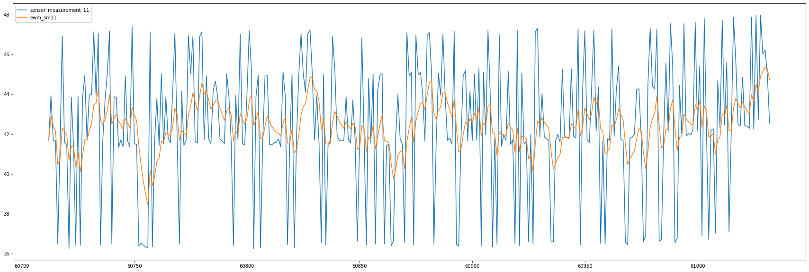
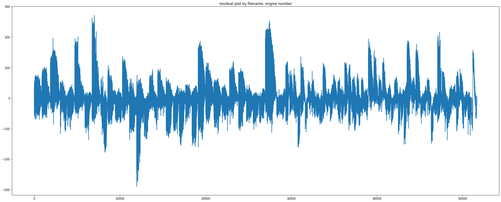
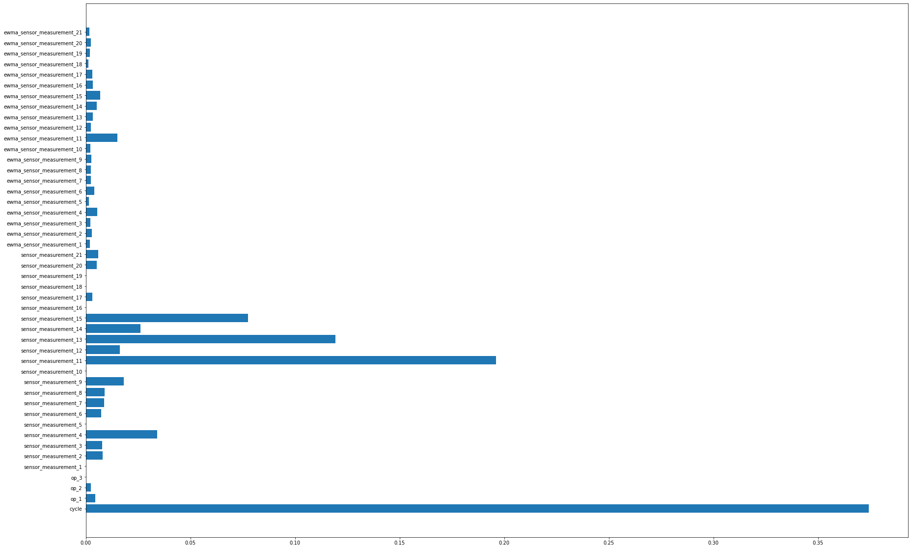

## Improving Models

### Feature Processing 

We considered some amendments to the features of our model which may improve performance. 

1. We noted in our EDA that operational setting appears to interact with some of the sensor measurements
  * Creating a feature cross operational setting 1 and sensor measurement 11 (our two most useful features cycle number aside)
2. In our regression problem we used RUL as our dependent variable.
  * We notice our errors are much higher for early cycles due to the fact these predictions are far further into the future, because we're using mean squared loss this means we adjust the model parameters more for these early cycles.
  * A log transform on the RUL feature would enable us to have all errors be on the same scale meaning all errors are treated equally.
3. Our model as is doesn't use any previous cycle information to inform our current predictions, this seems like we're missing out on significant valuable information to leverage for predictions. The variation through time of different features could well help us improve our predictions.
  * A smoothed sensor measurement may help the model avoid over fitting to noisy variations in the sensor measurements and has a notion of where the sensor measurement has been over time
  * exponential moving averages are an excellent way to do this, we can see the smoothed (yellow) line below provides a less noisy picture of the sensor measurement
  * If this approach, including sensor measurement history, provides more information then our model should have better accuracy.

#### Spoiler alert
As is often the case the "intuition" above didn't actually lead to a significantly improved performance when a model was trained and tested out of sample.

### Using pandas to calculate EMWA features 
* A similar approach was taken to calculate the feature product, if successful this could easily be converted to Spark DataFrames as the API is so similar.

```python
sensor_cols = [c for c in df.columns if 'sensor' in c]
```


```python
df["ewm_sm11"] = df.groupby(['filename', 'unit_number'])['sensor_measurement_11'].apply(lambda d: d.ewm(alpha=.2).mean())
```

Plot of sensor measurement alongside EWMA (yellow)
```python
fig, ax = plt.subplots(figsize=(30, 10))
df.loc[(df.filename == 'train_FD004.txt') & (df.unit_number == 1), ['sensor_measurement_11', 'ewm_sm11']].plot(ax=ax)
```

    

    

```python
df[['ewma_' + c for c in sensor_cols]] = df.groupby(['filename', 'unit_number'])[sensor_cols].apply(lambda d: d.ewm(alpha=.2).mean())
```


```python
x_test
```


<div>
<style scoped>
    .dataframe tbody tr th:only-of-type {
        vertical-align: middle;
    }

    .dataframe tbody tr th {
        vertical-align: top;
    }

    .dataframe thead th {
        text-align: right;
    }
</style>
<table border="1" class="dataframe">
  <thead>
    <tr style="text-align: right;">
      <th></th>
      <th>cycle</th>
      <th>op_1</th>
      <th>op_2</th>
      <th>op_3</th>
      <th>sensor_measurement_1</th>
      <th>sensor_measurement_2</th>
      <th>sensor_measurement_3</th>
      <th>sensor_measurement_4</th>
      <th>sensor_measurement_5</th>
      <th>sensor_measurement_6</th>
      <th>...</th>
      <th>ewma_sensor_measurement_12</th>
      <th>ewma_sensor_measurement_13</th>
      <th>ewma_sensor_measurement_14</th>
      <th>ewma_sensor_measurement_15</th>
      <th>ewma_sensor_measurement_16</th>
      <th>ewma_sensor_measurement_17</th>
      <th>ewma_sensor_measurement_18</th>
      <th>ewma_sensor_measurement_19</th>
      <th>ewma_sensor_measurement_20</th>
      <th>ewma_sensor_measurement_21</th>
    </tr>
  </thead>
  <tbody>
    <tr>
      <th>33966</th>
      <td>1</td>
      <td>20.0064</td>
      <td>0.7005</td>
      <td>100.0</td>
      <td>491.19</td>
      <td>606.99</td>
      <td>1481.38</td>
      <td>1244.70</td>
      <td>9.35</td>
      <td>13.63</td>
      <td>...</td>
      <td>316.120000</td>
      <td>2388.090000</td>
      <td>8061.990000</td>
      <td>9.157500</td>
      <td>0.020000</td>
      <td>364.000000</td>
      <td>2324.000000</td>
      <td>100.000000</td>
      <td>24.500000</td>
      <td>14.671500</td>
    </tr>
    <tr>
      <th>65237</th>
      <td>1</td>
      <td>25.0071</td>
      <td>0.6200</td>
      <td>60.0</td>
      <td>462.54</td>
      <td>536.12</td>
      <td>1259.83</td>
      <td>1051.85</td>
      <td>7.05</td>
      <td>9.02</td>
      <td>...</td>
      <td>164.490000</td>
      <td>2028.270000</td>
      <td>7868.750000</td>
      <td>10.878300</td>
      <td>0.020000</td>
      <td>307.000000</td>
      <td>1915.000000</td>
      <td>84.930000</td>
      <td>14.160000</td>
      <td>8.612000</td>
    </tr>
    <tr>
      <th>80361</th>
      <td>1</td>
      <td>0.0008</td>
      <td>0.0005</td>
      <td>100.0</td>
      <td>518.67</td>
      <td>642.04</td>
      <td>1584.20</td>
      <td>1398.13</td>
      <td>14.62</td>
      <td>21.61</td>
      <td>...</td>
      <td>522.240000</td>
      <td>2388.000000</td>
      <td>8138.400000</td>
      <td>8.420700</td>
      <td>0.030000</td>
      <td>391.000000</td>
      <td>2388.000000</td>
      <td>100.000000</td>
      <td>38.960000</td>
      <td>23.320500</td>
    </tr>
    <tr>
      <th>107813</th>
      <td>1</td>
      <td>0.0018</td>
      <td>-0.0001</td>
      <td>100.0</td>
      <td>518.67</td>
      <td>642.19</td>
      <td>1585.49</td>
      <td>1401.55</td>
      <td>14.62</td>
      <td>21.61</td>
      <td>...</td>
      <td>521.920000</td>
      <td>2388.000000</td>
      <td>8136.140000</td>
      <td>8.411100</td>
      <td>0.030000</td>
      <td>391.000000</td>
      <td>2388.000000</td>
      <td>100.000000</td>
      <td>38.910000</td>
      <td>23.489600</td>
    </tr>
    <tr>
      <th>33967</th>
      <td>2</td>
      <td>25.0065</td>
      <td>0.6200</td>
      <td>60.0</td>
      <td>462.54</td>
      <td>536.31</td>
      <td>1257.76</td>
      <td>1032.93</td>
      <td>7.05</td>
      <td>9.01</td>
      <td>...</td>
      <td>232.025556</td>
      <td>2188.173333</td>
      <td>7959.523333</td>
      <td>10.092111</td>
      <td>0.020000</td>
      <td>331.222222</td>
      <td>2096.777778</td>
      <td>91.627778</td>
      <td>18.833333</td>
      <td>11.285611</td>
    </tr>
    <tr>
      <th>...</th>
      <td>...</td>
      <td>...</td>
      <td>...</td>
      <td>...</td>
      <td>...</td>
      <td>...</td>
      <td>...</td>
      <td>...</td>
      <td>...</td>
      <td>...</td>
      <td>...</td>
      <td>...</td>
      <td>...</td>
      <td>...</td>
      <td>...</td>
      <td>...</td>
      <td>...</td>
      <td>...</td>
      <td>...</td>
      <td>...</td>
      <td>...</td>
    </tr>
    <tr>
      <th>101635</th>
      <td>139</td>
      <td>20.0065</td>
      <td>0.7017</td>
      <td>100.0</td>
      <td>491.19</td>
      <td>607.98</td>
      <td>1490.51</td>
      <td>1265.98</td>
      <td>9.35</td>
      <td>13.66</td>
      <td>...</td>
      <td>305.829646</td>
      <td>2384.783735</td>
      <td>8084.442496</td>
      <td>9.118041</td>
      <td>0.026276</td>
      <td>362.336446</td>
      <td>2295.636961</td>
      <td>99.862506</td>
      <td>23.366549</td>
      <td>14.036026</td>
    </tr>
    <tr>
      <th>101636</th>
      <td>140</td>
      <td>41.9993</td>
      <td>0.8400</td>
      <td>100.0</td>
      <td>445.00</td>
      <td>550.30</td>
      <td>1360.81</td>
      <td>1142.61</td>
      <td>3.91</td>
      <td>5.72</td>
      <td>...</td>
      <td>270.697717</td>
      <td>2385.372988</td>
      <td>8083.195996</td>
      <td>9.188713</td>
      <td>0.025021</td>
      <td>356.469157</td>
      <td>2278.909569</td>
      <td>99.890004</td>
      <td>20.771239</td>
      <td>12.509141</td>
    </tr>
    <tr>
      <th>101637</th>
      <td>141</td>
      <td>35.0052</td>
      <td>0.8408</td>
      <td>100.0</td>
      <td>449.44</td>
      <td>556.43</td>
      <td>1375.70</td>
      <td>1148.86</td>
      <td>5.48</td>
      <td>8.00</td>
      <td>...</td>
      <td>253.050174</td>
      <td>2385.898390</td>
      <td>8078.644797</td>
      <td>9.238030</td>
      <td>0.024017</td>
      <td>352.575325</td>
      <td>2267.727655</td>
      <td>99.912004</td>
      <td>19.560992</td>
      <td>11.779453</td>
    </tr>
    <tr>
      <th>101638</th>
      <td>142</td>
      <td>35.0032</td>
      <td>0.8400</td>
      <td>100.0</td>
      <td>449.44</td>
      <td>556.60</td>
      <td>1370.08</td>
      <td>1138.94</td>
      <td>5.48</td>
      <td>8.00</td>
      <td>...</td>
      <td>238.960139</td>
      <td>2386.326712</td>
      <td>8075.945838</td>
      <td>9.277984</td>
      <td>0.023213</td>
      <td>349.260260</td>
      <td>2258.782124</td>
      <td>99.929603</td>
      <td>18.574793</td>
      <td>11.175702</td>
    </tr>
    <tr>
      <th>101639</th>
      <td>143</td>
      <td>9.9984</td>
      <td>0.2500</td>
      <td>100.0</td>
      <td>489.05</td>
      <td>606.05</td>
      <td>1513.93</td>
      <td>1326.79</td>
      <td>10.52</td>
      <td>15.50</td>
      <td>...</td>
      <td>265.278111</td>
      <td>2386.753370</td>
      <td>8085.588670</td>
      <td>9.170227</td>
      <td>0.024571</td>
      <td>353.808208</td>
      <td>2270.825699</td>
      <td>99.943682</td>
      <td>20.523835</td>
      <td>12.330022</td>
    </tr>
  </tbody>
</table>
<p>51666 rows × 46 columns</p>
</div>


```python
x_train, x_test = df.loc[is_train, features + ['ewma_' + c for c in sensor_cols]], df.loc[is_test, features + ['ewma_' + c for c in sensor_cols]]
y_train, y_test = df.loc[is_train, 'failure_cycle'],  df.loc[is_test, 'failure_cycle']
```


```python
from sklearn.ensemble import RandomForestRegressor
```


Note because we have some RUL = 0 we use 
$$log(1+x)$$ 
To move RUL to consistent scale.

```python
cls_log = RandomForestRegressor(n_jobs=-1, n_estimators=40, )
cls_log = cls_log.fit(x_train, np.log1p(y_train))
```


```python
mean_squared_error(y_train, np.expm1(cls_log.predict(x_train)), squared=False)
```


    17.616184283965097

Performance on the evaluation set is very similar to our original EDA model so our changes haven't improved things.

```python
mean_squared_error(y_test, np.expm1(cls_log.predict(x_test)), squared=False)
```

    46.028908973942585


```python
residuals2 = y_test.values - np.expm1(cls_log.predict(x_test))
```
We note a similar residual pattern


```python
fig, ax = plt.subplots(figsize=(30, 12))
ax.plot(residuals2)
_ = ax.set_title('residual plot by filename, engine number')
```


    

    
We can see the EWMA features have pretty low importance for the model.


```python
fig, ax = plt.subplots(figsize=(30, 20))
ax.barh( features + ['ewma_' + c for c in sensor_cols], cls_log.feature_importances_)
```



    

