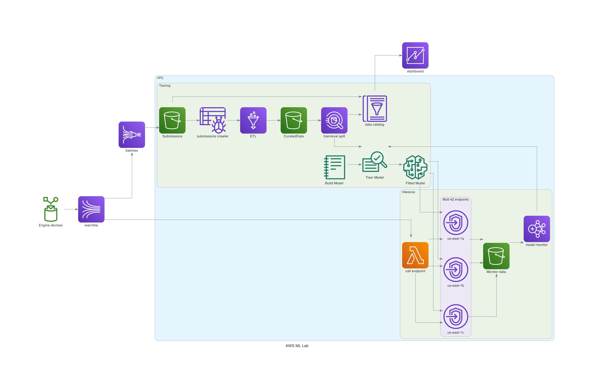

## Data Ingestion and Transformation

Given the multiple engines contained in the dataset one could envisage a scenario where device data arrived in real-time as engine testing is conducted.

To simulate this setup the dataset was published to a kinesis firehose endpoint, data is buffered as it arrives and is written to S3 in batches. 

In a production solution a customer could leverage AWS IOT Core to publish data from devices in the cloud and use an IOT Rule to forward data onto a kinesis data stream. Our firehose solution could easily consume from this stream. In the interests of expediency this project simulates the above using a simple python script running on a Cloud9 instance to publish the data.

As batches of fireshose data arrive in S3 a glue crawler is configured to discover the dataset's metadata, this is added to the glue data catalog which enables data preparation jobs to run against the discovered schema. The crawler could at a frequency as low as 5 minutes, enabling our system to provide soft real-time experience for users of the system. 

### Project architecture diagram

