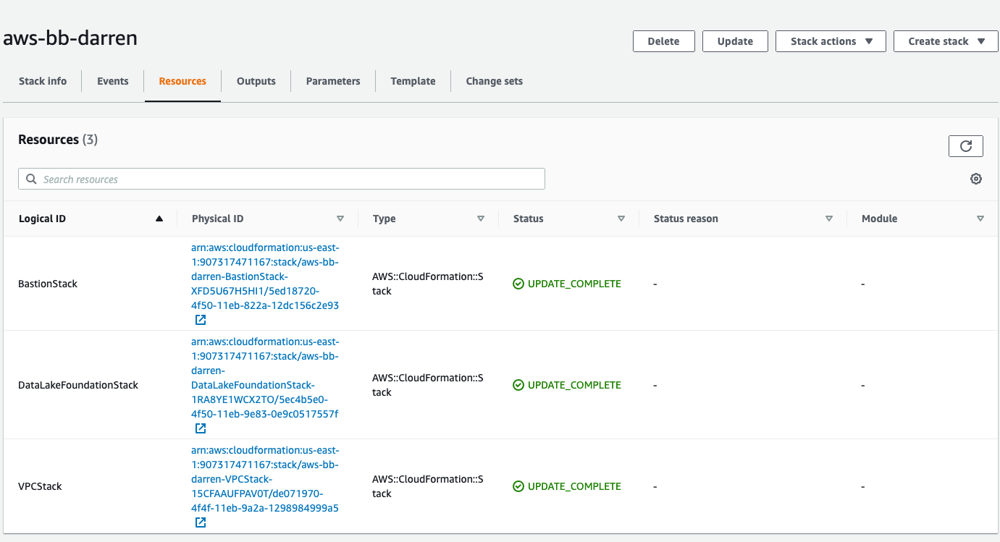
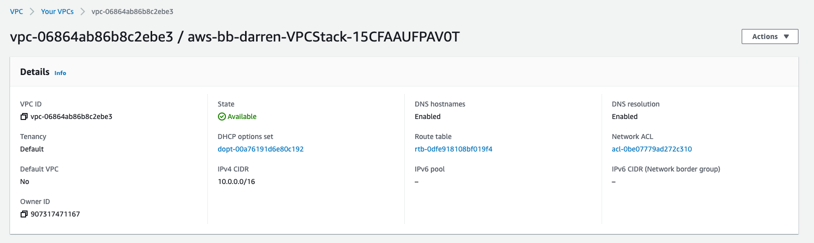
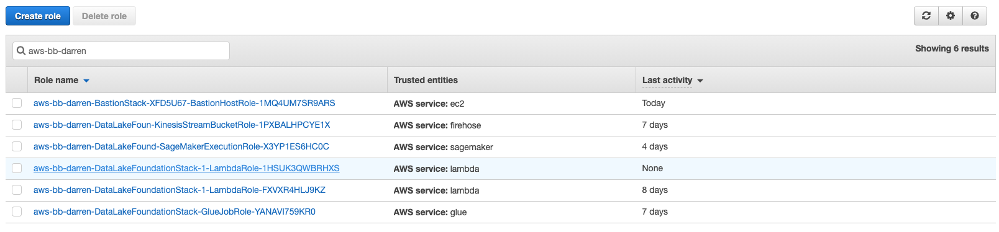
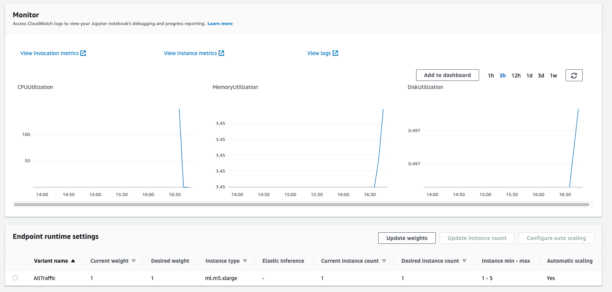
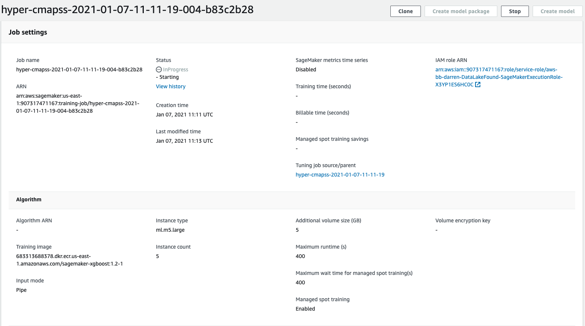
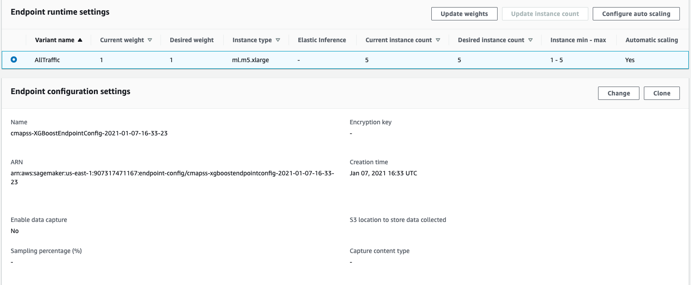

## Machine Learning Implementation / Operations & Well-Architected

### Deployment

* Core services deployed using CloudFormation per Well-Architected best practices.



### Security

#### VPC

* All services deployed inside a regional VPC.



* Supports control over ingress and egress of data and models.
* Sagemaker notebooks can be restricted from access the internet.
* Endpoint access can be limited to VPC interface endpoint

#### IAM

Following the principle of least privilege several individual roles were created to perform the task require for our ML pipeline.
Each role has permissions sufficient only to access data/services required for the tasks performed, allowing the control of different roles to vary as necessary for our project.
* Our firehose role can only write raw data to our S3 raw data bucket
* The Glue role can read this bucket and create new datasets in our "curated-dataset" bucket, this role can also run crawlers and glue jobs.
* The SageMaker role interacts with SageMaker and can submit training job and create inference endpoints.




## Model endpoint setup

We've trained several models:
1. A basic Sagemaker model with default hyper parameters
2. Many models under and SageMaker hyper parameter optimization job

We now want to make our trained model available to for real time inference, we envisage the scenario where engine testing is being conducted continuously and we'd like to leverage our best model to predict how many remaining useful cycles (RUL) each engine has. To facilitate this use case we proceed along the following lines. 

1. Create basic model endpoint config
2. Deploy model to endpoint
3. Perform inference against test data over http and evaluate performance
4. Update endpoint config to be highly available across multiple AZs
5. Setup autoscaling rule based on invocations of the endpoint

The above setup will provide a model endpoint which scales up to respond to higher levels of requests and scales down accordingly.

### Set up hosting for the model
In order to set up hosting, we have to import the model from training to hosting. 

### Import model into hosting

Register the model with hosting. This allows the flexibility of importing models trained elsewhere.


#### Deploy best model endpoint

```python
%%time
import boto3
from time import gmtime, strftime
# Best performing model across all those trained
job_name = "hyper-cmapss-2021-01-07-16-04-50-037-efc6d79a"
model_name = f"{job_name}-model"
print(model_name)

info = client.describe_training_job(TrainingJobName=job_name)
model_data = info["ModelArtifacts"]["S3ModelArtifacts"]
print(model_data)

primary_container = {"Image": container, "ModelDataUrl": model_data}

create_model_response = client.create_model(
    ModelName=model_name, ExecutionRoleArn=role, PrimaryContainer=primary_container
)

print(create_model_response["ModelArn"])
```

    hyper-cmapss-2021-01-07-16-04-50-037-efc6d79a-model
    s3://datalake-published-data-907317471167-us-east-1-pjkrtzr/sagemaker/cmapss-xgboost/hyper-xgboost/hyper-cmapss-2021-01-07-16-04-50-037-efc6d79a/output/model.tar.gz
    arn:aws:sagemaker:us-east-1:907317471167:model/hyper-cmapss-2021-01-07-16-04-50-037-efc6d79a-model
    CPU times: user 21.2 ms, sys: 0 ns, total: 21.2 ms
    Wall time: 488 ms


### Create endpoint configuration

SageMaker supports configuring REST endpoints in hosting with multiple models, e.g. for A/B testing purposes. In order to support this, customers create an endpoint configuration, that describes the distribution of traffic across the models, whether split, shadowed, or sampled in some way. In addition, the endpoint configuration describes the instance type required for model deployment.

This initial configuration only leverages a single instance which isn't best practice for production, we'll address that in our auto scaling config.

```python
from time import gmtime, strftime

endpoint_config_name = f"cmapss-XGBoostEndpointConfig-{strftime('%Y-%m-%d-%H-%M-%S', gmtime())}"
print(endpoint_config_name)
create_endpoint_config_response = client.create_endpoint_config(
    EndpointConfigName=endpoint_config_name,
    ProductionVariants=[
        {
            "InstanceType": "ml.t3.medium",
            "InitialVariantWeight": 1,
            "InitialInstanceCount": 1,
            "ModelName": model_name,
            "VariantName": "AllTraffic",
        }
    ],
)

print(f"Endpoint Config Arn: {create_endpoint_config_response['EndpointConfigArn']}")
```

    cmapss-XGBoostEndpointConfig-2021-01-07-16-33-23
    Endpoint Config Arn: arn:aws:sagemaker:us-east-1:907317471167:endpoint-config/cmapss-xgboostendpointconfig-2021-01-07-16-33-23


### Create endpoint
Lastly, the customer creates the endpoint that serves up the model, through specifying the name and configuration defined above. The end result is an endpoint that can be validated and incorporated into production applications. This takes 9-11 minutes to complete.


```python
%%time
import time

endpoint_name = f'cmapss-XGBoostEndpoint-{strftime("%Y-%m-%d-%H-%M-%S", gmtime())}'
print(endpoint_name)
create_endpoint_response = client.create_endpoint(
    EndpointName=endpoint_name, EndpointConfigName=endpoint_config_name
)
print(create_endpoint_response["EndpointArn"])

resp = client.describe_endpoint(EndpointName=endpoint_name)
status = resp["EndpointStatus"]
while status == "Creating":
    print(f"Status: {status}")
    time.sleep(60)
    resp = client.describe_endpoint(EndpointName=endpoint_name)
    status = resp["EndpointStatus"]

print(f"Status: {status}")
```

    cmapss-XGBoostEndpoint-2021-01-07-16-33-42
    arn:aws:sagemaker:us-east-1:907317471167:endpoint/cmapss-xgboostendpoint-2021-01-07-16-33-42
    Status: Creating
    Status: Creating
    ...
    Status: InService 

### Setup auto scaling

Notice we set a minimum capacity of 3 instances, this will provide high availability for up to a two availability zone failure.
The endpoint will add additional endpoint up until a maximum of 5 total instances.

```python
client = boto3.client('application-autoscaling')

resource_id='endpoint/' + endpoint_name + '/variant/' + 'AllTraffic' # This is the format in which application autoscaling references the endpoint

response = client.register_scalable_target(
    ServiceNamespace='sagemaker', #
    ResourceId=resource_id,
    ScalableDimension='sagemaker:variant:DesiredInstanceCount',
    MinCapacity=1,
    MaxCapacity=5
)

# SageMakerVariantInvocationsPerInstance Metric
response = client.put_scaling_policy(
    PolicyName='Invocations-ScalingPolicy',
    ServiceNamespace='sagemaker', # The namespace of the AWS service that provides the resource. 
    ResourceId=resource_id, # Endpoint name 
    ScalableDimension='sagemaker:variant:DesiredInstanceCount', # SageMaker supports only Instance Count
    PolicyType='TargetTrackingScaling', # 'StepScaling'|'TargetTrackingScaling'
    TargetTrackingScalingPolicyConfiguration={
        'TargetValue': 10.0, # The target value for the metric. - here the metric is - SageMakerVariantInvocationsPerInstance
        'PredefinedMetricSpecification': {
            'PredefinedMetricType': 'SageMakerVariantInvocationsPerInstance', # is the average number of times per minute that each instance for a variant is invoked. 
        },
        'ScaleInCooldown': 600, # The cooldown period helps you prevent your Auto Scaling group from launching or terminating 
                                # additional instances before the effects of previous activities are visible. 
                                # You can configure the length of time based on your instance startup time or other application needs.
                                # ScaleInCooldown - The amount of time, in seconds, after a scale in activity completes before another scale in activity can start. 
        'ScaleOutCooldown': 30 # ScaleOutCooldown - The amount of time, in seconds, after a scale out activity completes before another scale out activity can start.
        
        # 'DisableScaleIn': True|False - ndicates whether scale in by the target tracking policy is disabled. 
                            # If the value is true , scale in is disabled and the target tracking policy won't remove capacity from the scalable resource.
    }
)

                      
```

### Validate the model for use
Finally, the customer can now validate the model for use. They can obtain the endpoint from the client library using the result from previous operations, and generate predictions from the trained model using that endpoint.

```python
runtime_client = boto3.client("runtime.sagemaker", region_name=region)
```

```python
import json
from itertools import islice
import math
import struct
```


```python
import pandas as pd
```


```python
import sys
import math


def do_predict(data, endpoint_name, content_type):
    payload = "\n".join(data)
    response = runtime_client.invoke_endpoint(
        EndpointName=endpoint_name, ContentType=content_type, Body=payload
    )
    result = response["Body"].read()
    result = result.decode("utf-8")
    result = result.split(",")
    preds = [float((num)) for num in result]
    preds = [math.ceil(num) for num in preds]
    return preds


def batch_predict(data, batch_size, endpoint_name, content_type):
    items = len(data)
    arrs = []

    for offset in range(0, items, batch_size):
        if offset + batch_size < items:
            results = do_predict(data[offset : (offset + batch_size)], endpoint_name, content_type)
            arrs.extend(results)
        else:
            arrs.extend(do_predict(data[offset:items], endpoint_name, content_type))
        sys.stdout.write(".")
    return arrs
```


```python
from sklearn.metrics import mean_squared_error
```


```python
! cat /home/ec2-user/SageMaker/aws-bb-cmapss/data/test_FD001.txt | cut -d ' ' -f2- > cmapss.test.1
! cat /home/ec2-user/SageMaker/aws-bb-cmapss/data/test_FD002.txt | cut -d ' ' -f2- > cmapss.test.2
! cat /home/ec2-user/SageMaker/aws-bb-cmapss/data/test_FD003.txt | cut -d ' ' -f2- > cmapss.test.3
! cat /home/ec2-user/SageMaker/aws-bb-cmapss/data/test_FD004.txt | cut -d ' ' -f2- > cmapss.test.4
```


```python
all_y_true = []
all_preds = []

for i in range(1, 5):
    filename = f'cmapss.test.{i}'
    test_file_name = f'test_FD00{i}.txt'
    test_rul_name = f'RUL_FD00{i}.txt'
    test_data = pd.read_csv(f"/home/ec2-user/SageMaker/aws-bb-cmapss/data/{test_file_name}", header=None, delimiter=' ')

    labels = pd.read_csv(f"/home/ec2-user/SageMaker/aws-bb-cmapss/data/{test_rul_name}", names=['remaining_cycles'])
    labels.index += 1
    labels = labels.reset_index()
    labels = labels.rename(columns={'index' : 0})
    labels = test_data.groupby(0)[1].max().reset_index().merge(labels, left_on=0, right_on=0)
    labels['max_cycles'] = labels[1] + labels['remaining_cycles']

    test_data = test_data.merge(labels[[0, 'max_cycles']], left_on=0, right_on=0)

    test_data['RUL'] = test_data['max_cycles'] - test_data[1]
    with open(filename, "r") as f:
        payload = f.read().strip()

    y_true = test_data['RUL'].to_list()
    inference_data = [line.strip() for line in payload.split("\n")]
    preds = batch_predict(inference_data, 100, endpoint_name, "text/csv")
    
    all_y_true.extend(y_true)
    all_preds.extend(preds)
```

```python
len(all_y_true), len(all_preds)
```
    (104897, 104897)
```python
mean_squared_error(all_y_true, all_preds, squared=False)
```
    57.257269505265484

### Auto Scaling endpoints

After these many invocations we see a scale up in our endpoints

Initially a single instance (before we changed the endpoint config)


Send many requests to end point 


Endpoint scales up based on many invocations





### Delete Endpoint
Once you are done using the endpoint, you can use the following to delete it. 


```python
client.delete_endpoint(EndpointName=endpoint_name)
```

