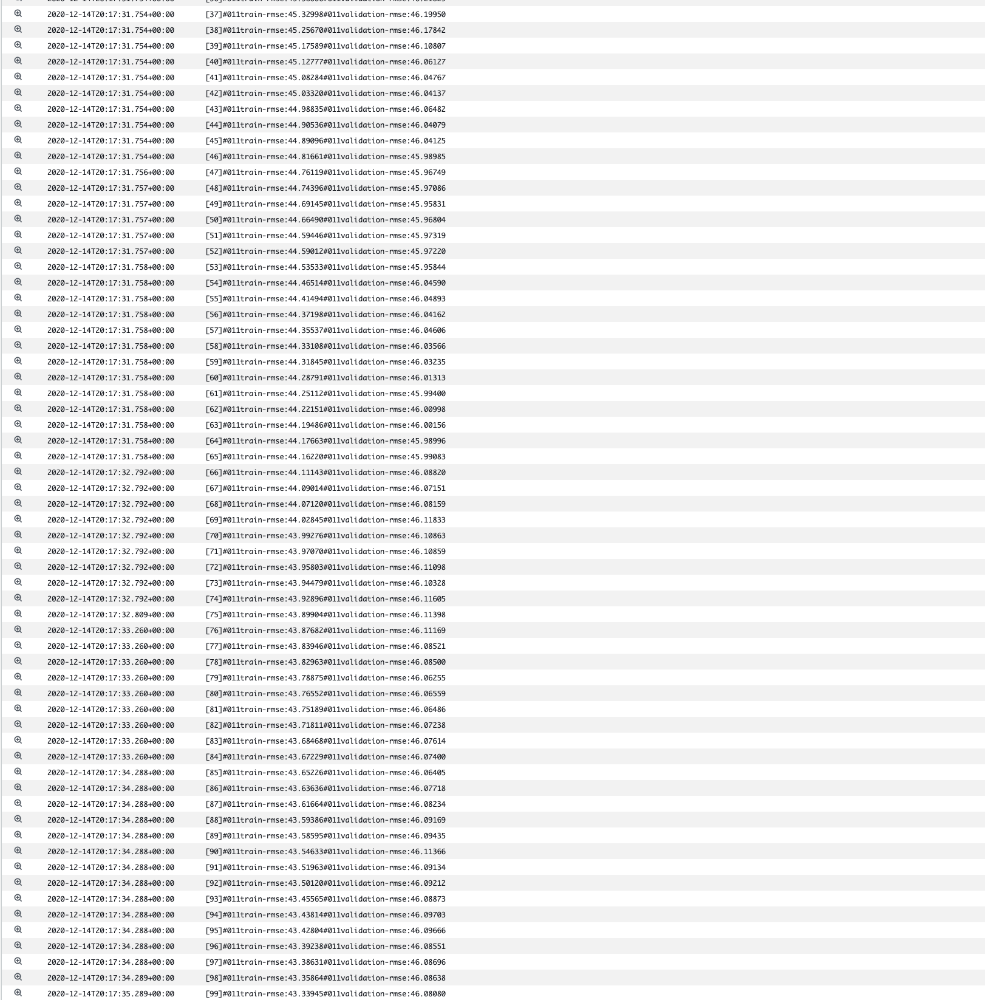

## Training Models

### Preparing the training data

* Our glue job have produced a dataset with the required labels in parquet format on S3, this data is available in our curated-datasets database in the data catalog.
* We now leverage Athena to create training/eval data.
    * We use a CTAS query to create a new training dataset to be used by SageMaker
    * This dataset is saved to our "published" bucket, a separate location specifically for the ML part of our project workflow.
    * We partition the data at the top level based on "validation" or "train" which provides paths for the train/validation channels.
    * Using Athena for this is a scalable solution as we can easily scale this approach up across more data.
* An important consideration for this dataset is how we split data between train and evaluation.
    * As our data has significant serial correlation, for a unique engine late cycles depend on earlier cycles, specifically the RUL for a given observation is linearly related to the RUL for all other cycles based on the difference between their cycle number.
    * For this reason its important to ensure our training data doesn't pollute the evaluation data, a few strategies are available.
        1. Ensure no training data for a given engine has a cycle number _higher_ than that in the evaulation set and no evaluation data for a given engine has a cycle number _lower_
than any cycle in the training set.
        2. Partition training and evaluation data so no single engine appears in either dataset. (This was the strategy we went for)

```
CREATE TABLE "datalake_curated_datasets"."cmaps_rul_train_validation"
WITH ( 
  format = 'TEXTFILE', 
  field_delimiter = ',', 
  external_location = 's3://datalake-published-data-907317471167-us-east-1-gismq40/cmaps-ml2', 
  partitioned_by = ARRAY['split', 'year', 'month', 'day', 'hour']
  ) AS
SELECT failure_cycle,
         cycle,
         op_1,
         op_2,
         op_3,
         sensor_measurement_1 ,
         sensor_measurement_2 ,
         sensor_measurement_3 ,
         sensor_measurement_4 ,
         sensor_measurement_5 ,
         sensor_measurement_6 ,
         sensor_measurement_7 ,
         sensor_measurement_8 ,
         sensor_measurement_9 ,
         sensor_measurement_10 ,
         sensor_measurement_11 ,
         sensor_measurement_12 ,
         sensor_measurement_13 ,
         sensor_measurement_14 ,
         sensor_measurement_15 ,
         sensor_measurement_16 ,
         sensor_measurement_17 ,
         sensor_measurement_18 ,
         sensor_measurement_19 ,
         sensor_measurement_20,
         sensor_measurement_21,        
    CASE unit_number % 3
    WHEN 0 THEN
    'validation'
    ELSE 'train'
    END AS split, year, month, day, hour
FROM "datalake_curated_datasets"."datalake_curated_datasets_907317471167_us_east_1_gismq40"
WHERE hour = '08'
```

### A single Sagemaker training job
We use the training data to train a single Sagemaker model, our objective is to reproduce the result from the EDA section. Subsequently we'll do bayesian hyperparameter optimisation to find a the best set of hyperparameters for our job. 

```python
%%time

import os
import boto3
import re
import sagemaker

role = sagemaker.get_execution_role()
region = boto3.Session().region_name
```

    CPU times: user 833 ms, sys: 71.6 ms, total: 905 ms
    Wall time: 1.97 s


```python
data_bucket = f"datalake-published-data-907317471167-us-east-1-gismq40"
data_prefix = "cmaps-ml2"
train_prefix = "split=train/year=2020/month=12/day=14/hour=19"
eval_prefix = "split=validation/year=2020/month=12/day=14/hour=19"
data_bucket_path = f"s3://{data_bucket}"
output_prefix = "sagemaker/cmapss-xgboost"
output_bucket_path = f"s3://{data_bucket}"
```


```python
from sagemaker.image_uris import retrieve
```


```python
from sagemaker.amazon.amazon_estimator import get_image_uri

container = retrieve(framework="xgboost", region=region, version="1.2-1")
```


Create a simple XGboost with fixed hyper parameters

```python
%%time
import boto3
from time import gmtime, strftime

job_name = f"cmapss-xgboost-regression-{strftime('%Y-%m-%d-%H-%M-%S', gmtime())}"
print("Training job", job_name)

create_training_params = {
    "AlgorithmSpecification": {"TrainingImage": container, "TrainingInputMode": "Pipe"},
    "RoleArn": role,
    "OutputDataConfig": {"S3OutputPath": f"{output_bucket_path}/{output_prefix}/single-xgboost"},
    "ResourceConfig": {"InstanceCount": 1, "InstanceType": "ml.m5.xlarge", "VolumeSizeInGB": 5},
    "TrainingJobName": job_name,
    "HyperParameters": {
        "max_depth": "5",
        "eta": "0.2",
        "gamma": "4",
        "min_child_weight": "6",
        "subsample": "0.7",
        "objective": "reg:squarederror",
        "num_round": "100",
    },
    "StoppingCondition": {"MaxRuntimeInSeconds": 3600},
    "InputDataConfig": [
        {
            "ChannelName": "train",
            "DataSource": {
                "S3DataSource": {
                    "S3DataType": "S3Prefix",
                    "S3Uri": f"{data_bucket_path}/{data_prefix}/{train_prefix}",
                    "S3DataDistributionType": "FullyReplicated",
                }
            },
            "ContentType": "text/csv",
            "CompressionType": "Gzip",
        },
        {
            "ChannelName": "validation",
            "DataSource": {
                "S3DataSource": {
                    "S3DataType": "S3Prefix",
                    "S3Uri": f"{data_bucket_path}/{data_prefix}/{eval_prefix}",
                    "S3DataDistributionType": "FullyReplicated",
                }
            },
            "ContentType": "text/csv",
            "CompressionType": "Gzip",
        },
    ],
}


client = boto3.client("sagemaker", region_name=region)
client.create_training_job(**create_training_params)

import time

status = client.describe_training_job(TrainingJobName=job_name)["TrainingJobStatus"]
print(status)
while status != "Completed" and status != "Failed":
    time.sleep(60)
    status = client.describe_training_job(TrainingJobName=job_name)["TrainingJobStatus"]
    print(status)
```

    Training job cmapss-xgboost-regression-2020-12-14-20-14-15
    InProgress
    InProgress
    InProgress
    InProgress
    Completed
    CPU times: user 90.6 ms, sys: 5.66 ms, total: 96.2 ms
    Wall time: 4min

Achieved RMSE is slightly better than our EDA random forest model with RMSE of 45.95 if we were to select the best iteration and use early stopping. I note the training performance diverges from the eval performance around iteration 60.




### Hyper parameter training job

Now we've managed to reproduce the performance of the MVM model in our EDA we can search hyperparameter space for a set of parameters which achieve the best out of sample performance. We use bayesian search and set variables to be explored on Log/Linear scale as appropriate.

```python
%%time

import os
import boto3
import re
import sagemaker

role = sagemaker.get_execution_role()
region = boto3.Session().region_name
```

    CPU times: user 40.6 ms, sys: 3.45 ms, total: 44 ms
    Wall time: 90 ms


```python
data_bucket = f"datalake-published-data-907317471167-us-east-1-pjkrtzr"
data_prefix = "cmaps-ml"
train_prefix = "split=train/year=2021"
eval_prefix = "split=validation/year=2021"
data_bucket_path = f"s3://{data_bucket}"
output_prefix = "sagemaker/cmapss-xgboost"
snapshot_prefix = "model_snapshots"
output_bucket_path = f"s3://{data_bucket}"
```


```python
from sagemaker.image_uris import retrieve
```


```python
from sagemaker.amazon.amazon_estimator import get_image_uri

container = retrieve(framework="xgboost", region=region, version="1.2-1")
```


```python
tuning_job_config = {
    "ParameterRanges": {
      "CategoricalParameterRanges": [],
      "ContinuousParameterRanges": [
        {
          "MaxValue": "1",
          "MinValue": "0.5",
          "Name": "subsample"
        },
        {
          "MaxValue": "1",
          "MinValue": "0",
          "Name": "eta",
        },
        {
          "MaxValue": "5",
          "MinValue": "0.0001",
          "Name": "lambda",
          "ScalingType" : "Logarithmic"
        },
        {
          "MaxValue": "5",
          "MinValue": "0.0001",
          "Name": "gamma",
          "ScalingType" : "Logarithmic"
        },
        {
          "MaxValue": "2",
          "MinValue": "0.0001",
          "Name": "alpha",
          "ScalingType" : "Logarithmic"
        },
        {
          "MaxValue": "100",
          "MinValue": "1",
          "Name": "min_child_weight",
          "ScalingType" : "Logarithmic"
        }
      ],
      "IntegerParameterRanges": [
        {
          "MaxValue": "100",
          "MinValue": "1",
          "Name": "max_depth",
          "ScalingType" : "Logarithmic"

        }        
      ]
    },
    "ResourceLimits": {
      "MaxNumberOfTrainingJobs": 500,
      "MaxParallelTrainingJobs": 10
    },
    "Strategy": "Bayesian",
    "HyperParameterTuningJobObjective": {
      "MetricName": "validation:rmse",
      "Type": "Minimize"
    }
  }
```


### Spot Training

Note for these many training jobs we use Spot training to reduce costs, this requires a boolean, a wait time which is how long we are willing to wait for spot instance to be available and a checkpoint s3 location for checkpoints in case our jobs are interrupted.

```python
# Ensure that the training and validation data folders generated above are reflected in the "InputDataConfig" parameter below.

create_training_params = {
    "AlgorithmSpecification": {"TrainingImage": container, "TrainingInputMode": "Pipe"},
    "RoleArn": role,
    "OutputDataConfig": {
        "S3OutputPath": f"{output_bucket_path}/{output_prefix}/hyper-xgboost"
    },
    "ResourceConfig": {"InstanceCount": 1, "InstanceType": "ml.m5.large", "VolumeSizeInGB": 5},
    "StaticHyperParameters": {
        "objective": "reg:squarederror",
        "num_round": "120",
    },
    "StoppingCondition": {"MaxRuntimeInSeconds": 7200},
    "InputDataConfig": [
        {
            "ChannelName": "train",
            "DataSource": {
                "S3DataSource": {
                    "S3DataType": "S3Prefix",
                    "S3Uri": f"{data_bucket_path}/{data_prefix}/{train_prefix}",
                    "S3DataDistributionType": "FullyReplicated",
                }
            },
            "ContentType": "text/csv",
            "CompressionType": "Gzip",
        },
        {
            "ChannelName": "validation",
            "DataSource": {
                "S3DataSource": {
                    "S3DataType": "S3Prefix",
                    "S3Uri": f"{data_bucket_path}/{data_prefix}/{eval_prefix}",
                    "S3DataDistributionType": "FullyReplicated",
                }
            },
            "ContentType": "text/csv",
            "CompressionType": "Gzip",
        },
    ],
    "StoppingCondition" : {
            "MaxWaitTimeInSeconds": 400,
            "MaxRuntimeInSeconds": 400,
    },
    "EnableManagedSpotTraining" : True,
    "CheckpointConfig" : {
            "S3Uri" : f"{output_bucket_path}/{snapshot_prefix}",
    }
}
```


```python
%%time
import boto3
from time import gmtime, strftime

job_name = f"hyper-cmapss-{strftime('%Y-%m-%d-%H-%M-%S', gmtime())}"
print("Training job", job_name)

client = boto3.client("sagemaker", region_name=region)
client.create_hyper_parameter_tuning_job(HyperParameterTuningJobName = job_name,
                                           HyperParameterTuningJobConfig = tuning_job_config,
                                           TrainingJobDefinition = create_training_params)

import time

status = client.describe_hyper_parameter_tuning_job(HyperParameterTuningJobName=job_name)["HyperParameterTuningJobStatus"]
print(status)
while status != "Completed" and status != "Failed":
    time.sleep(60)
    status = client.describe_hyper_parameter_tuning_job(HyperParameterTuningJobName=job_name)["HyperParameterTuningJobStatus"]
    print(status)
```

### Distributed Training

Unnecessary in this toy example due to the small data size (it actually takes much longer to train). Over time if our dataset size grew considerably we could enable Distributed training by increasing our instance count as appropriate. This is algorithm dependent as we can also scale the instance type vertically.

Due to quota issues on the number of spot instances I can run on my account (20) I set this to 2 as below. I learnt that of course the number of parallel hyper parameters jobs and the instance count are multiplied to calculate this number 

$$ Max Spot instance quota = (Parallel Hyper parameter jobs * Instance Count) = 10 * 2 = 20.$$

```
create_training_params = {
    "AlgorithmSpecification": {"TrainingImage": container, "TrainingInputMode": "Pipe"},
    "RoleArn": role,
    "OutputDataConfig": {
        "S3OutputPath": f"{output_bucket_path}/{output_prefix}/hyper-xgboost"
    },
    ### SET BELOW
    "ResourceConfig": {"InstanceCount": 2, "InstanceType": "ml.m5.large", "VolumeSizeInGB": 5},
    "StaticHyperParameters": {
        "objective": "reg:squarederror",
        "num_round": "120",
    },
    "StoppingCondition": {"MaxRuntimeInSeconds": 7200},
    "InputDataConfig": [
        {
            "ChannelName": "train",
            "DataSource": {
                "S3DataSource": {
                    "S3DataType": "S3Prefix",
                    "S3Uri": f"{data_bucket_path}/{data_prefix}/{train_prefix}",
                    "S3DataDistributionType": "FullyReplicated",
                }
            },
            "ContentType": "text/csv",
            "CompressionType": "Gzip",
        },
        {
            "ChannelName": "validation",
            "DataSource": {
                "S3DataSource": {
                    "S3DataType": "S3Prefix",
                    "S3Uri": f"{data_bucket_path}/{data_prefix}/{eval_prefix}",
                    "S3DataDistributionType": "FullyReplicated",
                }
            },
            "ContentType": "text/csv",
            "CompressionType": "Gzip",
        },
    ],
    "StoppingCondition" : {
            "MaxWaitTimeInSeconds": 400,
            "MaxRuntimeInSeconds": 400,
    },
    "EnableManagedSpotTraining" : True,
    "CheckpointConfig" : {
            "S3Uri" : f"{output_bucket_path}/{snapshot_prefix}",
    }
}
```


