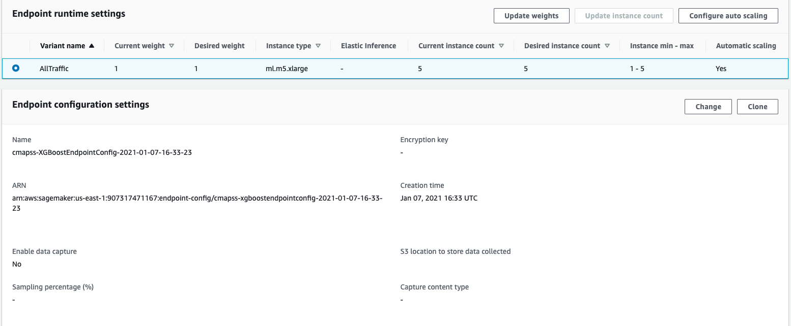

## Training Models
<details>
    <Summary>Click to expand</summary>

### Preparing the training data

* Our glue job have produced a dataset with the required labels in parquet format on S3.
* We can now leverage athena to create training/eval data, we could have used glue for this also.
    * We use a CTAS query to create a new training dataset to be used by SageMaker
* An important consideration for this dataset is how we split data between train and evaluation.
    * As our data has significant serial correlation, for a unique engine late cycles depend on earlier cycles, specifically the RUL for a given observation is linearly related to the RUL for all other cycles based on the difference between their cycle number.
    * For this reason its important to ensure our training data doesn't pollute the evaluation data, a few strategies are available.
        1. Ensure no training data for a given engine has a cycle number _higher_ than that in the evaulation set and no evaluation data for a given engine has a cycle number _lower_
than any cycle in the training set.
        2. Partition training and evaluation data so no single engine appears in either dataset. (This was the strategy we went for)

```
CREATE TABLE "datalake_curated_datasets"."cmaps_rul_train_validation"
WITH ( 
  format = 'TEXTFILE', 
  field_delimiter = ',', 
  external_location = 's3://datalake-published-data-907317471167-us-east-1-gismq40/cmaps-ml2', 
  partitioned_by = ARRAY['split', 'year', 'month', 'day', 'hour']
  ) AS
SELECT failure_cycle,
         cycle,
         op_1,
         op_2,
         op_3,
         sensor_measurement_1 ,
         sensor_measurement_2 ,
         sensor_measurement_3 ,
         sensor_measurement_4 ,
         sensor_measurement_5 ,
         sensor_measurement_6 ,
         sensor_measurement_7 ,
         sensor_measurement_8 ,
         sensor_measurement_9 ,
         sensor_measurement_10 ,
         sensor_measurement_11 ,
         sensor_measurement_12 ,
         sensor_measurement_13 ,
         sensor_measurement_14 ,
         sensor_measurement_15 ,
         sensor_measurement_16 ,
         sensor_measurement_17 ,
         sensor_measurement_18 ,
         sensor_measurement_19 ,
         sensor_measurement_20,
         sensor_measurement_21,        
    CASE unit_number % 3
    WHEN 0 THEN
    'validation'
    ELSE 'train'
    END AS split, year, month, day, hour
FROM "datalake_curated_datasets"."datalake_curated_datasets_907317471167_us_east_1_gismq40"
WHERE hour = '08'
```

### A single Sagemaker training job

```python
%%time

import os
import boto3
import re
import sagemaker

role = sagemaker.get_execution_role()
region = boto3.Session().region_name
```

    CPU times: user 833 ms, sys: 71.6 ms, total: 905 ms
    Wall time: 1.97 s


```python
data_bucket = f"datalake-published-data-907317471167-us-east-1-gismq40"
data_prefix = "cmaps-ml2"
train_prefix = "split=train/year=2020/month=12/day=14/hour=19"
eval_prefix = "split=validation/year=2020/month=12/day=14/hour=19"
data_bucket_path = f"s3://{data_bucket}"
output_prefix = "sagemaker/cmapss-xgboost"
output_bucket_path = f"s3://{data_bucket}"
```


```python
from sagemaker.image_uris import retrieve
```


```python
from sagemaker.amazon.amazon_estimator import get_image_uri

container = retrieve(framework="xgboost", region=region, version="1.2-1")
```


Create a simple XGboost with fixed hyper parameters

```python
%%time
import boto3
from time import gmtime, strftime

job_name = f"cmapss-xgboost-regression-{strftime('%Y-%m-%d-%H-%M-%S', gmtime())}"
print("Training job", job_name)

create_training_params = {
    "AlgorithmSpecification": {"TrainingImage": container, "TrainingInputMode": "Pipe"},
    "RoleArn": role,
    "OutputDataConfig": {"S3OutputPath": f"{output_bucket_path}/{output_prefix}/single-xgboost"},
    "ResourceConfig": {"InstanceCount": 1, "InstanceType": "ml.m5.xlarge", "VolumeSizeInGB": 5},
    "TrainingJobName": job_name,
    "HyperParameters": {
        "max_depth": "5",
        "eta": "0.2",
        "gamma": "4",
        "min_child_weight": "6",
        "subsample": "0.7",
        "objective": "reg:squarederror",
        "num_round": "100",
    },
    "StoppingCondition": {"MaxRuntimeInSeconds": 3600},
    "InputDataConfig": [
        {
            "ChannelName": "train",
            "DataSource": {
                "S3DataSource": {
                    "S3DataType": "S3Prefix",
                    "S3Uri": f"{data_bucket_path}/{data_prefix}/{train_prefix}",
                    "S3DataDistributionType": "FullyReplicated",
                }
            },
            "ContentType": "text/csv",
            "CompressionType": "Gzip",
        },
        {
            "ChannelName": "validation",
            "DataSource": {
                "S3DataSource": {
                    "S3DataType": "S3Prefix",
                    "S3Uri": f"{data_bucket_path}/{data_prefix}/{eval_prefix}",
                    "S3DataDistributionType": "FullyReplicated",
                }
            },
            "ContentType": "text/csv",
            "CompressionType": "Gzip",
        },
    ],
}


client = boto3.client("sagemaker", region_name=region)
client.create_training_job(**create_training_params)

import time

status = client.describe_training_job(TrainingJobName=job_name)["TrainingJobStatus"]
print(status)
while status != "Completed" and status != "Failed":
    time.sleep(60)
    status = client.describe_training_job(TrainingJobName=job_name)["TrainingJobStatus"]
    print(status)
```

    Training job cmapss-xgboost-regression-2020-12-14-20-14-15
    InProgress
    InProgress
    InProgress
    InProgress
    Completed
    CPU times: user 90.6 ms, sys: 5.66 ms, total: 96.2 ms
    Wall time: 4min

Achieved RMSE is slightly better than our EDA random forest model with RMSE of 45.95 if we were to select the best iteration and use early stopping. I note the training performance diverges from the eval performance around iteration 60.


### Set up hosting for the model
In order to set up hosting, we have to import the model from training to hosting. 

### Import model into hosting

Register the model with hosting. This allows the flexibility of importing models trained elsewhere.


```python
%%time
import boto3
from time import gmtime, strftime

model_name = f"{job_name}-model"
print(model_name)

info = client.describe_training_job(TrainingJobName=job_name)
model_data = info["ModelArtifacts"]["S3ModelArtifacts"]
print(model_data)

primary_container = {"Image": container, "ModelDataUrl": model_data}

create_model_response = client.create_model(
    ModelName=model_name, ExecutionRoleArn=role, PrimaryContainer=primary_container
)

print(create_model_response["ModelArn"])
```

    cmapss-xgboost-regression-2020-12-14-14-39-48-model
    s3://datalake-published-data-907317471167-us-east-1-gismq40/sagemaker/cmapss-xgboost/single-xgboost/cmapss-xgboost-regression-2020-12-14-14-39-48/output/model.tar.gz
    arn:aws:sagemaker:us-east-1:907317471167:model/cmapss-xgboost-regression-2020-12-14-14-39-48-model
    CPU times: user 25.3 ms, sys: 150 µs, total: 25.5 ms
    Wall time: 1.59 s


### Create endpoint configuration

SageMaker supports configuring REST endpoints in hosting with multiple models, e.g. for A/B testing purposes. In order to support this, customers create an endpoint configuration, that describes the distribution of traffic across the models, whether split, shadowed, or sampled in some way. In addition, the endpoint configuration describes the instance type required for model deployment.


```python
from time import gmtime, strftime

endpoint_config_name = f"cmapss-XGBoostEndpointConfig-{strftime('%Y-%m-%d-%H-%M-%S', gmtime())}"
print(endpoint_config_name)
create_endpoint_config_response = client.create_endpoint_config(
    EndpointConfigName=endpoint_config_name,
    ProductionVariants=[
        {
            "InstanceType": "ml.m5.xlarge",
            "InitialVariantWeight": 1,
            "InitialInstanceCount": 1,
            "ModelName": model_name,
            "VariantName": "AllTraffic",
        }
    ],
)

print(f"Endpoint Config Arn: {create_endpoint_config_response['EndpointConfigArn']}")
```

    cmapss-XGBoostEndpointConfig-2020-12-14-17-22-55
    Endpoint Config Arn: arn:aws:sagemaker:us-east-1:907317471167:endpoint-config/cmapss-xgboostendpointconfig-2020-12-14-17-22-55


### Create endpoint
Lastly, the customer creates the endpoint that serves up the model, through specifying the name and configuration defined above. The end result is an endpoint that can be validated and incorporated into production applications. This takes 9-11 minutes to complete.


```python
%%time
import time

endpoint_name = f'cmapss-XGBoostEndpoint-{strftime("%Y-%m-%d-%H-%M-%S", gmtime())}'
print(endpoint_name)
create_endpoint_response = client.create_endpoint(
    EndpointName=endpoint_name, EndpointConfigName=endpoint_config_name
)
print(create_endpoint_response["EndpointArn"])

resp = client.describe_endpoint(EndpointName=endpoint_name)
status = resp["EndpointStatus"]
while status == "Creating":
    print(f"Status: {status}")
    time.sleep(60)
    resp = client.describe_endpoint(EndpointName=endpoint_name)
    status = resp["EndpointStatus"]

print(f"Arn: {resp['EndpointArn']}")
print(f"Status: {status}")
```

    cmapss-XGBoostEndpoint-2020-12-14-17-23-20
    arn:aws:sagemaker:us-east-1:907317471167:endpoint/cmapss-xgboostendpoint-2020-12-14-17-23-20
    Status: Creating
    Status: Creating
    Status: Creating
    Status: Creating
    Status: Creating
    Status: Creating
    Status: Creating
    Status: Creating
    Arn: arn:aws:sagemaker:us-east-1:907317471167:endpoint/cmapss-xgboostendpoint-2020-12-14-17-23-20
    Status: InService
    CPU times: user 142 ms, sys: 13.4 ms, total: 155 ms
    Wall time: 8min 1s


### Validate the model for use
Now to we can validate our model and simulate a production scenario using the test data set.


```python
runtime_client = boto3.client("runtime.sagemaker", region_name=region)
```

Start with a single prediction.
We didn't train with the engine number so drop this (first) field


```python
file = 4
test_file_name = f'test_FD00{file}.txt'
test_rul_name = f'RUL_FD00{file}.txt'
filename = f"cmapss.test.{file}"
single_filename = f"single.{filename}"
```

Transform the test data, drop unit_number column. 

```python
! cat /home/ec2-user/SageMaker/aws-bb-cmapss/data/{test_file_name} | cut -d ' ' -f2- > {filename}
```


```python
! head -1 {filename} > {single_filename}
```


```python
%%time
import json
from itertools import islice
import math
import struct

 # customize to your test file
with open(single_file_name, "r") as f:
    payload = f.read().strip()
response = runtime_client.invoke_endpoint(
    EndpointName=endpoint_name, ContentType="text/csv", Body=payload
)
result = response["Body"].read()
result = result.decode("utf-8")
result = result.split(",")
result = [math.ceil(float(i)) for i in result]
print(result)
print(f"Label: {label}\nPrediction: {result[0]}")
```

    [194]
    Label: 1
    Prediction: 194
    CPU times: user 6.17 ms, sys: 115 µs, total: 6.28 ms
    Wall time: 11.7 ms


OK, a single prediction works. Let's do a whole batch to see how good is the predictions accuracy.


```python
import sys
import math


def do_predict(data, endpoint_name, content_type):
    payload = "\n".join(data)
    response = runtime_client.invoke_endpoint(
        EndpointName=endpoint_name, ContentType=content_type, Body=payload
    )
    result = response["Body"].read()
    result = result.decode("utf-8")
    result = result.split(",")
    preds = [float((num)) for num in result]
    preds = [math.ceil(num) for num in preds]
    return preds


def batch_predict(data, batch_size, endpoint_name, content_type):
    items = len(data)
    arrs = []

    for offset in range(0, items, batch_size):
        if offset + batch_size < items:
            results = do_predict(data[offset : (offset + batch_size)], endpoint_name, content_type)
            arrs.extend(results)
        else:
            arrs.extend(do_predict(data[offset:items], endpoint_name, content_type))
        sys.stdout.write(".")
    return arrs
```

```python
import pandas as pd
test_data = pd.read_csv(f"/home/ec2-user/SageMaker/aws-bb-cmapss/data/{test_file_name}", header=None, delimiter=' ')
```

Calculate the inference data RUL values

```python
labels = pd.read_csv(f"/home/ec2-user/SageMaker/aws-bb-cmapss/data/{test_rul_name}", names=['remaining_cycles'])
labels.index += 1
labels = labels.reset_index()
labels = labels.rename(columns={'index' : 0})
labels = test_data.groupby(0)[1].max().reset_index().merge(labels, left_on=0, right_on=0)
labels['max_cycles'] = labels[1] + labels['remaining_cycles']
test_data = test_data.merge(labels[[0, 'max_cycles']], left_on=0, right_on=0)
test_data['RUL'] = test_data['max_cycles'] - test_data[1]
```

```python
%%time
import json
import numpy as np

with open(filename, "r") as f:
    payload = f.read().strip()

y_true = test_data['RUL'].to_list()
inference_data = [line.strip() for line in payload.split("\n")]

preds = batch_predict(inference_data, 100, endpoint_name, "text/csv")
```

    .............................................................................................................................................................................................................................................................................................................................................................................................................................CPU times: user 1.47 s, sys: 42.4 ms, total: 1.51 s
    Wall time: 5.5 s


For the test file 4 we see a performance quite a lot worse than our eval performance, this requires some investigation and may indicate we need to do some feature engineering to enable the model to differentiate between the different operational settings "regimes" we've seen in the [Data Visualisation](#Data-Visualisation) section. We'll investigate this subsequently and move on to hyperparameter optimization.

```python
from sklearn.metrics import mean_squared_error
mean_squared_error(y_true, preds, squared=False)
```

    68.86138013002605

### Delete Endpoint
Once you are done using the endpoint, you can use the following to delete it. 


```python
client.delete_endpoint(EndpointName=endpoint_name)
```

### Hyper parameter training job

```python
%%time

import os
import boto3
import re
import sagemaker

role = sagemaker.get_execution_role()
region = boto3.Session().region_name
```

    CPU times: user 40.6 ms, sys: 3.45 ms, total: 44 ms
    Wall time: 90 ms


```python
data_bucket = f"datalake-published-data-907317471167-us-east-1-pjkrtzr"
data_prefix = "cmaps-ml"
train_prefix = "split=train/year=2021"
eval_prefix = "split=validation/year=2021"
data_bucket_path = f"s3://{data_bucket}"
output_prefix = "sagemaker/cmapss-xgboost"
snapshot_prefix = "model_snapshots"
output_bucket_path = f"s3://{data_bucket}"
```


```python
from sagemaker.image_uris import retrieve
```


```python
from sagemaker.amazon.amazon_estimator import get_image_uri

container = retrieve(framework="xgboost", region=region, version="1.2-1")
```


```python
tuning_job_config = {
    "ParameterRanges": {
      "CategoricalParameterRanges": [],
      "ContinuousParameterRanges": [
        {
          "MaxValue": "1",
          "MinValue": "0.5",
          "Name": "subsample"
        },
        {
          "MaxValue": "1",
          "MinValue": "0",
          "Name": "eta",
        },
        {
          "MaxValue": "5",
          "MinValue": "0.0001",
          "Name": "lambda",
          "ScalingType" : "Logarithmic"
        },
        {
          "MaxValue": "5",
          "MinValue": "0.0001",
          "Name": "gamma",
          "ScalingType" : "Logarithmic"
        },
        {
          "MaxValue": "2",
          "MinValue": "0.0001",
          "Name": "alpha",
          "ScalingType" : "Logarithmic"
        },
        {
          "MaxValue": "100",
          "MinValue": "1",
          "Name": "min_child_weight",
          "ScalingType" : "Logarithmic"
        }
      ],
      "IntegerParameterRanges": [
        {
          "MaxValue": "100",
          "MinValue": "1",
          "Name": "max_depth",
          "ScalingType" : "Logarithmic"

        }        
      ]
    },
    "ResourceLimits": {
      "MaxNumberOfTrainingJobs": 500,
      "MaxParallelTrainingJobs": 10
    },
    "Strategy": "Bayesian",
    "HyperParameterTuningJobObjective": {
      "MetricName": "validation:rmse",
      "Type": "Minimize"
    }
  }
```


### Spot Training

Note for these many training jobs we use Spot training to reduce costs, this requires a boolean, a wait time which is how long we are willing to wait for spot instance to be available and a checkpoint s3 location for checkpoints in case our jobs are interrupted.

```python
# Ensure that the training and validation data folders generated above are reflected in the "InputDataConfig" parameter below.

create_training_params = {
    "AlgorithmSpecification": {"TrainingImage": container, "TrainingInputMode": "Pipe"},
    "RoleArn": role,
    "OutputDataConfig": {
        "S3OutputPath": f"{output_bucket_path}/{output_prefix}/hyper-xgboost"
    },
    "ResourceConfig": {"InstanceCount": 1, "InstanceType": "ml.m5.large", "VolumeSizeInGB": 5},
    "StaticHyperParameters": {
        "objective": "reg:squarederror",
        "num_round": "120",
    },
    "StoppingCondition": {"MaxRuntimeInSeconds": 7200},
    "InputDataConfig": [
        {
            "ChannelName": "train",
            "DataSource": {
                "S3DataSource": {
                    "S3DataType": "S3Prefix",
                    "S3Uri": f"{data_bucket_path}/{data_prefix}/{train_prefix}",
                    "S3DataDistributionType": "FullyReplicated",
                }
            },
            "ContentType": "text/csv",
            "CompressionType": "Gzip",
        },
        {
            "ChannelName": "validation",
            "DataSource": {
                "S3DataSource": {
                    "S3DataType": "S3Prefix",
                    "S3Uri": f"{data_bucket_path}/{data_prefix}/{eval_prefix}",
                    "S3DataDistributionType": "FullyReplicated",
                }
            },
            "ContentType": "text/csv",
            "CompressionType": "Gzip",
        },
    ],
    "StoppingCondition" : {
            "MaxWaitTimeInSeconds": 400,
            "MaxRuntimeInSeconds": 400,
    },
    "EnableManagedSpotTraining" : True,
    "CheckpointConfig" : {
            "S3Uri" : f"{output_bucket_path}/{snapshot_prefix}",
    }
}
```


```python
%%time
import boto3
from time import gmtime, strftime

job_name = f"hyper-cmapss-{strftime('%Y-%m-%d-%H-%M-%S', gmtime())}"
print("Training job", job_name)

client = boto3.client("sagemaker", region_name=region)
client.create_hyper_parameter_tuning_job(HyperParameterTuningJobName = job_name,
                                           HyperParameterTuningJobConfig = tuning_job_config,
                                           TrainingJobDefinition = create_training_params)

import time

status = client.describe_hyper_parameter_tuning_job(HyperParameterTuningJobName=job_name)["HyperParameterTuningJobStatus"]
print(status)
while status != "Completed" and status != "Failed":
    time.sleep(60)
    status = client.describe_hyper_parameter_tuning_job(HyperParameterTuningJobName=job_name)["HyperParameterTuningJobStatus"]
    print(status)
```

#### Deploy best model endpoint

```python
%%time
import boto3
from time import gmtime, strftime
# Best performing model across all those trained
job_name = "hyper-cmapss-2021-01-07-16-04-50-037-efc6d79a"
model_name = f"{job_name}-model"
print(model_name)

info = client.describe_training_job(TrainingJobName=job_name)
model_data = info["ModelArtifacts"]["S3ModelArtifacts"]
print(model_data)

primary_container = {"Image": container, "ModelDataUrl": model_data}

create_model_response = client.create_model(
    ModelName=model_name, ExecutionRoleArn=role, PrimaryContainer=primary_container
)

print(create_model_response["ModelArn"])
```

    hyper-cmapss-2021-01-07-16-04-50-037-efc6d79a-model
    s3://datalake-published-data-907317471167-us-east-1-pjkrtzr/sagemaker/cmapss-xgboost/hyper-xgboost/hyper-cmapss-2021-01-07-16-04-50-037-efc6d79a/output/model.tar.gz
    arn:aws:sagemaker:us-east-1:907317471167:model/hyper-cmapss-2021-01-07-16-04-50-037-efc6d79a-model
    CPU times: user 21.2 ms, sys: 0 ns, total: 21.2 ms
    Wall time: 488 ms


### Create endpoint configuration

SageMaker supports configuring REST endpoints in hosting with multiple models, e.g. for A/B testing purposes. In order to support this, customers create an endpoint configuration, that describes the distribution of traffic across the models, whether split, shadowed, or sampled in some way. In addition, the endpoint configuration describes the instance type required for model deployment.

This initial configuration only leverages a single instance which isn't best practice for production, we'll address that in our auto scaling config.

```python
from time import gmtime, strftime

endpoint_config_name = f"cmapss-XGBoostEndpointConfig-{strftime('%Y-%m-%d-%H-%M-%S', gmtime())}"
print(endpoint_config_name)
create_endpoint_config_response = client.create_endpoint_config(
    EndpointConfigName=endpoint_config_name,
    ProductionVariants=[
        {
            "InstanceType": "ml.t3.medium",
            "InitialVariantWeight": 1,
            "InitialInstanceCount": 1,
            "ModelName": model_name,
            "VariantName": "AllTraffic",
        }
    ],
)

print(f"Endpoint Config Arn: {create_endpoint_config_response['EndpointConfigArn']}")
```

    cmapss-XGBoostEndpointConfig-2021-01-07-16-33-23
    Endpoint Config Arn: arn:aws:sagemaker:us-east-1:907317471167:endpoint-config/cmapss-xgboostendpointconfig-2021-01-07-16-33-23


### Create endpoint
Lastly, the customer creates the endpoint that serves up the model, through specifying the name and configuration defined above. The end result is an endpoint that can be validated and incorporated into production applications. This takes 9-11 minutes to complete.


```python
%%time
import time

endpoint_name = f'cmapss-XGBoostEndpoint-{strftime("%Y-%m-%d-%H-%M-%S", gmtime())}'
print(endpoint_name)
create_endpoint_response = client.create_endpoint(
    EndpointName=endpoint_name, EndpointConfigName=endpoint_config_name
)
print(create_endpoint_response["EndpointArn"])

resp = client.describe_endpoint(EndpointName=endpoint_name)
status = resp["EndpointStatus"]
while status == "Creating":
    print(f"Status: {status}")
    time.sleep(60)
    resp = client.describe_endpoint(EndpointName=endpoint_name)
    status = resp["EndpointStatus"]

print(f"Status: {status}")
```

    cmapss-XGBoostEndpoint-2021-01-07-16-33-42
    arn:aws:sagemaker:us-east-1:907317471167:endpoint/cmapss-xgboostendpoint-2021-01-07-16-33-42
    Status: Creating
    Status: Creating
    ...
    Status: InService 

### Setup auto scaling

Notice we set a minimum capacity of 3 instances, this will provide high availability for up to a two availability zone failure.
The endpoint will add additional endpoint up until a maximum of 5 total instances.

```python
client = boto3.client('application-autoscaling')

resource_id='endpoint/' + endpoint_name + '/variant/' + 'AllTraffic' # This is the format in which application autoscaling references the endpoint

response = client.register_scalable_target(
    ServiceNamespace='sagemaker', #
    ResourceId=resource_id,
    ScalableDimension='sagemaker:variant:DesiredInstanceCount',
    MinCapacity=1,
    MaxCapacity=5
)

# SageMakerVariantInvocationsPerInstance Metric
response = client.put_scaling_policy(
    PolicyName='Invocations-ScalingPolicy',
    ServiceNamespace='sagemaker', # The namespace of the AWS service that provides the resource. 
    ResourceId=resource_id, # Endpoint name 
    ScalableDimension='sagemaker:variant:DesiredInstanceCount', # SageMaker supports only Instance Count
    PolicyType='TargetTrackingScaling', # 'StepScaling'|'TargetTrackingScaling'
    TargetTrackingScalingPolicyConfiguration={
        'TargetValue': 10.0, # The target value for the metric. - here the metric is - SageMakerVariantInvocationsPerInstance
        'PredefinedMetricSpecification': {
            'PredefinedMetricType': 'SageMakerVariantInvocationsPerInstance', # is the average number of times per minute that each instance for a variant is invoked. 
        },
        'ScaleInCooldown': 600, # The cooldown period helps you prevent your Auto Scaling group from launching or terminating 
                                # additional instances before the effects of previous activities are visible. 
                                # You can configure the length of time based on your instance startup time or other application needs.
                                # ScaleInCooldown - The amount of time, in seconds, after a scale in activity completes before another scale in activity can start. 
        'ScaleOutCooldown': 30 # ScaleOutCooldown - The amount of time, in seconds, after a scale out activity completes before another scale out activity can start.
        
        # 'DisableScaleIn': True|False - ndicates whether scale in by the target tracking policy is disabled. 
                            # If the value is true , scale in is disabled and the target tracking policy won't remove capacity from the scalable resource.
    }
)

                      
```

### Validate the model for use
Finally, the customer can now validate the model for use. They can obtain the endpoint from the client library using the result from previous operations, and generate predictions from the trained model using that endpoint.

```python
runtime_client = boto3.client("runtime.sagemaker", region_name=region)
```

```python
import json
from itertools import islice
import math
import struct
```


```python
import pandas as pd
```


```python
import sys
import math


def do_predict(data, endpoint_name, content_type):
    payload = "\n".join(data)
    response = runtime_client.invoke_endpoint(
        EndpointName=endpoint_name, ContentType=content_type, Body=payload
    )
    result = response["Body"].read()
    result = result.decode("utf-8")
    result = result.split(",")
    preds = [float((num)) for num in result]
    preds = [math.ceil(num) for num in preds]
    return preds


def batch_predict(data, batch_size, endpoint_name, content_type):
    items = len(data)
    arrs = []

    for offset in range(0, items, batch_size):
        if offset + batch_size < items:
            results = do_predict(data[offset : (offset + batch_size)], endpoint_name, content_type)
            arrs.extend(results)
        else:
            arrs.extend(do_predict(data[offset:items], endpoint_name, content_type))
        sys.stdout.write(".")
    return arrs
```


```python
from sklearn.metrics import mean_squared_error
```


```python
! cat /home/ec2-user/SageMaker/aws-bb-cmapss/data/test_FD001.txt | cut -d ' ' -f2- > cmapss.test.1
! cat /home/ec2-user/SageMaker/aws-bb-cmapss/data/test_FD002.txt | cut -d ' ' -f2- > cmapss.test.2
! cat /home/ec2-user/SageMaker/aws-bb-cmapss/data/test_FD003.txt | cut -d ' ' -f2- > cmapss.test.3
! cat /home/ec2-user/SageMaker/aws-bb-cmapss/data/test_FD004.txt | cut -d ' ' -f2- > cmapss.test.4
```


```python
all_y_true = []
all_preds = []

for i in range(1, 5):
    filename = f'cmapss.test.{i}'
    test_file_name = f'test_FD00{i}.txt'
    test_rul_name = f'RUL_FD00{i}.txt'
    test_data = pd.read_csv(f"/home/ec2-user/SageMaker/aws-bb-cmapss/data/{test_file_name}", header=None, delimiter=' ')

    labels = pd.read_csv(f"/home/ec2-user/SageMaker/aws-bb-cmapss/data/{test_rul_name}", names=['remaining_cycles'])
    labels.index += 1
    labels = labels.reset_index()
    labels = labels.rename(columns={'index' : 0})
    labels = test_data.groupby(0)[1].max().reset_index().merge(labels, left_on=0, right_on=0)
    labels['max_cycles'] = labels[1] + labels['remaining_cycles']

    test_data = test_data.merge(labels[[0, 'max_cycles']], left_on=0, right_on=0)

    test_data['RUL'] = test_data['max_cycles'] - test_data[1]
    with open(filename, "r") as f:
        payload = f.read().strip()

    y_true = test_data['RUL'].to_list()
    inference_data = [line.strip() for line in payload.split("\n")]
    preds = batch_predict(inference_data, 100, endpoint_name, "text/csv")
    
    all_y_true.extend(y_true)
    all_preds.extend(preds)
```

```python
len(all_y_true), len(all_preds)
```
    (104897, 104897)
```python
mean_squared_error(all_y_true, all_preds, squared=False)
```
    57.257269505265484

### Auto Scaling endpoints

After these many invocations we see a scale up in our endpoints

Initially a single instance (before we changed the endpoint config)


Send many requests to end point 


Endpoint scales





</details>

