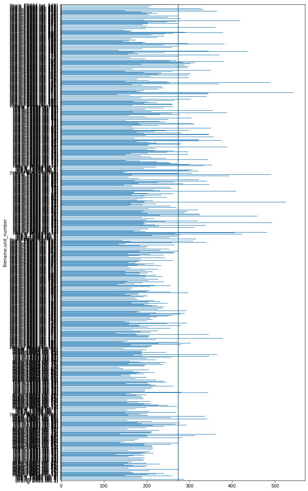
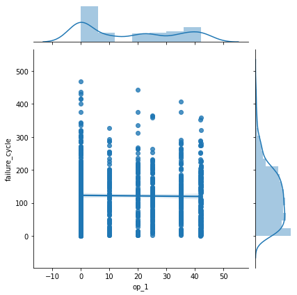
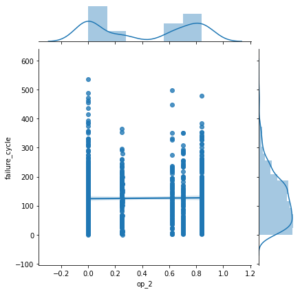
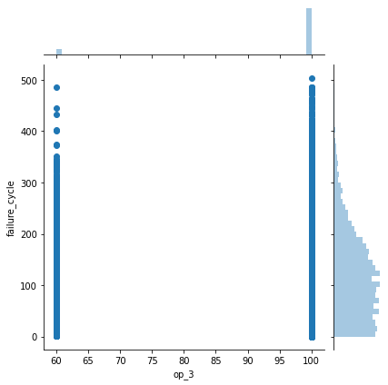
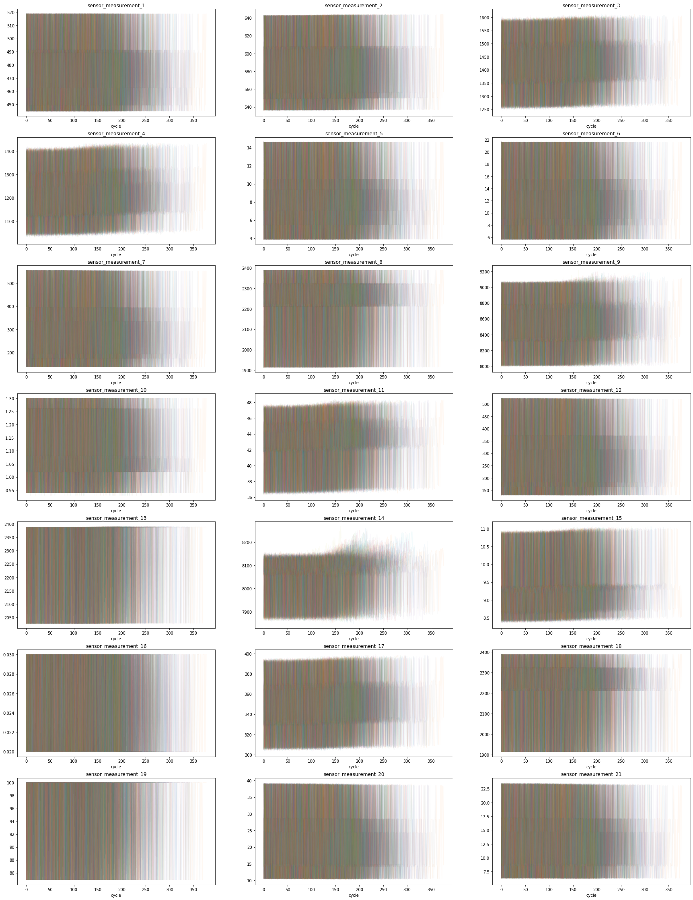
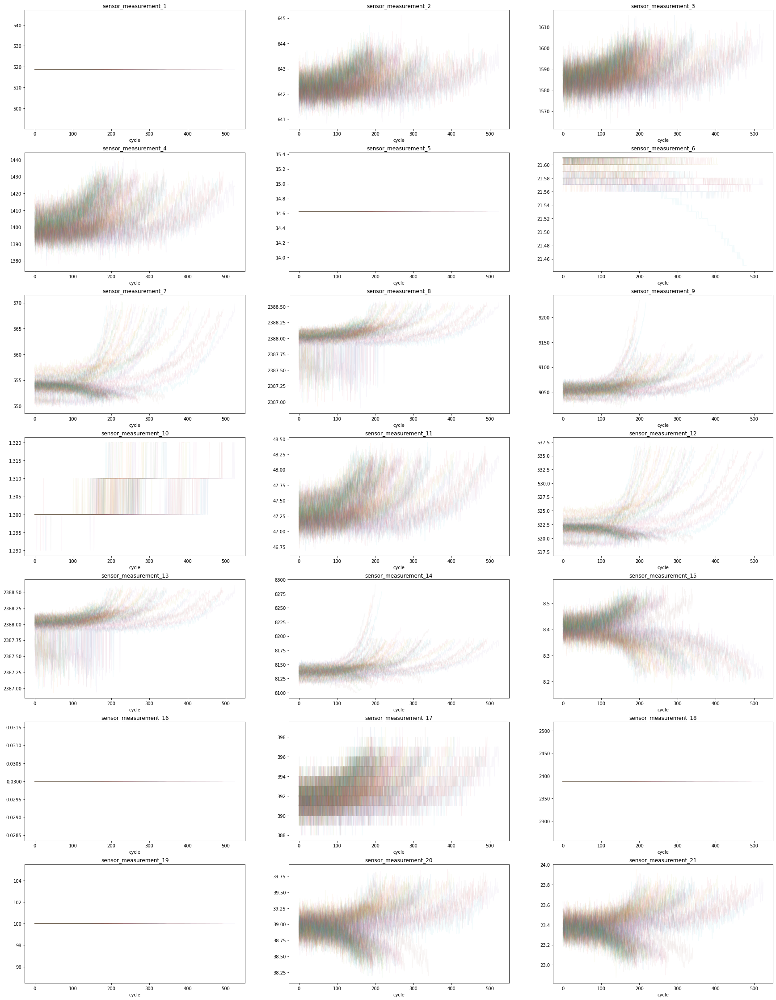
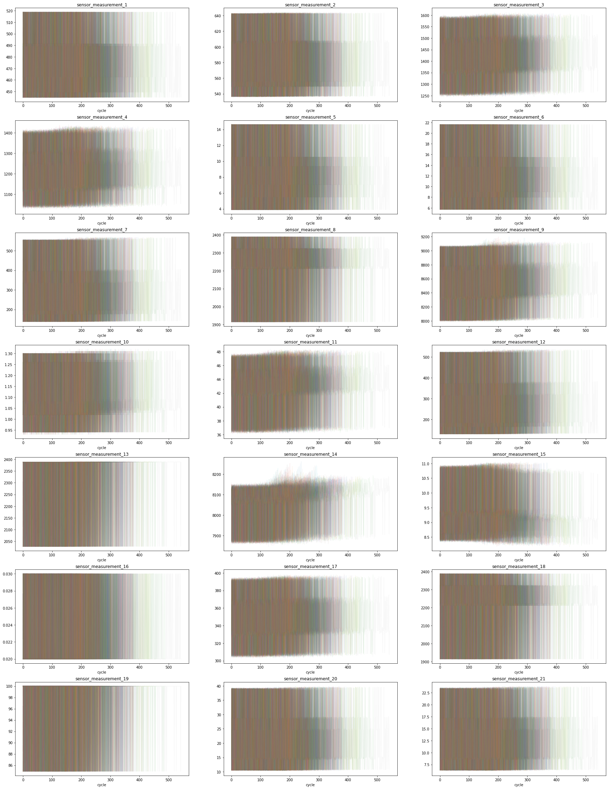

# Data Visualisation

An initial EDA was performed on the data to understand the dataset and relationships between the exogenous and endogenous (RUL) variables, this informed the approach described so far and worked with the entire (small ~30Mb) dataset. In a production scenario the dataset could be representatively sampled to achieve a similar insights to be achieved. We use the data processed from our data preparation step in glue, saved in parquet format to S3. Our Analysis is run a SageMaker notebook, our Sagemaker notebook role only has read access to this s3 bucket and so cannot change the data, this ensures no inadvertent changes to the data are made and means we can carry forward an observations to our ML approach subsequently.

A quick look at 5 rows in the dataset to understand the columns and datatypes

```python
dataset = pq.ParquetDataset('s3://datalake-curated-datasets-907317471167-us-east-1-gismq40/year=2020/month=12/day=14/hour=19', filesystem=fs)
table = dataset.read()
df = table.to_pandas()
df = df.sort_values(['unit_number', 'cycle'])
df.head()
```

<div>
<table border="1" class="dataframe">
  <thead>
    <tr style="text-align: right;">
      <th></th>
      <th>filename</th>
      <th>unit_number</th>
      <th>failure_cycle</th>
      <th>cycle</th>
      <th>op_1</th>
      <th>op_2</th>
      <th>op_3</th>
      <th>sensor_measurement_1</th>
      <th>sensor_measurement_2</th>
      <th>sensor_measurement_3</th>
      <th>...</th>
      <th>sensor_measurement_12</th>
      <th>sensor_measurement_13</th>
      <th>sensor_measurement_14</th>
      <th>sensor_measurement_15</th>
      <th>sensor_measurement_16</th>
      <th>sensor_measurement_17</th>
      <th>sensor_measurement_18</th>
      <th>sensor_measurement_19</th>
      <th>sensor_measurement_20</th>
      <th>sensor_measurement_21</th>
    </tr>
  </thead>
  <tbody>
    <tr>
      <th>77121</th>
      <td>train_FD001.txt</td>
      <td>1</td>
      <td>191</td>
      <td>1</td>
      <td>-0.0007</td>
      <td>-0.0004</td>
      <td>100.0</td>
      <td>518.67</td>
      <td>641.82</td>
      <td>1589.70</td>
      <td>...</td>
      <td>521.66</td>
      <td>2388.02</td>
      <td>8138.62</td>
      <td>8.4195</td>
      <td>0.03</td>
      <td>392</td>
      <td>2388</td>
      <td>100.0</td>
      <td>39.06</td>
      <td>23.4190</td>
    </tr>
    <tr>
      <th>95307</th>
      <td>train_FD003.txt</td>
      <td>1</td>
      <td>258</td>
      <td>1</td>
      <td>-0.0005</td>
      <td>0.0004</td>
      <td>100.0</td>
      <td>518.67</td>
      <td>642.36</td>
      <td>1583.23</td>
      <td>...</td>
      <td>522.31</td>
      <td>2388.01</td>
      <td>8145.32</td>
      <td>8.4246</td>
      <td>0.03</td>
      <td>391</td>
      <td>2388</td>
      <td>100.0</td>
      <td>39.11</td>
      <td>23.3537</td>
    </tr>
    <tr>
      <th>132437</th>
      <td>train_FD002.txt</td>
      <td>1</td>
      <td>148</td>
      <td>1</td>
      <td>34.9983</td>
      <td>0.8400</td>
      <td>100.0</td>
      <td>449.44</td>
      <td>555.32</td>
      <td>1358.61</td>
      <td>...</td>
      <td>183.06</td>
      <td>2387.72</td>
      <td>8048.56</td>
      <td>9.3461</td>
      <td>0.02</td>
      <td>334</td>
      <td>2223</td>
      <td>100.0</td>
      <td>14.73</td>
      <td>8.8071</td>
    </tr>
    <tr>
      <th>150804</th>
      <td>train_FD004.txt</td>
      <td>1</td>
      <td>320</td>
      <td>1</td>
      <td>42.0049</td>
      <td>0.8400</td>
      <td>100.0</td>
      <td>445.00</td>
      <td>549.68</td>
      <td>1343.43</td>
      <td>...</td>
      <td>129.78</td>
      <td>2387.99</td>
      <td>8074.83</td>
      <td>9.3335</td>
      <td>0.02</td>
      <td>330</td>
      <td>2212</td>
      <td>100.0</td>
      <td>10.62</td>
      <td>6.3670</td>
    </tr>
    <tr>
      <th>77122</th>
      <td>train_FD001.txt</td>
      <td>1</td>
      <td>190</td>
      <td>2</td>
      <td>0.0019</td>
      <td>-0.0003</td>
      <td>100.0</td>
      <td>518.67</td>
      <td>642.15</td>
      <td>1591.82</td>
      <td>...</td>
      <td>522.28</td>
      <td>2388.07</td>
      <td>8131.49</td>
      <td>8.4318</td>
      <td>0.03</td>
      <td>392</td>
      <td>2388</td>
      <td>100.0</td>
      <td>39.00</td>
      <td>23.4236</td>
    </tr>
  </tbody>
</table>
<p>5 rows × 28 columns</p>
</div>


We gain further insight about the distribution of data in each of the columns.
```python
df.describe().T
```

<div>
<table border="1" class="dataframe">
  <thead>
    <tr style="text-align: right;">
      <th></th>
      <th>count</th>
      <th>mean</th>
      <th>std</th>
      <th>min</th>
      <th>25%</th>
      <th>50%</th>
      <th>75%</th>
      <th>max</th>
    </tr>
  </thead>
  <tbody>
    <tr>
      <th>unit_number</th>
      <td>160359.0</td>
      <td>105.553758</td>
      <td>72.867325</td>
      <td>1.0000</td>
      <td>44.00000</td>
      <td>89.0000</td>
      <td>164.0000</td>
      <td>260.0000</td>
    </tr>
    <tr>
      <th>failure_cycle</th>
      <td>160359.0</td>
      <td>122.331338</td>
      <td>83.538146</td>
      <td>0.0000</td>
      <td>56.00000</td>
      <td>113.0000</td>
      <td>172.0000</td>
      <td>542.0000</td>
    </tr>
    <tr>
      <th>cycle</th>
      <td>160359.0</td>
      <td>123.331338</td>
      <td>83.538146</td>
      <td>1.0000</td>
      <td>57.00000</td>
      <td>114.0000</td>
      <td>173.0000</td>
      <td>543.0000</td>
    </tr>
    <tr>
      <th>op_1</th>
      <td>160359.0</td>
      <td>17.211973</td>
      <td>16.527988</td>
      <td>-0.0087</td>
      <td>0.00130</td>
      <td>19.9981</td>
      <td>35.0015</td>
      <td>42.0080</td>
    </tr>
    <tr>
      <th>op_2</th>
      <td>160359.0</td>
      <td>0.410004</td>
      <td>0.367938</td>
      <td>-0.0006</td>
      <td>0.00020</td>
      <td>0.6200</td>
      <td>0.8400</td>
      <td>0.8420</td>
    </tr>
    <tr>
      <th>op_3</th>
      <td>160359.0</td>
      <td>95.724344</td>
      <td>12.359044</td>
      <td>60.0000</td>
      <td>100.00000</td>
      <td>100.0000</td>
      <td>100.0000</td>
      <td>100.0000</td>
    </tr>
    <tr>
      <th>sensor_measurement_1</th>
      <td>160359.0</td>
      <td>485.840890</td>
      <td>30.420388</td>
      <td>445.0000</td>
      <td>449.44000</td>
      <td>489.0500</td>
      <td>518.6700</td>
      <td>518.6700</td>
    </tr>
    <tr>
      <th>sensor_measurement_2</th>
      <td>160359.0</td>
      <td>597.361022</td>
      <td>42.478516</td>
      <td>535.4800</td>
      <td>549.96000</td>
      <td>605.9300</td>
      <td>642.3400</td>
      <td>645.1100</td>
    </tr>
    <tr>
      <th>sensor_measurement_3</th>
      <td>160359.0</td>
      <td>1467.035653</td>
      <td>118.175261</td>
      <td>1242.6700</td>
      <td>1357.36000</td>
      <td>1492.8100</td>
      <td>1586.5900</td>
      <td>1616.9100</td>
    </tr>
    <tr>
      <th>sensor_measurement_4</th>
      <td>160359.0</td>
      <td>1260.956434</td>
      <td>136.300073</td>
      <td>1023.7700</td>
      <td>1126.83000</td>
      <td>1271.7400</td>
      <td>1402.2000</td>
      <td>1441.4900</td>
    </tr>
    <tr>
      <th>sensor_measurement_5</th>
      <td>160359.0</td>
      <td>9.894999</td>
      <td>4.265554</td>
      <td>3.9100</td>
      <td>5.48000</td>
      <td>9.3500</td>
      <td>14.6200</td>
      <td>14.6200</td>
    </tr>
    <tr>
      <th>sensor_measurement_6</th>
      <td>160359.0</td>
      <td>14.424935</td>
      <td>6.443922</td>
      <td>5.6700</td>
      <td>8.00000</td>
      <td>13.6600</td>
      <td>21.6100</td>
      <td>21.6100</td>
    </tr>
    <tr>
      <th>sensor_measurement_7</th>
      <td>160359.0</td>
      <td>359.729968</td>
      <td>174.133835</td>
      <td>136.1700</td>
      <td>175.71000</td>
      <td>341.6900</td>
      <td>553.2900</td>
      <td>570.8100</td>
    </tr>
    <tr>
      <th>sensor_measurement_8</th>
      <td>160359.0</td>
      <td>2273.829707</td>
      <td>142.426613</td>
      <td>1914.7200</td>
      <td>2212.12000</td>
      <td>2319.3700</td>
      <td>2388.0500</td>
      <td>2388.6400</td>
    </tr>
    <tr>
      <th>sensor_measurement_9</th>
      <td>160359.0</td>
      <td>8677.553696</td>
      <td>374.657454</td>
      <td>7984.5100</td>
      <td>8334.77000</td>
      <td>8764.2000</td>
      <td>9055.8500</td>
      <td>9244.5900</td>
    </tr>
    <tr>
      <th>sensor_measurement_10</th>
      <td>160359.0</td>
      <td>1.153705</td>
      <td>0.142103</td>
      <td>0.9300</td>
      <td>1.02000</td>
      <td>1.0900</td>
      <td>1.3000</td>
      <td>1.3200</td>
    </tr>
    <tr>
      <th>sensor_measurement_11</th>
      <td>160359.0</td>
      <td>44.212049</td>
      <td>3.426342</td>
      <td>36.0400</td>
      <td>42.01000</td>
      <td>44.9300</td>
      <td>47.3400</td>
      <td>48.5300</td>
    </tr>
    <tr>
      <th>sensor_measurement_12</th>
      <td>160359.0</td>
      <td>338.789821</td>
      <td>164.193480</td>
      <td>128.3100</td>
      <td>164.79000</td>
      <td>321.6900</td>
      <td>521.3400</td>
      <td>537.4900</td>
    </tr>
    <tr>
      <th>sensor_measurement_13</th>
      <td>160359.0</td>
      <td>2349.645243</td>
      <td>111.167242</td>
      <td>2027.5700</td>
      <td>2387.97000</td>
      <td>2388.0700</td>
      <td>2388.1600</td>
      <td>2390.4900</td>
    </tr>
    <tr>
      <th>sensor_measurement_14</th>
      <td>160359.0</td>
      <td>8088.950972</td>
      <td>80.623257</td>
      <td>7845.7800</td>
      <td>8070.53000</td>
      <td>8118.5900</td>
      <td>8139.4100</td>
      <td>8293.7200</td>
    </tr>
    <tr>
      <th>sensor_measurement_15</th>
      <td>160359.0</td>
      <td>9.054747</td>
      <td>0.751581</td>
      <td>8.1563</td>
      <td>8.43925</td>
      <td>9.0301</td>
      <td>9.3442</td>
      <td>11.0669</td>
    </tr>
    <tr>
      <th>sensor_measurement_16</th>
      <td>160359.0</td>
      <td>0.025185</td>
      <td>0.004997</td>
      <td>0.0200</td>
      <td>0.02000</td>
      <td>0.0300</td>
      <td>0.0300</td>
      <td>0.0300</td>
    </tr>
    <tr>
      <th>sensor_measurement_17</th>
      <td>160359.0</td>
      <td>360.698801</td>
      <td>31.021430</td>
      <td>302.0000</td>
      <td>332.00000</td>
      <td>367.0000</td>
      <td>392.0000</td>
      <td>400.0000</td>
    </tr>
    <tr>
      <th>sensor_measurement_18</th>
      <td>160359.0</td>
      <td>2273.754039</td>
      <td>142.513114</td>
      <td>1915.0000</td>
      <td>2212.00000</td>
      <td>2319.0000</td>
      <td>2388.0000</td>
      <td>2388.0000</td>
    </tr>
    <tr>
      <th>sensor_measurement_19</th>
      <td>160359.0</td>
      <td>98.389146</td>
      <td>4.656270</td>
      <td>84.9300</td>
      <td>100.00000</td>
      <td>100.0000</td>
      <td>100.0000</td>
      <td>100.0000</td>
    </tr>
    <tr>
      <th>sensor_measurement_20</th>
      <td>160359.0</td>
      <td>25.942709</td>
      <td>11.691422</td>
      <td>10.1600</td>
      <td>14.33000</td>
      <td>24.9200</td>
      <td>38.8200</td>
      <td>39.8900</td>
    </tr>
    <tr>
      <th>sensor_measurement_21</th>
      <td>160359.0</td>
      <td>15.565700</td>
      <td>7.015067</td>
      <td>6.0105</td>
      <td>8.60130</td>
      <td>14.9535</td>
      <td>23.2946</td>
      <td>23.9505</td>
    </tr>
  </tbody>
</table>
</div>

A quick (ugly) plot shows us the distribution of the max cycle time per unique unit number (we combine this with the filename to ensure unit numbers are unique) 
```python
fig, ax = plt.subplots(figsize=(10, 20))
_ = df.groupby(['filename', 'unit_number']).cycle.max().plot.barh(ax=ax)
_ = plt.axvline(x=df.groupby('unit_number').cycle.max().mean())
```
    


### Operational Settings
    
The documentation explains the columns settings 1,2 and 3 vary between files and represent different settings the engines were configured at before cycles were run, here we explore to relationship between the target variable, failure cycle, and each operational setting
```python
sns.jointplot(x='op_1', y='failure_cycle', data=df.sample(1000), kind='reg')
```

```python
sns.jointplot(x='op_2', y='failure_cycle', data=df.sample(1000), kind='reg')
```

```python
sns.jointplot(x='op_3', y='failure_cycle', data=df.sample(10000))
```


The distribution of operational settings is multi modal, and infact varies between the files.

### Sensor measurements

Looking at the other 20 sensor measurements we can see how measurements vary between unique unit numbers across cycles and files, there are some clear trends across many of the variables as cycles increase which seems to represent changes due to wear and tear, this insight indicates these features provide information our model can leverage to predict RUL.

The training data for files 2 and 4 have 6 different operational settings and we can see how this effects the measurements, as files 2 and 4 have several operational settings where as files 1 and 3 have individual settings we can see that operational setting and some of the sensor measurements interact, resulting in the difference between the plots (clear non linear trends vs noisy plots).
    
File 1
```python
fig, axes = plt.subplots(7, 3, figsize=(30, 40))
axes = axes.ravel()
for i, a in zip(range(1, 22), axes):
    column = 'sensor_measurement_' + str(i)
    _ = a.plot(ddf.loc[['train_FD001.txt', ...], column].unstack(level=[0, 1]).values, alpha=.05)
    a.set_title(column)
    a.set_xlabel('cycle')
```

    
File 2
```python
fig, axes = plt.subplots(7, 3, figsize=(30, 40))
axes = axes.ravel()
for i, a in zip(range(1, 22), axes):
    column = 'sensor_measurement_' + str(i)
    _ = a.plot(ddf.loc[['train_FD002.txt', ...], column].unstack(level=[0, 1]).values, alpha=.05)
    a.set_title(column)
    a.set_xlabel('cycle')
```

File 3    
```python
fig, axes = plt.subplots(7, 3, figsize=(30, 40))
axes = axes.ravel()
for i, a in zip(range(1, 22), axes):
    column = 'sensor_measurement_' + str(i)
    _ = a.plot(ddf.loc[['train_FD003.txt', ...], column].unstack(level=[0, 1]).values, alpha=.05)
    a.set_title(column)
    a.set_xlabel('cycle')
```

File 4
```python
fig, axes = plt.subplots(7, 3, figsize=(30, 40))
axes = axes.ravel()
for i, a in zip(range(1, 22), axes):
    column = 'sensor_measurement_' + str(i)
    _ = a.plot(ddf.loc[['train_FD004.txt', ...], column].unstack(level=[0, 1]).values, alpha=.05)
    a.set_title(column)
    a.set_xlabel('cycle')
```



### Minimum viable model

Given the above an ensemble model may be an appropriate approach as the data exhibits non linear effects and has clear interactions between the exogenous variables which a tree based method can discover. 

```python
from sklearn.ensemble import RandomForestRegressor
from sklearn.model_selection import train_test_split
import numpy as np

features = ['cycle', 'op_1', 'op_2',
       'op_3', 'sensor_measurement_1', 'sensor_measurement_2',
       'sensor_measurement_3', 'sensor_measurement_4', 'sensor_measurement_5',
       'sensor_measurement_6', 'sensor_measurement_7', 'sensor_measurement_8',
       'sensor_measurement_9', 'sensor_measurement_10',
       'sensor_measurement_11', 'sensor_measurement_12',
       'sensor_measurement_13', 'sensor_measurement_14',
       'sensor_measurement_15', 'sensor_measurement_16',
       'sensor_measurement_17', 'sensor_measurement_18',
       'sensor_measurement_19', 'sensor_measurement_20',
       'sensor_measurement_21']

is_train = df.unit_number % 3 != 0
is_test = df.unit_number % 3 == 0

x_train, x_test = df.loc[is_train, features], df.loc[is_test, features]
y_train, y_test = df.loc[is_train, 'failure_cycle'],  df.loc[is_test, 'failure_cycle']

cls = RandomForestRegressor(n_jobs=-1, n_estimators=40, )
cls = cls.fit(x_train, y_train)
cls.score(x_test, y_test)
```
What percentage of the variance in the dataset does this model explain?

<p align="center">

</p>

    0.6777656054746929

```python
from sklearn.metrics import mean_squared_error
mean_squared_error(y_test, cls.predict(x_test), squared=False)
```
RMSE   

    46.4291275009693
A root mean squared error of ~46 cycles

Which features does this model find most useful based on the model frequent feature which the trees are split on.
1. Cycle number (makes intuitive sense, the more cycles a engine has completed the fewer we expect will be required before a failure)
2. sensor_measurement 11
3. sensor_measurement 13
4. sensor_measurement 15
The model appears to have discovered patterns in the data and predictions aren't entirely dominated by any single feature.

```python
fig, ax = plt.subplots(figsize=(30, 20))
ax.barh(features, cls.feature_importances_)
```
    

    
### Baseline mean regressor

It's useful to establish how good are MVM is before proceeding, at the very least we'd hope to do better than a naive guess. The sklearn dummyregressor provides a model which ignores all features (exogenous data) and makes a prediction entirely based on the our target (endogenous) column (specifically its mean) 


```python
from sklearn.dummy import DummyRegressor

dummy = DummyRegressor()
dummy = dummy.fit(x_train, y_train)
mean_squared_error(y_test, dummy.predict(x_test), squared=False)
```
RMSE  

    81.9091606758585

An ensemble based method outperforms a naive mean prediction by ~50%.
* This approach validates the potential value before we commit to building a sagemaker model, ie if there wasn't a margin over our "dummy" model then building a sagemaker model may be a waste of our time. 
* We've validated the processed data lines appropriately and can be used predictively.
* Next steps apply Xgboost, gradient boosting generally outperforms random forest when tuned appropriately

### Quicksight dashboard

A quicksight dashboard to enable insight into the distribution of features in the dataset to aid debugging the model as new data arrives.
A use case for this dashboard would be to provide insight into new data arriving to understand any human discernible patterns.
This dashboard leverages AWS Athena to query the same data as analysed in our EDA above. As can be seen the visualisations capture the different ranges of values observed across the dataset files and would provide clear oversight of data processed and available in the data lake.


<br/>*Dashboard after first training data file has been published.*

<br/>*Dashboard after first and second training data files have been published, note the change in the distribution of some features and operational settings.*

<br/>*Dashboard after all training data files have been published.*

